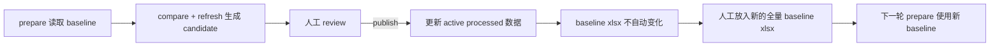

# 01_RAW_DATA

## 目录结构

```
01_RAW_DATA/
├── baseline/                   ← 冻结的全量基线
│   └── JATO-2026.1-full-21countries-baseline.xlsx
├── patches/<YYYY-MM>/          ← 每月新 patch
│   └── JATO-2026.2-partial-18countries.xlsx
│   └── monthly_update_plan.md  ← 自动生成的执行计划
└── historyDataArchive/         ← 历史留档
```

## 每月更新（3 步）

### 第 1 步 · 整理文件 + 生成计划

```bash
python 03_Scripts/prepare_monthly_raw_update.py \
  --month 2026-03 \
  --patch 01_RAW_DATA/新收到的文件.xlsx
```

baseline 不传则优先找 `baseline/` 下最新的一份；如果 active baseline 暂时缺位，会回退到 `historyDataArchive/baseline/` 下最新的一份。脚本会：
- 把 patch 复制到 `patches/<month>/` 并标准化命名
- 打印后续两步要执行的命令
- 在 `patches/<month>/monthly_update_plan.md` 留档
- 如果当前 active parquet 已存在，则 refresh 命令会自动带上 `--supplement-missing-countries-from-parquet 04_Processed_data/jato_full_archive.parquet`，把 patch 未覆盖国家从 current active 补齐，避免 partial patch publish 时把旧国家回退

### baseline 更新时机

当前实现里，**baseline 不会随着 publish 自动改成新的 xlsx**。

- upload / prepare / raw compare / candidate refresh / review：都只是生成候选结果，不会改 baseline。
- publish：只会把 staging 里的 parquet / manifest / partition / refresh report 覆盖到 active 数据集，不会反向生成 baseline xlsx。
- cleanup：只会归档旧 baseline，保留 `baseline/` 里当前最新的一份。

所以真正的 baseline 换代，还是要在你确认某次 publish 结果可作为下一轮锚点之后，**手动把新的全量 raw xlsx 放进 `01_RAW_DATA/baseline/`**。



### 第 2 步 · Raw Compare

直接复制第 1 步输出的命令执行即可。

### 第 3 步 · Candidate Refresh

同上，复制第 1 步输出的 refresh 命令执行。

### 完整示例

```bash
# 1. 整理
python 03_Scripts/prepare_monthly_raw_update.py \
  --month 2026-02 \
  --patch "01_RAW_DATA/patches/2026-02/JATO-2026.2-partial-18countries.xlsx"

# 2. 对比（命令由第 1 步自动生成）
python 03_Scripts/raw_compare_review.py \
  --old  01_RAW_DATA/baseline/JATO-2026.1-full-21countries-baseline.xlsx \
  --new  01_RAW_DATA/patches/2026-02/JATO-2026.2-partial-18countries.xlsx \
  --output-dir 04_Processed_data/reviews/raw_compare/2026-01_vs_2026-02

# 3. 刷新（命令由第 1 步自动生成）
python 03_Scripts/run_data_refresh_job.py \
  --baseline-input 01_RAW_DATA/baseline/JATO-2026.1-full-21countries-baseline.xlsx \
  --patch-input-files 01_RAW_DATA/patches/2026-02/JATO-2026.2-partial-18countries.xlsx \
  --supplement-missing-countries-from-parquet 04_Processed_data/jato_full_archive.parquet \
  --output 04_Processed_data/staging/2026-02-mixed/jato_full_archive.parquet \
  --manifest 04_Processed_data/staging/2026-02-mixed/manifest.json \
  --partition-output 04_Processed_data/staging/2026-02-mixed/partitioned_dataset_v1 \
  --report 04_Processed_data/staging/2026-02-mixed/refresh_job_report.json \
  --fingerprint 04_Processed_data/staging/2026-02-mixed/dataset_fingerprint.json \
  --incremental --skip-benchmark
```
