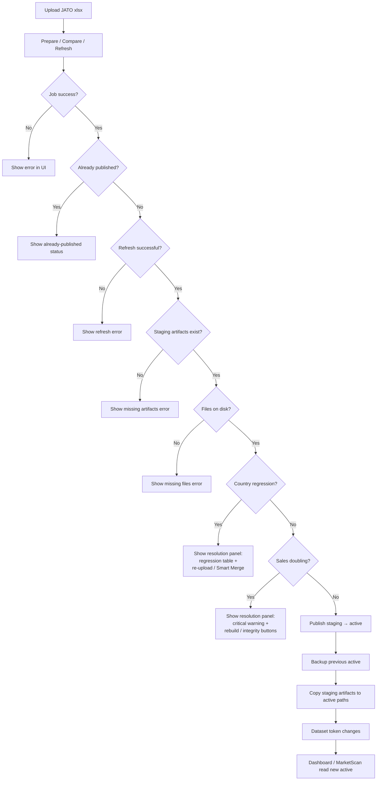

# JATO Monthly Update Data Lifecycle Runbook

Date: 2026-05-17
Last updated: 2026-07-21
Scope: JATO monthly Excel upload, active Parquet publication, MarketScan/Dashboard data correctness, and deploy/runtime boundaries.

## Executive Rule

JATO monthly data is runtime data, not code deploy payload.

The production truth source is:

- `04_Processed_data/jato_full_archive.parquet`
- `04_Processed_data/manifest.json`
- `04_Processed_data/partitioned_dataset_v1/`
- `04_Processed_data/partitioned_dataset_v1/manifest.json`
- `04_Processed_data/refresh_job_report.json`
- `04_Processed_data/dataset_fingerprint.json`

GitHub Actions deploys application code. It must not be used as the implicit source of truth for monthly JATO active data.

## Architecture

```text
Monthly JATO xlsx upload
  -> /v1/msrp/monthly-update job
  -> 03_Scripts/data_pipeline/run_data_refresh_job.py
  -> staging parquet + staging partitioned_dataset_v1
  -> publish copies staging artifacts to 04_Processed_data active paths
  -> FastAPI Parquet repository reads active partitioned dataset
  -> Dashboard / MarketScan consume /v1/analysis and /v1/market-scan
```

Backend stack notes:

- FastAPI routes call service functions; do not duplicate data-loading logic in routes.
- Analytical reads should reuse `app.infra.parquet_repository` instead of opening Parquet independently.
- MarketScan Redis cache is derived cache only. Redis is not the data source.
- `partitioned_dataset_v1` is a serving artifact derived from `jato_full_archive.parquet`.
- If `partitioned_dataset_v1/manifest.json.parquetFileCount` does not equal actual `*.parquet` file count, the backend should avoid trusting the partition directory.

## Publish Guards Flowchart



## Expected Monthly Update Behavior

When a monthly xlsx contains only a subset of countries:

1. Uploaded countries are replaced/advanced from the uploaded xlsx.
2. Countries not in the upload are supplemented from the current active parquet.
3. Countries whose latest month already equals the upload month should not be duplicated.
4. Existing country/month sales should not be doubled.
5. Publishing a candidate must not regress any country's latest active month.

This is the desired behavior for staggered JATO releases. Example:

- First batch advanced 12 countries to `2026 Mar`.
- Second batch advanced Germany, Poland, Hungary, Denmark, Austria, Finland, Slovakia to `2026 Mar`.
- First-batch countries should remain unchanged after the second publish.
- Countries not present in either batch remain at their previous latest month.

## Historical Change And Correction Policy

The routine monthly-update path and an intentional historical correction are related, but they do not have the same risk level. The default production rule is:

> A routine country update preserves that country's current active history and uses uploaded rows only after the country's active latest month.

The Review must classify each uploaded country's historical differences and offer only the decisions that the backend has validated:

| Decision | Meaning | When allowed | Effect |
|---|---|---|---|
| `keep_active` | Preserve active history | Default for every monthly update; mandatory when historical monthly sales totals differ | Keep all active rows through the country's active latest month, then use uploaded rows strictly after that month |
| `use_latest` | Adopt uploaded historical classification | Only when historical monthly sales totals are stable and Review reports the affected dimensions | Replace the reviewed country's historical classification/details with the uploaded version; this is an explicit historical correction, not a routine append |
| Historical sales correction | Correct historical sales totals and details | High-risk controlled flow only; not supported by the routine monthly fast path as of 2026-07-21 | Replace only explicitly approved country-month partitions after a dedicated diff, reason, second approval, backup, and rollback plan |

`use_latest` is therefore a limited historical-correction decision inside JATO Monthly Update. It must not be interpreted as blanket permission to trust every historical row in a newly washed workbook. If historical monthly sales totals changed, the current routine flow must expose `keep_active` only and stop the upload from rewriting those months.

### Routine Monthly Update Rules

1. Do not automatically select a historical decision for the user.
2. Require a decision for every country whose uploaded history differs from active.
3. For `keep_active`, retain active history exactly and append uploaded data only for months later than the country's active latest month.
4. Reject overlapping month boundaries, country regression, duplicate business keys, negative sales, schema regression, and suspected near-2x accumulation.
5. Reuse the existing candidate and run Smart Merge exactly once after the complete decision set is submitted.
6. Require post-merge `resolutionValidation=pass` for every `keep_active` country before Review approval.
7. Keep countries absent from the upload logically and physically unchanged; their partition manifests and fingerprints must remain stable.
8. Publish only after explicit approval, active/candidate/report fingerprint checks, active backup, and final historical sales/configuration guards.

### Historical Correction Rules

If JATO or the data-washing owner confirms that active history is wrong, keep the correction in the JATO Monthly Update product but place it in an explicit correction mode:

1. Select exact countries, month ranges, fields, and a correction reason.
2. Show before/after values, monthly sales deltas, affected models/configurations, missing fields, and duplicate-key findings.
3. Separate classification-only correction from sales-total correction. Stable sales may use `use_latest`; changed sales require the high-risk flow.
4. Replace approved country-month partitions atomically. Never append historical rows blindly and never broaden the correction beyond the selected scope.
5. Bind the correction decision to upload SHA-256, candidate fingerprint, active-base fingerprint, report fingerprint, approver, and timestamp.
6. Create a recoverable active backup before promotion and support rollback by correction batch.
7. Re-run Dashboard/MarketScan freshness, country latest-month, monthly-total, partition-count, and no-accumulation checks after publication.

### June 2026 Sixteen-Country Decision

For the June 2026 sixteen-country workbook, the approved business intent is `keep_active` for all uploaded countries: prior active months remain unchanged, while uploaded data is used only after each country's active latest month. Historical differences in the washed workbook are Review evidence, not authorization to overwrite active history.

## 2026-05-17 Incident Record

Symptoms:

- MarketScan Sweden `2026 Mar` showed doubled rolling figures.
- Dashboard and MarketScan disagreed with local expectations.
- MarketScan custom time range returned HTTP 500.
- Second uploaded batch was not reflected in active data.

Confirmed root causes:

1. Duplicate partition files existed under production `04_Processed_data/partitioned_dataset_v1`.
   - Manifest expected `21` parquet files.
   - Directory had `42` parquet files.
   - PyArrow read both old and new partition files, doubling results.
   - Redis only cached the already wrong computed response; Redis was not the source.

2. Second monthly update batch had succeeded in staging but production active data had been overwritten/rolled back to the earlier first-batch dataset.
   - Job: `jato-update-245fb6f5`
   - Batch: `2026-03-r3`
   - Staging path: `04_Processed_data/staging/2026-03-r3-mixed`
   - Staging row count: `989912`
   - Active before restore: `promote-2026-03-partial12`, row count `950999`
   - Active after restore: `2026-03-r3-mixed`, row count `989912`

Validated restored values:

| Country | 2026 Jan | 2026 Feb | 2026 Mar |
|---|---:|---:|---:|
| Germany | 193981 | 211262 | 294161 |
| Poland | 40272 | 47449 | 63865 |
| Hungary | 8291 | 10738 | 17448 |
| Denmark | 12887 | 12071 | 19086 |
| Austria | 22929 | 21288 | 33018 |
| Finland | 5461 | 4949 | 6793 |
| Slovakia | 5152 | 5870 | 7962 |
| Sweden | 16041 | 19341 | 26578 |

Operational recovery:

- Production active restored from `04_Processed_data/staging/2026-03-r3-mixed`.
- Production pre-restore backup: `04_Processed_data/.refresh_backups/restore-pre-r3-staging-20260517-020911`.
- Local active-only runtime sync backup: `.runtime_sync_backups/active-only-20260517-101708`.
- Current active partition check after restore: manifest `21`, actual parquet files `21`.

## Normal Operating Procedure

For future JATO monthly updates:

1. Use the web monthly-update upload flow.
2. Upload only the countries provided by JATO for that batch.
3. Let the system supplement missing countries from current active parquet.
4. Publish only after review shows no latest-month regression and no suspected 2x sales anomaly.
5. Verify production freshness and key values.
6. If local development must use the same data, sync runtime data from cloud to local after production publish.

Useful commands:

```bash
# Sync production active runtime data to local before local data work.
bash 03_Scripts/sync_monthly_update_runtime_from_cloud.sh

# Data upload script now guards against local stale data overwriting newer cloud active data.
bash 03_Scripts/ops/sync_data_to_cloud.sh <xlsx>

# Only override the stale-data guard when intentionally replacing cloud active data.
ALLOW_STALE_LOCAL_DATA_SYNC=true bash 03_Scripts/ops/sync_data_to_cloud.sh <xlsx>
```

## Verification Checklist

Production API checks:

```bash
curl --noproxy '*' -fsS http://127.0.0.1:8000/healthz
curl --noproxy '*' -fsS http://127.0.0.1:8000/v1/analysis/data-freshness
```

Parquet file checks:

```bash
python - <<'PY'
import json
from pathlib import Path

root = Path("04_Processed_data")
manifest = json.loads((root / "partitioned_dataset_v1/manifest.json").read_text())
actual = sum(1 for _ in (root / "partitioned_dataset_v1").rglob("*.parquet"))
print("manifest parquetFileCount:", manifest.get("parquetFileCount"))
print("actual parquet files:", actual)
PY
```

Expected invariant:

```text
manifest parquetFileCount == actual parquet files
```

Dashboard and MarketScan checks:

- Dashboard raw Sweden `2026 Mar` should be `26578`.
- MarketScan Sweden with default selected fuels can be `26576` because it excludes fuel rows outside `ICE/MHEV/HEV/PHEV/BEV`.
- MarketScan custom range `2026-01..2026-03` must return HTTP 200.

## Development Guardrails

When changing backend data code:

- Reuse `app.infra.parquet_repository.current_dataset_token()` for cache invalidation.
- Include active manifest and partition manifest in dataset version checks.
- Keep Redis cache keys tied to dataset token.
- Keep publish guards in `jato_monthly_update_service.py`.
- Do not make route handlers read `04_Processed_data` directly.
- Add unit tests for regression checks, partition mismatch behavior, and custom time-range parsing.

When changing deploy or sync scripts:

- Do not silently overwrite production active data with older local parquet.
- Preserve active-data backups before replacing `04_Processed_data` runtime artifacts.
- Keep `04_Processed_data/.refresh_backups/pre-sync-*` cleanup scoped; do not use broad `git clean` on data directories.
- Remember that GitHub Actions deploy archives exclude `04_Processed_data`; deploy and monthly data publication are separate concerns.

When changing frontend MarketScan/Dashboard:

- Treat Dashboard and MarketScan as different analytical views over the same active parquet.
- If values differ, first compare selected filters/fuel types/time range before assuming data corruption.
- Do not add UI-side correction factors for backend data issues.

When changing frontend monthly update page (`JatoMonthlyUpdatePage.tsx`):

- Publish button must be disabled when job is already published (`isSelectedJobPublished`) and when user has not reviewed (`reviewBundle?.jobId !== selectedJob?.jobId`).
- Upload submit button must be disabled when another job is queued or running (`hasActiveJob`).
- Do not remove the review-before-publish gate without replacing it with an equivalent confirmation step.

## Known Failure Patterns

| Pattern | Likely cause | Fix |
|---|---|---|
| Country volume exactly doubled | Duplicate partition parquet files | Rebuild/replace `partitioned_dataset_v1`; verify manifest count equals actual files |
| Web upload job says success but UI still shows old month | Staging published result not active, or active later overwritten | Compare job `staging/*/manifest.json` with active `04_Processed_data/manifest.json`; restore correct staging or republish |
| MarketScan custom range HTTP 500 | Backend custom time-range parsing/period variables | Test `_build_overview_payload` and period normalization |
| Local `127` differs from production | Local active parquet is stale | Sync production runtime data to local |
| Redis shows stale MarketScan response | Cache built before data/token change | Restart backend or ensure dataset token changes with active manifest/parquet |
