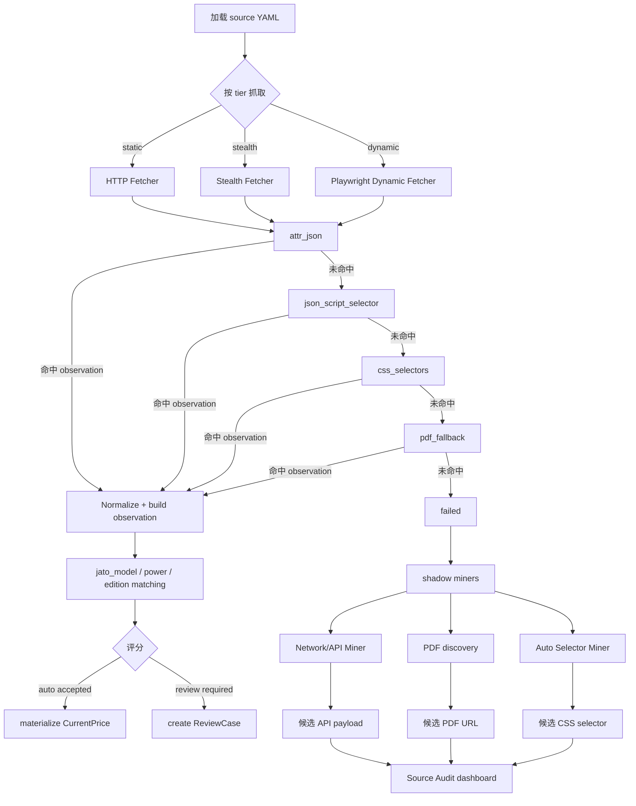
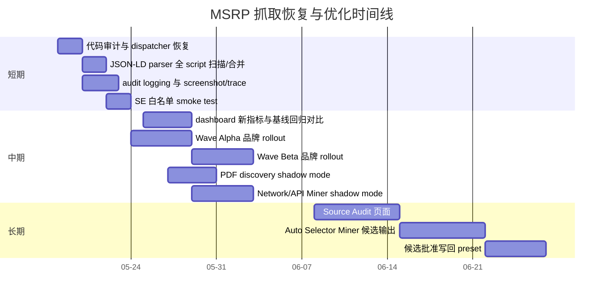

# 恢复并优化 MSRP 抓取管线的工程分析与执行建议

## Executive summary

本报告基于你提供的执行计划主文档与当前补充信息，结合官方技术文档，对“恢复并优化 MSRP 抓取管线”的最短恢复路径、最小可行改动、自动化替代方案与监控体系进行了重构。结论很明确：**当前阶段的主线不是继续扩大人工 CSS Inspect，而是先恢复既有设计中的提取优先级链，并把 JSON-LD 重新放回第一优先级的可执行路径**。

关键结论如下：

- **最先恢复的不是 CSS preset，而是 extractor dispatcher。** W3C JSON-LD 1.1 明确规定，HTML 中的 JSON-LD 通过 `<script type="application/ld+json">` 嵌入；若未显式指定单个脚本，处理器应处理并合并页面中的所有这类脚本。这意味着：如果当前代码只读取第一个 JSON-LD script，或者先跑 CSS 再跑 JSON-LD，那么这本身就是偏离设计和标准的高优先级缺陷。citeturn10view0turn10view3turn3view6

- **对汽车 MSRP 抓取，JSON-LD 比人工 CSS Inspect 更接近“可恢复、可扩展、可验证”的主路径。** Schema.org 的汽车示例明确以 `Car` 作为 `Vehicle`/`Product` 的子类，并通过 `Offer` 表达价格与 `priceCurrency`；`AggregateOffer` 可表达 `lowPrice`/`highPrice`，`UnitPriceSpecification.priceType` 还可标识“manufacturer suggested retail price”。这非常适合把覆盖度分成 L3 完整 trim 价、L2 起售价或价格区间、L1 页面可达、L0 失败。citeturn3view2turn3view3turn8view2turn8view0turn8view1turn13view0turn8view3

- **要显著减少人工 CSS Inspect，必须先补“可观测性”，而不是先补更多 heuristic。** Playwright 官方文档已经提供了你需要的绝大部分排障能力：浏览器依赖安装、全局或 context 级代理、`request/response` 事件、`expect_response`、页面截图、以及 `trace.zip` 形式的可回放调试证据。没有这些证据，任何“brand preset 调优”都只能靠猜。citeturn3view0turn14view1turn4view0turn11view0turn11view1turn17view0

- **PDF fallback 必须保留，但必须收敛使用范围。** `pdfplumber` 适合机器生成 PDF 的文本与表格提取，也提供可视化调试；但官方 README 明确说明它不提供 OCR，对 OCR 化文档也没有强支持。因此，PDF 适合作为“网页抓不到时的官方价表兜底”，不适合作为默认主路径。citeturn5view0turn5view2turn5view3turn5view4

- **恢复目标应以你 2026-04-12 文档中的 dry-run 水平为第一基线，而不是立刻追求更高。** 就你给出的上下文看，系统此前已经达到过更高通过率，因此当前工作的目标应优先定义为“恢复已验证能力”，随后再做自动化替代与扩展优化。这一点属于内部基线判断，当前无代码库证据可进一步核实，状态应标注为“待运行日志确认”。  

## 现状核查清单

当前已知与未指定项如下：

| 项目 | 状态 |
|---|---|
| 执行计划主文档 | 已知，日期为 2026-04-12 |
| 当前 Batch A 国家范围 | 已知：SE, FI, NO, DK, HU, HR, AT, CZ, DE, FR, IT, PL |
| 代码库根路径 | 未指定 |
| CI/CD 方式 | 未指定 |
| dashboard 技术栈 | 未指定 |
| 当前运行日志样本 | 未指定 |
| source YAML 实际目录 | 未指定 |
| 现网 extractor dispatcher 文件路径 | 未指定 |

在未提供实际 repo 路径的前提下，下面是工程上应优先执行的核查表。示例命令默认在 repo 根目录执行，路径以常见布局示意；若你的仓库结构不同，请替换为实际路径。

| 优先级 | 检查项 | 建议命令或路径 | 预期值 | 失败指示 | 依据 |
|---|---|---|---|---|---|
| 最高 | extractor dispatcher 是否按 `attr_json → json_script_selector → css_selectors → pdf_fallback` 执行 | `grep -RIn --include='*.py' -E 'attr_json|json_script_selector|css_selectors|pdf_fallback|dispatch|dispatcher|priority|strategy_chain' .` | 代码中存在明确顺序链，且 JSON-LD 在 CSS 前 | 默认走 Scrapling/CSS；未见统一 dispatcher；或 JSON-LD 分支从未进入 | W3C 要求处理 HTML 中的 JSON-LD script；你的执行计划也已定义该链路。citeturn10view0turn10view3 |
| 最高 | JSON-LD 解析器是否扫描**所有** `application/ld+json` script，而不是只拿第一个 | `grep -RIn --include='*.py' -E 'find_all\\(|select\\(|application/ld\\+json|ld\\+json' .` | 使用 `find_all`/等价遍历，并合并多段 JSON-LD 结果 | 只见 `find()`、只解析单 script、未做 merge | JSON-LD 1.1 规定，如未指定单个 script，应处理并合并所有 `application/ld+json` 脚本。citeturn10view0turn10view3 |
| 最高 | 白名单品牌 source YAML 是否配置了 `json_script_selector` 或等价 JSON-LD extractor 标记 | `find . -type f \\( -name '*.yml' -o -name '*.yaml' \\) | xargs grep -nE 'json_script_selector|attr_json|vehicle_container|default_currency'` | Toyota/Volvo/Skoda/Kia/Hyundai/Dacia/Ford/Peugeot/Nissan/Opel/Mercedes/Renault 对应 source 存在 JSON-LD 路径或 extractor 标记 | 白名单品牌 YAML 只保留 CSS/Scrapling 字段，无 JSON-LD 提示 | Schema.org 的汽车/Offer模型天然适合集成 JSON-LD 抽取。citeturn3view2turn8view2turn8view0turn8view1 |
| 高 | observation 规范化是否支持 `Offer.price`、`priceCurrency`、`AggregateOffer.lowPrice/highPrice`、`UnitPriceSpecification.priceType` | `grep -RIn --include='*.py' -E 'priceCurrency|lowPrice|highPrice|AggregateOffer|UnitPriceSpecification|priceType|msrp' .` | 可以区分单价、区间价、MSRP/list price；`priceCurrency` 优先于站点默认币种 | 仅支持单一 `price`；忽略区间价；忽略 `priceType`；币种仍主要依赖站点手填 | Schema.org 对这些字段均有正式定义。citeturn8view0turn8view1turn13view0turn8view3 |
| 高 | Playwright 浏览器与系统依赖健康度 | `python -m playwright install --with-deps`；如只用 Chromium：`python -m playwright install --with-deps chromium` | 命令可执行；运行节点能正常启动浏览器 | 缺浏览器、缺依赖、启动崩溃 | 官方文档将 `playwright install --with-deps` 作为标准安装/CI 做法。citeturn3view0turn14view1 |
| 高 | 代理注入位置与健康检查 | 代码搜索：`grep -RIn --include='*.py' -E 'proxy=|HTTP_PROXY|HTTPS_PROXY|new_context\\(|chromium.launch\\(' .`；运行时脚本验证浏览器启动与页面访问 | 代理可以全局配置或按 context 配置；至少一处有统一注入 | 只在个别品牌脚本硬编码；启动不走代理；代理失败无告警 | Playwright 官方支持 browser-level 与 context-level 代理配置。citeturn3view1turn4view0 |
| 高 | 网络事件采集是否真正开启，是否受 Service Worker 干扰 | `grep -RIn --include='*.py' -E 'page\\.on\\(\"request\"|page\\.on\\(\"response\"|expect_response|service_workers' .` | 失败时可看到 request/response 事件或 `expect_response`；必要时 `service_workers="block"` | 页面显著动态但完全无响应事件；或无法抓到 API | Playwright 可监听 request/response；若网络事件缺失，官方建议考虑 `service_workers='block'`。citeturn4view0turn17view0 |
| 中 | 动态 source 是否保存截图与 trace | `grep -RIn --include='*.py' -E 'screenshot\\(|tracing\\.start|tracing\\.stop|show-trace|trace.zip' .` | 失败或低置信度 source 至少保留 screenshot；动态失败最好有 trace.zip | 只有 stderr 文本，无页面证据 | 官方支持 `page.screenshot()`、element screenshot 和 trace.zip 调试。citeturn11view0turn11view1 |
| 中 | Batch A 实际 source 列表是否冻结并可导出 | 示例：`grep -RIn --include='*.yml' --include='*.yaml' -E 'batch.?a|SE|FI|NO|DK|HU|HR|AT|CZ|DE|FR|IT|PL' .`；若用 `yq`：`yq '.batch_a' [batch-config].yaml` | 国家列表与 source 数量一致，可导出用于 dry-run | 国别与 source 映射不一致；DE/FR/IT/PL 混入但无 source | 内部计划信息，外部未指定 |
| 中 | JSON-LD smoke test fixture 是否存在 | `grep -RIn --include='*.py' --include='*.yml' -E 'smoke|toyota.*se|volvo.*se|skoda.*se|kia.*se' tests/ .` | 至少有 12 品牌 × SE 的固定样本集 | 只有全量 batch，无小样本回归集 | 内部测试设计，外部未指定 |
| 中 | PDF fallback 是否区分机器生成 PDF 与扫描件 | `grep -RIn --include='*.py' -E 'pdfplumber|ocr|extract_table|extract_text' .` | 机器 PDF 优先 `pdfplumber`；扫描件显式标记需 OCR/人工 | 扫描件被当作普通 PDF 静默解析，误抽取率高 | `pdfplumber` 官方说明：更适合机器生成 PDF，不提供 OCR。citeturn5view0turn5view2turn5view3 |
| 中 | 容器/CI 环境是否统一 | 查 Dockerfile/CI：`grep -RIn -E 'playwright/python|playwright install --with-deps|xvfb-run' .github/ ci/ docker/ Dockerfile* .` | 使用官方推荐镜像或等价安装流程 | 本地能跑、CI 跑不起来；浏览器依赖不一致 | 官方 CI 与 Docker 文档都建议镜像或 `install --with-deps`。citeturn14view0turn14view1 |

上表中，**与 JSON-LD/Schema 相关的预期值**来自 W3C 与 Schema.org 官方定义；**与 Playwright 健康检查相关的预期值**来自 Playwright 官方安装、网络、截图、追踪与 CI 文档。citeturn10view0turn10view3turn3view2turn8view2turn8view0turn8view1turn13view0turn8view3turn3view0turn14view1turn4view0turn11view0turn11view1turn17view0turn5view0turn5view2turn5view3

## 优先级与最小可行改动

按照“恢复 2026-04-12 水平优先、减少人工 CSS Inspect 次之、全自动 miner 再后置”的原则，建议把未来两周的最小可行改动拆成 P0 到 P3 四层。

| 优先级 | 目标 | 具体实现步骤 | 回滚策略 | 预期影响 | 主要风险 | 粗略工时 |
|---|---|---|---|---|---|---:|
| P0 | 恢复 extractor 优先级链 | 审计 dispatcher；实现统一 `STRATEGY_CHAIN = ("attr_json","json_script_selector","css_selectors","pdf_fallback")`；对白名单品牌默认启用 JSON-LD；JSON-LD parser 改成扫描全部 `application/ld+json` script 并 merge；先不改现有 CSS extractor 本体 | 加 feature flag：`EXTRACTOR_CHAIN_V2=1`；保留旧 dispatcher，异常时一键回切 | 最快恢复通过率；最大限度减少继续补 CSS 的冲动 | 若 JSON-LD parser 对异常 schema 容错差，可能会抬高 parse error | 6–10 小时 |
| P1 | 补“可观测性”而不是补猜测 | 增加 extractor audit logging；失败动态页保存 screenshot，条件允许时保存 trace.zip；日志中记录尝试策略、胜出策略、JSON-LD script 数、response 事件数、是否来自 service worker | `AUDIT_LOGGING_ENABLED=1`；日志双写到文件和控制台，可独立关闭 | 快速定位“为什么没走 JSON-LD / 为什么没抓到价格” | 日志量增大；trace 文件占空间 | 8–14 小时 |
| P2 | 建立最小回归面 | 先做 12 品牌 × SE 的 JSON-LD smoke test；再按品牌白名单而不是按国家全量扩展；dashboard 新增 extractor win rate、brand coverage、regression vs 基线 | `WHITELIST_ROLLOUT=1`；若指标异常，停止到上一波次 | 把“恢复成功”定义成可测的回归结果，而不是主观感受 | 如果 source_id 与品牌映射不规范，初期要先整理 fixture | 10–18 小时 |
| P3 | 低风险减人工作业 | 仅以 shadow mode 开启 PDF discovery 与 Network/API Miner 脚手架；Auto Selector Miner 暂不作为 blocker，只输出候选不入主链 | `SHADOW_MINERS=1`；主 extraction 不依赖 shadow 结果 | 为下一阶段减少人工 CSS Inspect 打基础 | 若过早接入主链，容易把恢复项目拖慢 | 12–24 小时 |

在成功率/投入比上，建议这样理解：

| 方案 | 成本 | 预期收益 | 时间估计 |
|---|---:|---:|---:|
| 仅继续补 CSS preset | 中到高 | 低到中 | 10–40 小时且不可控 |
| 恢复优先级链 + JSON-LD 先行 | 低到中 | 高 | 1–2 天 |
| 加 audit logging + smoke test | 中 | 很高 | 1–2 天 |
| 白名单分波次 rollout | 中 | 高 | 2–4 天 |
| Auto Selector Miner 直接上主链 | 高 | 中，且短期风险高 | 1–3 周 |
| Network/API Miner shadow mode | 中 | 中到高 | 3–5 天 |
| PDF discovery shadow mode | 低到中 | 中 | 2–4 天 |

建议的 dispatcher 伪代码如下。这里的关键点不是“有没有 JSON-LD extractor”，而是“它有没有真正排在 CSS 之前，并在成功后短路返回”。

```python
STRATEGY_CHAIN = (
    "attr_json",
    "json_script_selector",
    "css_selectors",
    "pdf_fallback",
)

def extract_source(source, page_ctx):
    attempted = []

    for strategy in STRATEGY_CHAIN:
        if not strategy_enabled_for_source(source, strategy):
            continue

        result = run_strategy(strategy, source, page_ctx)
        attempted.append({
            "strategy": strategy,
            "status": result.status,
            "observations_count": len(result.observations),
            "error": result.error,
        })

        if result.observations:
            emit_extractor_audit(
                source=source,
                attempted_strategies=attempted,
                winning_strategy=strategy,
                coverage_level=classify_coverage(result.observations),
                raw_evidence_refs=result.evidence_refs,
            )
            return result

    emit_extractor_audit(
        source=source,
        attempted_strategies=attempted,
        winning_strategy=None,
        coverage_level="L0_FAILED",
        raw_evidence_refs=[],
    )
    return ExtractionResult.failed()
```

W3C 与 Schema.org 的定义决定了 JSON-LD 分支至少应包含三条具体实现要求：**扫描全部 `application/ld+json` script、支持 `Offer/AggregateOffer/PriceSpecification` 多种价格表达、优先信任 `priceCurrency` 而不是站点默认币种**。其中 `AggregateOffer.lowPrice/highPrice` 可直接映射到“L2 起售价/价格区间”，而 `UnitPriceSpecification.priceType` 可用于单独识别 MSRP。citeturn10view0turn10view3turn8view2turn8view0turn8view1turn13view0turn8view3

建议新增的 extractor audit log schema 如下。这个 schema 的目标不是做 BI，而是让工程团队能在单个 source 级别判断：为什么这次没走 JSON-LD、为什么赢的是 CSS、为什么动态页没有 API。

```json
{
  "ts": "2026-05-16T10:42:15+08:00",
  "run_id": "dryrun_batch_a_20260516_01",
  "source_id": "toyota_se_corolla",
  "brand": "Toyota",
  "country": "SE",
  "url": "https://example.invalid",
  "tier": "dynamic",
  "configured_strategy": "auto",
  "attempted_strategies": [
    {
      "strategy": "attr_json",
      "status": "no_match",
      "observations_count": 0,
      "duration_ms": 43
    },
    {
      "strategy": "json_script_selector",
      "status": "success",
      "observations_count": 4,
      "duration_ms": 87,
      "jsonld_scripts_seen": 3,
      "jsonld_product_nodes": 4
    }
  ],
  "winning_strategy": "json_script_selector",
  "coverage_level": "L3_FULL_TRIM_PRICE",
  "currency": "SEK",
  "price_kind": "MSRP",
  "response_events": 18,
  "response_json_candidates": 2,
  "service_worker_seen": false,
  "screenshot_path": "artifacts/20260516/toyota_se_corolla.png",
  "trace_path": "artifacts/20260516/toyota_se_corolla.trace.zip",
  "status": "success"
}
```

JSON-LD smoke test 建议不要从“国家全量”开始，而是按你文档中已验证的品牌白名单先做 **SE 单国固定样本**。source_id 命名未指定，下面以“品牌 + 国家 + 车型占位”的形式列出最小集。

| 品牌 | 国家 | 建议 fixture 名称 | 期望胜出策略 | 核心断言 |
|---|---|---|---|---|
| Toyota | SE | `toyota_se_*` | `json_script_selector` | `observations_count >= 1`；`winning_strategy == json_script_selector` |
| Volvo | SE | `volvo_se_*` | `json_script_selector` | 至少一个 observation 带 `price` 与 `currency` |
| Skoda | SE | `skoda_se_*` | `json_script_selector` | 如出现区间价，允许 `L2_ENTRY_OR_RANGE_PRICE` |
| Kia | SE | `kia_se_*` | `json_script_selector` | 保存 raw JSON-LD evidence |
| Hyundai | SE | `hyundai_se_*` | `json_script_selector` | `currency` 正常归一到 ISO 4217 |
| Dacia | SE | `dacia_se_*` | `json_script_selector` | 页面多个 script 时不应漏掉非首个 script |
| Ford | SE | `ford_se_*` | `json_script_selector` | 同一车型多 trim 时可输出多 observation |
| Peugeot | SE | `peugeot_se_*` | `json_script_selector` | `price_type` 缺失时允许默认 `UNKNOWN` |
| Nissan | SE | `nissan_se_*` | `json_script_selector` | 价格节点必须有 URL/source evidence |
| Opel | SE | `opel_se_*` | `json_script_selector` | `priceCurrency` 优先于 `default_currency` |
| Mercedes | SE | `mercedes_se_*` | `json_script_selector` | 若仅有 `Offer` 单价，输出 L3 或 L2 取决于 trim 粒度 |
| Renault | SE | `renault_se_*` | `json_script_selector` | 无论成功失败，都必须写 audit log |

推荐的白名单配置示例如下。核心思想是：**以品牌分波次，而不是按国家全量推进**。

```yaml
rollout:
  mode: brand_whitelist
  wave_alpha:
    - Toyota
    - Dacia
    - Skoda
    - Volvo
    - Ford
  wave_beta:
    - Mercedes
    - Hyundai
    - Kia
    - Peugeot
    - Nissan
    - Opel
    - Renault
  wave_gamma:
    - Volkswagen
```

## 自动化替代方案设计

当前阶段不建议让 Auto Selector Miner 成为主线 blocker，原因很简单：**你已经有更短路径的“已验证可行功能”需要先恢复**。但这并不意味着自动化替代方案要等到很后面才开始。更合理的做法是：

- **Network/API Miner 与 PDF discovery 可以先以 shadow mode 并行做。**
- **Auto Selector Miner 可以做，但先只输出候选，不参与主 extraction 决策。**

这个排序有官方文档上的现实基础。Playwright 可以监听页面的 `request/response`，也支持 `expect_response` 与网络路由；如果请求被 Service Worker 截断，官方文档明确建议考虑 `service_workers='block'`。同时，Playwright 也原生支持截图和 trace，这让 shadow mode 的“候选证据”非常容易保存。citeturn4view0turn11view0turn11view1turn17view0

对 PDF 路线，则应保守一些：`pdfplumber` 擅长机器生成 PDF 的文本与表格提取，也有 visual debugging，但它不提供 OCR，对 OCR 化 PDF 没有强支持，因此当前更适合作为“发现与分类模块”，而不是“默认主解析器”。citeturn5view0turn5view2turn5view3turn5view4

建议的新提取决策树如下：



三类自动化替代模块建议如下：

| 模块 | 当前优先级 | 当前阶段建议 | 原因 |
|---|---|---|---|
| Network/API Miner | 高 | 立刻做 shadow mode | 直接复用 Playwright network 事件；对动态站 ROI 高 |
| PDF discovery | 高 | 立刻做 shadow mode | 低成本发现官方 price list，便于人工核验或后续 parser |
| Auto Selector Miner | 中 | 先做候选生成，不进主链 | 需要启发式与评分体系，短期不是恢复主线的瓶颈 |

建议的候选 selector 输出 schema 如下。该格式的重点是：**不要只给选择器，要一起给置信度、重复结构计数、价格命中证据与截图索引**，这样工程/产品才真的能少做人工 Inspect。

```json
{
  "source_id": "kia_se_sportage",
  "url": "https://example.invalid",
  "generated_at": "2026-05-16T11:08:00+08:00",
  "candidates": [
    {
      "rank": 1,
      "trim_card_selector": ".elp-trimlist-box",
      "trim_name_selector": "h3",
      "detail_price_selector": ".price-value",
      "confidence": 0.86,
      "signals": {
        "repeated_card_count": 5,
        "price_nodes_matched": 5,
        "currency_consistency_score": 1.0,
        "name_presence_score": 0.8,
        "selector_specificity_score": 0.7
      },
      "sample_text": [
        "GT-Line",
        "från 479 900 kr"
      ],
      "artifact_refs": {
        "page_screenshot": "artifacts/kia_se_sportage/page.png",
        "element_screenshot": "artifacts/kia_se_sportage/card_1.png",
        "html_snippet": "artifacts/kia_se_sportage/card_1.html"
      }
    }
  ]
}
```

建议的 confidence 计算可以保持简单而可解释，不必一开始就做机器学习：

| 模块 | 建议评分信号 | 示例权重 |
|---|---|---:|
| Auto Selector Miner | 重复卡片数、价格正则命中率、名称节点存在性、币种一致性、选择器特异性 | 0.30 / 0.25 / 0.20 / 0.15 / 0.10 |
| Network/API Miner | 响应 Content-Type 是否为 JSON、字段命中 `price/priceCurrency/offers`、模型名命中、URL 稳定性、状态码 | 0.25 / 0.30 / 0.20 / 0.15 / 0.10 |
| PDF discovery | 链接文本与文件名关键词、同域官方性、MIME 命中、路径稳定性 | 0.35 / 0.25 / 0.20 / 0.20 |

实践上，候选模块在当前阶段的定位应是：

- **Network/API Miner：并行做，失败页也做。**
- **PDF discovery：并行做，尤其对白名单外且动态复杂品牌。**
- **Auto Selector Miner：只帮助“减少未来人工 CSS Inspect”，不要反客为主。**

## 验证与监控

恢复项目如果没有新的 dashboard 指标，最终一定会回到“用 dry-run 总通过率猜问题”的老路。建议在 dashboard 与日志中新增以下指标。

| 指标 | 计算方法 | 数据源 | 建议阈值 | 告警动作 |
|---|---|---|---|---|
| `coverage_by_brand` | 每品牌 `L3/L2/L1/L0` source 占比 | extractor audit log | 任一白名单品牌 `L3+L2 < 70%` 连续 2 次 dry-run | 创建品牌专项工单 |
| `coverage_by_country` | 每国家成功覆盖占比 | extractor audit log + batch 清单 | 对基线国家低于 2026-04-12 水平 10 个百分点以上 | 阻止扩大 rollout |
| `extractor_win_rate` | `winning_strategy == X` 的成功 source / 总成功 source | extractor audit log | 白名单品牌中 JSON-LD 胜出率 < 60% | 排查 dispatcher 与 parser |
| `jsonld_attempt_rate` | `attempted_strategies` 包含 `json_script_selector` 的 source 占比 | extractor audit log | 白名单品牌 < 95% | 视为回归 |
| `smoke_test_pass_rate` | smoke test 中通过断言的 source / 全部 smoke source | CI test result + audit log | < 85% | 阻止合并 |
| `regression_vs_2026_04_12` | 当前通过率 - 2026-04-12 基线 | dashboard baseline table | 任一基线国家 < -10pp | 标红 + 通知负责人 |
| `playwright_launch_success_rate` | Playwright fetch 中浏览器成功启动次数 / 尝试次数 | runtime logs | < 98% | 排查依赖/沙箱/容器 |
| `proxy_success_rate` | 代理启用时成功导航次数 / 代理启用总次数 | runtime logs | < 95% | 排查代理可用性或注入点 |
| `response_capture_rate` | dynamic source 中记录到 response 事件的 source / dynamic source 总数 | Playwright audit logs | < 80% | 检查 Service Worker/事件监听 |
| `service_worker_seen_rate` | `service_worker_seen == true` 的 dynamic source 占比 | response audit | 快速上升超过 20% | 评估是否 block service workers |
| `pdf_fallback_rate` | 进入 PDF fallback 的 source / 总 source | extractor audit log | 白名单品牌 > 15% | 说明前置链路失效 |
| `trace_artifact_rate` | dynamic 失败 source 中有 trace.zip 的比例 | artifact registry | < 90% | 排查 artifact 上传链路 |
| `review_queue_size` | review_required 条目数 | DB / review service | 日增长异常或积压 > 既定 SLA | 提前限流 rollout |

Playwright 文档支持直接保存 screenshot 与 `trace.zip`，并可用 Trace Viewer 打开本地或远程 trace；Trace Viewer 在浏览器中加载 trace 时不会把数据再外传。这很适合作为 dashboard drill-down 的证据链接。citeturn11view0turn11view1

建议的示例告警规则如下：

```yaml
alerts:
  - name: smoke_test_regression
    condition: smoke_test_pass_rate < 0.85 for 2 consecutive runs
    severity: critical
    action: stop_merge_and_page_owner

  - name: jsonld_attempt_gap
    condition: jsonld_attempt_rate < 0.95 on brand_whitelist
    severity: high
    action: open_dispatcher_bug

  - name: baseline_regression_se
    condition: regression_vs_2026_04_12["SE"] < -0.10
    severity: high
    action: freeze_rollout_wave

  - name: proxy_instability
    condition: proxy_success_rate < 0.95 for 30m
    severity: medium
    action: reroute_to_backup_proxy

  - name: missing_dynamic_artifacts
    condition: trace_artifact_rate < 0.90 on dynamic_failures
    severity: medium
    action: check_artifact_uploader
```

恢复期最重要的不是“告警很多”，而是告警必须遵循一个固定顺序：**先看 smoke test，再看 JSON-LD attempt/win rate，再看 Playwright/proxy 健康度，最后才进入品牌级结构差异排查**。

## 交付物与时间线

下面给出一个按当前日期 2026-05-16 排的建议时间线。短期目标定义为“恢复并证明恢复”，中期目标定义为“稳态扩张并减少人工”，长期目标定义为“自动候选替代人工 Inspect”。



建议的交付物与验收标准如下：

| 阶段 | 交付物 | 验收标准 |
|---|---|---|
| 短期 | 新 dispatcher + feature flag | JSON-LD 在 CSS 前执行；白名单品牌 source 有 audit log 证明 |
| 短期 | JSON-LD smoke test 套件 | 12 品牌 × SE 可重复运行；失败时保留证据 |
| 短期 | extractor audit logging | 每个 source 都有 `attempted_strategies`、`winning_strategy`、`coverage_level` |
| 中期 | baseline 回归 dashboard | 能显示与 2026-04-12 基线的差值 |
| 中期 | brand whitelist rollout 配置 | 可按波次启停，不再按国家全量推进 |
| 中期 | PDF discovery / Network shadow 输出 | 失败 source 可看到候选 PDF/API 证据 |
| 长期 | Source Audit 页面 | 可直接审批候选 selector / API / PDF |
| 长期 | Auto Selector Miner | 至少对失败页输出 top 3 候选与 confidence |

整体节奏上，**一周内应完成“恢复链路 + 证明恢复”**；**两到四周内完成“按品牌白名单稳态扩张 + 可观测性闭环”**；**四周后再做“候选自动化替代人工 CSS Inspect”进入主链**。

## 可直接发给 GPT-5.5 或 Claude Code 的任务说明

下面这份任务说明可以直接发给 GPT-5.5 / Claude Code 执行。由于代码库根路径、CI/CD、dashboard 技术栈未指定，我把所有路径都写成可替换占位。与 Playwright 相关的安装、代理、网络、截图与 trace 命令设计均对齐官方文档。citeturn3view0turn14view1turn4view0turn11view0turn11view1

```md
目标：恢复并优化 MSRP 抓取管线，优先恢复 2026-04-12 dry-run 水平，并减少人工 CSS Inspect 工作量。

前提：
- repo 根路径：未指定，以下假设为 [repo-root]
- source YAML 路径：未指定，以下假设在 [repo-root]/config 或 [repo-root]/sources
- 日志目录：未指定，以下假设为 [repo-root]/logs
- dashboard 技术栈：未指定
- 当前日期：2026-05-16 Asia/Taipei

请按以下顺序执行。

一、先做代码与配置审计

在 [repo-root] 执行：

```bash
grep -RIn --include='*.py' -E 'attr_json|json_script_selector|css_selectors|pdf_fallback|dispatch|dispatcher|priority|strategy_chain' .
grep -RIn --include='*.py' -E 'application/ld\+json|ld\+json|find_all\(|find\(' .
grep -RIn --include='*.py' -E 'priceCurrency|AggregateOffer|lowPrice|highPrice|UnitPriceSpecification|priceType|msrp' .
grep -RIn --include='*.py' -E 'proxy=|HTTP_PROXY|HTTPS_PROXY|chromium.launch|new_context|service_workers' .
grep -RIn --include='*.py' -E 'page\.on\("request"|page\.on\("response"|expect_response|tracing\.start|tracing\.stop|screenshot\(' .
find . -type f \( -name '*.yml' -o -name '*.yaml' \) | sort
```

输出要求：
- 找到真正的 extractor dispatcher 文件
- 确认当前 winning strategy 的决策点
- 确认 JSON-LD parser 是否只读一个 script
- 确认 Playwright 代理与网络事件监听位置
- 导出 batch A 相关配置与 source 清单

二、恢复 extractor 优先级链

实现统一顺序：

```python
STRATEGY_CHAIN = (
    "attr_json",
    "json_script_selector",
    "css_selectors",
    "pdf_fallback",
)
```

要求：
- 白名单品牌默认必须尝试 `json_script_selector`
- 只要某策略产出有效 observation，立即短路返回
- 不允许白名单品牌先跑 CSS 再跑 JSON-LD
- JSON-LD parser 需要扫描页面中所有 `application/ld+json` script，并合并候选节点

请加 feature flag：
- `EXTRACTOR_CHAIN_V2=1`

三、增加 extractor audit logging

新增或扩展日志输出，至少包含：

```json
{
  "ts": "2026-05-16T10:42:15+08:00",
  "run_id": "dryrun_batch_a_20260516_01",
  "source_id": "toyota_se_corolla",
  "brand": "Toyota",
  "country": "SE",
  "attempted_strategies": [],
  "winning_strategy": null,
  "coverage_level": "L0_FAILED",
  "response_events": 0,
  "service_worker_seen": false,
  "screenshot_path": null,
  "trace_path": null,
  "status": "failed"
}
```

要求：
- dynamic source 失败时尽量保存 screenshot
- 对高价值失败 source 保存 trace.zip
- 如果 response 来自 Service Worker，写入 `service_worker_seen=true`

四、做 JSON-LD smoke test

先不要跑全量 batch。

先建立这 12 个 source fixture，source_id 以现有 YAML 为准：
- Toyota SE
- Volvo SE
- Skoda SE
- Kia SE
- Hyundai SE
- Dacia SE
- Ford SE
- Peugeot SE
- Nissan SE
- Opel SE
- Mercedes SE
- Renault SE

断言：
- `attempted_strategies` 必须包含 `json_script_selector`
- 白名单品牌成功时 `winning_strategy == "json_script_selector"`
- `observations_count >= 1`
- observation 至少包含：`model`, `price`, `currency`, `source_url`
- 若命中 `AggregateOffer.lowPrice/highPrice`，允许 `coverage_level == "L2_ENTRY_OR_RANGE_PRICE"`
- 每个 source 都必须写审计日志

五、按品牌白名单分波次 rollout

配置品牌白名单：
- wave_alpha: Toyota, Dacia, Skoda, Volvo, Ford
- wave_beta: Mercedes, Hyundai, Kia, Peugeot, Nissan, Opel, Renault
- wave_gamma: Volkswagen

要求：
- rollout 按品牌，不按国家全量
- 每一波次完成后输出：
  - by brand 覆盖率
  - extractor win rate
  - 与 2026-04-12 基线差值
- 如果 smoke test 失败率超过阈值，自动停止下一个波次

六、并行 shadow mode

不要进入主链，只做候选输出：
- PDF discovery
- Network/API Miner

候选输出示例：

```json
{
  "source_id": "kia_se_sportage",
  "candidate_api_payloads": [],
  "candidate_pdf_urls": [],
  "candidate_selectors": [
    {
      "rank": 1,
      "trim_card_selector": ".elp-trimlist-box",
      "trim_name_selector": "h3",
      "detail_price_selector": ".price-value",
      "confidence": 0.86
    }
  ]
}
```

七、测试与期望输出

运行：
```bash
pytest -k "msrp or extractor or smoke" -q
```

如果项目未接入 pytest，请执行现有 dry-run 命令，并额外输出：
- `artifacts/smoke_test_summary.json`
- `artifacts/extractor_audit/*.jsonl`
- `artifacts/coverage_by_brand.json`
- `artifacts/regression_vs_20260412.json`

期望结果：
- 白名单品牌不再默认走 CSS
- SE smoke test 可重复通过
- audit log 能明确说明每个 source 为什么成功/失败
- batch A rollout 可以按 brand wave 控制
- 没有新增手工 CSS preset 的前提下，通过率接近或恢复到 2026-04-12 水平
```

这份任务说明的真正目标不是“让模型帮你写更多 selector”，而是让它先把系统拉回到**按设计文档工作的状态**：**先遍历 JSON-LD，再做 CSS；先生成证据，再做判断；先白名单恢复，再全量扩张**。只要这三件事做到位，后续人工 CSS Inspect 的工作量会明显下降。