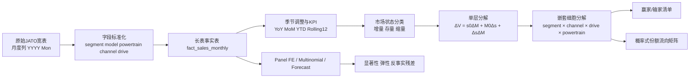
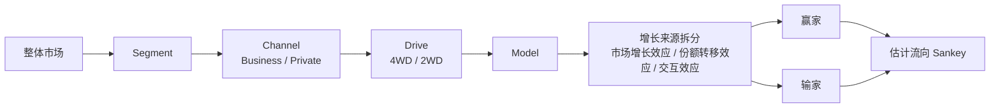
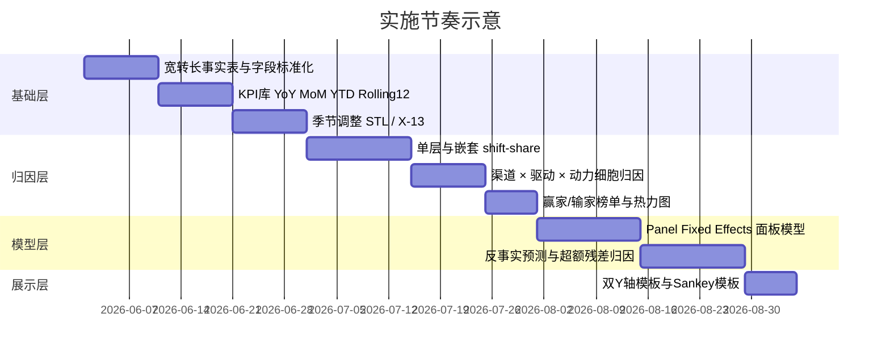

# JATO销量数据如何识别增量归属与份额转移

## 核心结论

按你的约束，本次调研只把 **主检索域限定为 `ojeur.cloud`**，连接器范围限定为 **GitHub**，且只使用仓库 **`tristan419/JATO_Analysis_System`**。从 `ojeur.cloud` 已公开可抓取页面和指定仓库代码看，你现在的平台已经具备不少“增量归因”的前置条件：站点已包含 *Market Overview / 市场总览*、*Segment Analysis / 细分市场*、*Brand Ranking / 品牌排名*、*Model Ranking / 车型排名*、*Powertrain Mix / 动力结构*；`Market Scan Deck` 已支持按国家、月份和动力组合切换；前端 `MarketScanPage.tsx` 也已经定义了 **month / YTD（Year to Date，年初至今）/ rolling12（Rolling 12 Months，近12个月）** 口径，后端/前端类型中已经有 `sharePct`、`yoy`、`mom`、`driveMix`、`registrationMix`、`channelMix`、`selectedTimeRange`、`customRangeActive` 等字段或结构。换句话说，你的问题不是“能不能做”，而是“先把**归因逻辑层**补齐，再决定哪些图形层要上”。 citeturn28search1turn28search2turn40view1turn44view2turn44view3turn56view0

最重要的结论是：**双Y轴不是分析引擎，只是展示控件；真正应该先上马的是季节性处理、市场状态分层、嵌套 shift-share（份额分解）、渠道与驱动细胞分析，以及固定效应面板回归。** 你现有前端已经在用 Plotly，而 Plotly 原生支持双Y轴、叠加多轴、Sankey（桑基图）和堆叠面积图，所以图形实现并不是障碍；统计方法层面，`statsmodels` 已提供 STL（Seasonal-Trend decomposition using LOESS，基于局部加权回归的季节-趋势分解）和 X-13 ARIMA（适用于月度或季度序列并可测试交易日效应）的接口，`linearmodels` 提供双向固定效应 `PanelOLS`，`statsmodels`/`scikit-learn` 也支持多项逻辑回归。也就是说：**先上“解释谁吃到了增长、谁在缩量里抢了份额”的模型，再上双Y轴和Sankey做表达。** citeturn40view1turn48view0turn49view0turn49view2turn49view1turn51view1turn51view2turn51view3turn51view4turn55view1

如果只给一个优先级判断，我的建议是：

| 优先级 | 是否建议上马 | 结论 |
|---|---|---|
| 季节调整、YoY/MoM、Rolling 12 | 必须 | 这是所有“增量/存量/缩量”判断的底座 |
| 嵌套 shift-share 归因 | 必须 | 这是回答“增量落到哪些 model”最直接、最稳的主方法 |
| 渠道 × 驱动细胞分析 | 必须 | 这是回答“大客户/零售、4WD/2WD 对份额变化影响”的关键 |
| Panel Fixed Effects 面板固定效应回归 | 强烈建议 | 用来检验渠道和驱动变量是否显著、方向是否稳定 |
| 反事实预测与残差归因 | 建议 | 适合解释 launch、招投标、政策窗口后的超额表现 |
| 双Y轴 | 选择性上 | 只用于“销量 + 份额”或“销量 + mix”对照，不应泛滥 |
| Sankey / 份额流向图 | 选择性上 | 用于讲故事很强，但本质上是对转移的**估计**而非直接观测 |
| DiD（Difference-in-Differences，双重差分）/ Synthetic Control（合成控制） | 条件式上 | 只有出现清晰外生事件时才值得重投入 |

## 现有平台与数据能力

`ojeur.cloud` 的可抓取公开页面显示，当前站点首页已经把 JATO 分析产品组织为市场总览、细分市场、品牌排名、车型排名和动力结构等模块；`Market Scan Deck` 页面摘要则明确写到“按国家、月份与动力组合切换市场扫描页”，并且支持 drilldown（下钻）到例如 SUV A0 这样的层级。这说明你的平台本来就不是纯“静态走势图”，而是已经有成体系的 deck 化分析入口。 citeturn28search1turn28search2


从指定仓库 README 可见，应用架构已经分成 `backend/app`、`frontend/src` 等部分，并且列出了后端接口如 `GET /v1/metadata/columns`、`GET /v1/metadata/filters`、`POST /v1/filters/options`、`POST /v1/analysis/query`，以及前端页面 `MarketOverviewPage.tsx`、`MarketBrandRankingPage.tsx`、`MarketModelRankingPage.tsx`、`MarketScanPage.tsx` 等。这意味着你不是在“从零做一个新分析系统”，而是在现有 API 和 deck 页面上加一层更强的归因逻辑即可。 citeturn15view1

再往前走一步看代码细节，`MarketScanPage.tsx` 已经明确引入了 `plotly.js` 类型、`LazyPlotlyChart` 组件，并定义了 `month`、`ytd`、`rolling12` 三种销量口径；而前端类型 `MarketScanMetadata`、`MarketScanSegmentPage`、`MarketScanRankingItem` 又已经暴露了 `selectedTimeRange`、`customRangeActive`、`selectedFuelTypes`、`selectedDrilldownSegment`、`channelMix`、`driveMix`、`registrationMix`、`mom`、`yoy` 等字段。这说明：**你现在缺少的主要不是字段，而是字段之间的系统性归因框架。** citeturn40view1turn44view2turn44view3turn45view0turn56view0

我在检查 `MarketScanPage.tsx` 时能确认页面使用 Plotly，但没有在这个文件里检出 `yaxis2`、`overlaying` 或 `Sankey` 字样；与此同时，Plotly 官方文档又明确支持双Y轴和 Sankey 图。所以更合理的判断是：**当前缺的是页面设计和分析叙事，不是图形库能力。** citeturn40view1turn39view0turn39view1turn39view2turn39view5turn51view1turn51view2turn51view3

## 从仓库抽出的数据模式

从仓库代码看，后端 `market_scan_service.py` 会先解析原始列名，识别国家、品牌、车型、细分市场、动力、车系、车身形式、驱动形式、注册类型，以及一系列月度列；随后把驱动形式标准化为 `4WD / 2WD / OTHER`，把注册类型标准化为 `Business / Private / Other`。前端类型再把这些基础字段包装成 `MarketScanMetadata`、`MarketScanRankingItem`、`MarketScanChannelMixWindow` 等结构。下面这两张表是按 **指定仓库代码** 而不是按猜测整理出来的。 citeturn21view0turn21view1turn22view3turn44view2turn44view3turn56view0

| 字段层 | 仓库字段 | 仓库类型/形态 | 业务含义 |
|---|---|---|---|
| 国家 | `country_value`, `country_label` | `str`, `str \| None` | 市场国家代码/显示名 |
| 品牌 | `make` | `str` | 品牌 |
| 车型 | `model` | `str` | 车型规整后的主分析主键 |
| 版本名 | `version` | `str \| None` | 版本/版型 |
| 配置 | `trim` | `str \| None` | trim / 配置层 |
| 车长 | `length` | `str \| None` | 产品带宽、价格带和尺寸定位分析输入 |
| MSRP | `msrp` | `str \| None` | 建议零售价或价格带 |
| 车系 | `origin` | `str \| None` | 欧系/日系/中系等来源标签 |
| 细分市场 | `segment` | `str` | 例如 `SUV-A0`、`SD-B` |
| 动力路线 | `powertrain` | `str` | ICE、MHEV、HEV、PHEV、BEV 等 |
| 车身形式 | `body_type` | `str \| None` | SUV / Sedan 等 |
| 驱动形式 | `drive_type` | `str \| None` | 原始驱动字段，后续会标准化 |
| 注册类型 | `registration_type` | `str \| None` | 原始注册/渠道字段，后续会标准化 |
| 月度销量列 | `month_columns` | `tuple[str, ...]` | 宽表形态的月销量列，格式是 `YYYY Mon` |

上述表来自后端 `ColumnMap` 字段定义与列解析逻辑；其中月度列通过 `YYYY Mon` 形式识别，之后会标准化为 `YYYY-MM` 这样的 period 文本。仓库预处理还会把部分维度列转成 category 类型，把年份列与月度列转成数值型，以便下游聚合和绘图。 citeturn21view0turn22view3

| 规范化/flags/响应层 | 仓库字段 | 类型/取值 | 业务含义 |
|---|---|---|---|
| 驱动规范化 | `4WD / 2WD / OTHER` | 分类值 | 用于四驱/两驱 mix 和 drive share 分析 |
| 渠道规范化 | `Business / Private / Other` | 分类值 | 用于零售/大客户 mix 和 channel share 分析 |
| 时间范围 flag | `selectedTimeRange` | `{start,end} \| null` | 自定义分析窗口 |
| 自定义窗口 flag | `customRangeActive` | `bool \| None` | 是否启用自定义区间 |
| 目标月份 | `requestedPeriod`, `resolvedPeriod`, `latestPeriod` | `string` | 用户请求月、实际使用月、最新可用月 |
| 同比/环比参考期 | `priorPeriod`, `sameMonthLastYearPeriod` | `string \| null` | 环比、同比对照窗口 |
| 选中动力 | `selectedFuelTypes` | `string[]` | 动力过滤器 |
| 下钻细分市场 | `selectedDrilldownSegment` | `string` | 当前 drilldown segment |
| 排名项销量 | `volume` | `number` | 排名项当前销量 |
| 排名项份额 | `sharePct`, `shareDisplay` | `number`, `string` | 市场份额 |
| 驱动份额 | `driveSharePct`, `driveShareDisplay` | `number`, `string` | 车型内四驱份额等摘要 |
| 先验销量 | `priorVolume`, `priorMonthVolume` | `number` | 去年同期/上月销量 |
| 增长指标 | `yoy`, `mom` | `MarketScanDelta` | 同比与环比 |
| 结构项 | `fuelMix`, `driveMix`, `registrationMix` | `Record<string, number>` | 各动力、驱动、渠道的结构分布 |
| 渠道窗口 | `channelMix.month/ytd/rolling12/customRange` | `MarketScanChannelMixWindow` | 渠道 mix 分析的不同口径窗口 |

仓库代码里，驱动标准化规则会把 `awd / 4wd / 4x4 / all wheel / quattro / xdrive` 等归入 `4WD`，把 `fwd / rwd / 2wd / front wheel / rear wheel / sdrive` 等归入 `2WD`；注册类型规则会把 `business / fleet / company / corporate / lease / rental` 归入 `Business`，把 `private / retail / personal / consumer` 归入 `Private`。这正好对应你关心的“大客户 vs 零售”和“4WD vs 2WD”分析主轴。 citeturn21view1turn21view2turn35view0turn35view2

一个很关键的限制也需要说清楚：**在我检查到的仓库数据模式里，没有客户级 switching、前序拥车、conquest/defection 之类的“谁从谁转化而来”的字段。** 所以你能从 JATO 月销量稳定识别的是“谁赢了份额、谁丢了份额”，但**一对一**“A 吃掉了 B 多少”通常只能做**同细胞内的概率式归因**，不能当作直接观测。这个边界必须在产品定义里写明，否则用户会误把 Sankey 当成真实交易流。 citeturn21view0turn44view2turn56view0

## 识别增量与份额转移的分析框架

我建议你把分析的最小稳定单元定义成：

**市场 × 月份 × segment × model × powertrain × registration_type × drive_type**

如果 granularity 想再深一层，可以加 `make / version / trim / body_type`，但一开始不要直接下钻到 trim，否则样本噪声会显著增加。你仓库里原始数据本质上是“维度列 + 月销量宽表列”，第一步应先把月度列转成长表 fact，后面所有同比、季调、shift-share、回归都基于这张长表做。仓库预处理逻辑已经为这一步准备好了月度列识别和类型优化。 citeturn21view0turn22view3

我建议的主分析流水线如下：

| 步骤 | 动作 | 产出 |
|---|---|---|
| 数据准备 | 宽表月度列转成长表，统一 `segment/model/powertrain/drive_type/registration_type` | `fact_sales_monthly` |
| 口径标准化 | 生成月环比、年同比、YTD、近12个月、份额、份额变化 | KPI 基础表 |
| 季节与日历调整 | 总市场、segment、重点 model 做 STL 或 X-13 | 季调销量、趋势项、残差项 |
| 市场状态分类 | 以 market / segment / channel / drive 细胞识别增量、存量、缩量 | 状态标签 |
| 份额归因 | 做单层与嵌套 shift-share 分解 | 增长效应、份额效应、交互效应 |
| 解释变量检验 | 面板固定效应回归、必要时多项逻辑回归 | 显著性、弹性、交互项 |
| 反事实 | 对重点车型做 baseline forecast，超额部分看 residual attribution | “超额赢份额”解释 |
| 诊断 | 自相关、异方差、聚类稳健标准误、回测误差 | 模型可信度板块 |

对月度数据，**同比（YoY，Year over Year，同比）** 和 **环比（MoM，Month over Month，月环比）** 是最基础的度量；`pandas.DataFrame.pct_change` 的定义就是“与前一元素的分数变化”。但对于汽车月度注册量，仅靠原始 MoM 很容易被季节性和交易日扰动，所以你至少要引入 **Rolling 12** 或季节调整后的趋势项。`statsmodels` 的 STL 可把序列分成季节、趋势和残差；X-13 ARIMA 接口则专门面向**月度或季度数据**，并可测试 outlier（异常值）和 trading day（交易日）效应。 citeturn51view0turn48view0turn49view0

真正回答“增量市场落到哪些 model 上”的核心，我建议不是先上回归，而是先上 **精确代数分解**。把某个分析单元内的单车型销量写成：

\[
V_{i,t} = s_{i,t}\cdot M_t
\]

其中 \(V_{i,t}\) 是车型 \(i\) 在时点 \(t\) 的销量，\(s_{i,t}\) 是该车型在该单元内的份额，\(M_t\) 是该单元总市场销量。则相对基期 \(0\) 的变化可以精确分解为：

\[
\Delta V_i = s_{i,0}\Delta M + M_0\Delta s_i + \Delta s_i \Delta M
\]

这三个部分可以直接命名为：

- **市场增长效应**：\(s_{i,0}\Delta M\)  
- **份额转移效应**：\(M_0\Delta s_i\)  
- **交互效应**：\(\Delta s_i \Delta M\)

这套式子很重要，因为它能把“我跟着市场一起长”与“我真正在抢别人份额”分开。比如在**增量市场**里，一个车型增长很快，并不一定说明它赢了；如果它的主要增量来自 \(s_{i,0}\Delta M\)，那只是“顺风”；如果主要来自 \(M_0\Delta s_i\)，那才是“抢份额”。同理，在**缩量市场**里，\(\Delta M<0\) 时，仍然能做到销量持平甚至增长的车型，一定是份额转移效应足够强。这个框架比仅看单线走势图强很多，而且完全可落地到你的现有字段体系上。 

把上式扩展到 **segment × channel × drive × powertrain** 的嵌套细胞 \(g\) 后，就得到你真正想要的业务答案：

\[
\Delta V_i = \sum_g \left(s_{i,g,0}\Delta M_g + M_{g,0}\Delta s_{i,g} + \Delta s_{i,g}\Delta M_g\right)
\]

这一步是决定你分析质量高低的关键。因为整个市场看似“平”，很可能 Business（大客户）在增长、Private（零售）在缩，或者 4WD（Four-Wheel Drive，四驱）在涨、2WD（Two-Wheel Drive，两驱）在跌；如果不分细胞，你会把大量真实的份额迁移误判成“市场没变化”。而仓库现有类型里已经有 `channelMix`、`driveMix`、`registrationMix`、`selectedTimeRange`、`customRangeActive` 和 drilldown segment 结构，这个方法与现有平台结构是对得上的。 citeturn44view2turn44view3turn56view0

下面这个流程图是我建议的主线：



对于“存量/缩量市场是谁吃掉了别人的份额”，推荐你在产品上分两层输出。第一层是**确定性层**：输出每个 model 在每个细胞中的份额转移效应 \(M_{g,0}\Delta s_{i,g}\)，把正值定义为 winner，把负值定义为 loser。第二层是**估计性层**：如果你非要做“谁吃掉了谁”的 Sankey，就只在同一个 `segment × channel × drive × powertrain` 细胞内做**概率式转移**，比如把赢家的正份额效应按输家负份额效应的比例去分摊。这样得到的是 “likely transfer” 而不是 “observed transfer”。这比直接跨全市场连一条大而化之的流向线可靠得多。 

## 方法库与模型设计

下面这张表给你一个可直接用于产品路线图的“方法 → 前提 → 输入字段 → 产出”的映射。

| 方法 | 最适合回答的问题 | 至少需要的字段 | 关键假设 | 优点 | 局限 | 推荐图 |
|---|---|---|---|---|---|---|
| 代数分解 / shift-share | 增量落到哪些 model；缩量里谁仍在涨 | `period, market, segment, model, sales, share` | 同一分析单元内份额可比较 | 快、稳、可解释性强 | 不直接给因果 | Waterfall、heatmap、赢家/输家表 |
| 嵌套 shift-share | 渠道和驱动对份额变化各贡献多少 | 上述字段 + `registration_type, drive_type, powertrain` | 细胞划分合理且容量足够 | 直接回答“大客户/四驱是否在托举” | 细胞过细时噪声会变大 | 分层 waterfall、stacked area、heatmap |
| 固定效应面板回归 `PanelOLS` | 渠道占比/四驱占比变化是否显著影响销量或份额 | 长表 + mix 特征 + lags | 组内变化有信息；遗漏变量由实体/时间效应吸收 | 能看显著性、方向、交互项 | 解释是“条件相关”，非天然因果 | coefficient plot、forest plot | 
| 多项逻辑回归 `MNLogit` / `LogisticRegression` | 哪类 model 更容易在某 segment-month 成为增长赢家 | 赢家标签 + 特征矩阵 | 样本量足够；类别定义合理 | 适合做“赢家画像” | 对线性可分和特征尺度较敏感 | odds ratio 图、胜率热图 |
| 反事实预测 + 残差归因 | 某车型本来应该卖多少；超额部分来自哪里 | 至少 24+ 月历史更佳 | 基准模型能刻画正常季节性和趋势 | 适合解释 launch、招标、政策窗口 | 对短历史和结构突变敏感 | actual vs forecast、residual bridge |
| STL / X-13 季调 | 去掉季节性后看真实趋势 | 月度历史序列 | 季节模式可识别 | 适合月度汽车注册量 | 太短样本下不稳 | decomposition chart |
| Granger 非因果检验 | 渠道占比/四驱占比的滞后变化是否先于销量变化 | 两条平稳或已差分的时序 | 滞后结构合理 | 适合做探索性先后关系判断 | 不是因果证明 | lag response chart |

`statsmodels` 官方文档说明，STL 能把序列分成季节、趋势和残差，X-13 ARIMA 适用于月度或季度数据，并支持 outlier 和 trading day 设置；`PanelOLS` 是一维/二维固定效应面板估计器；`MNLogit` 是 `statsmodels` 的多项 logit；`scikit-learn` 的 `LogisticRegression` 在多分类场景下，除 `liblinear` 外的求解器都可优化 multinomial loss；`statsmodels` 的 Granger 检验则是检验第二列时序的过去值是否能在控制第一列自身滞后后，对第一列当前值提供显著解释。 citeturn48view0turn49view0turn49view2turn49view1turn55view0turn55view1turn54view0

如果你真要做“渠道效应”和“驱动效应”的统计检验，我建议先建两个面板模型，而不是一上来就做很重的因果模型：

\[
\log(1+sales_{i,m,t}) = \beta_1 businessShare_{i,m,t}
+ \beta_2 fourwdShare_{i,m,t}
+ \beta_3 bevShare_{i,m,t}
+ \beta_4 businessShare \times fourwdShare
+ \alpha_i + \gamma_t + \epsilon_{i,t}
\]

\[
shareShift_{i,m,t} = \beta_1 businessShare_{i,m,t}
+ \beta_2 fourwdShare_{i,m,t}
+ \beta_3 segmentMix_{m,t}
+ \beta_4 channelGrowth_{m,t}
+ \alpha_i + \gamma_t + \epsilon_{i,t}
\]

其中 \(\alpha_i\) 是 model 固定效应，\(\gamma_t\) 是月份固定效应。如果是多市场数据，再加 country fixed effects（国家固定效应）或 country × month fixed effects（国家×月份固定效应）。标准误建议至少按 **model 聚类**，如果国家多、市场多，也可以按 **model × country 双层聚类**。`PanelOLS` 官方文档明确支持 entity effects、time effects 和 other effects。 citeturn49view2

我对“这些功能有必要上马吗”的判断是：

- **趋势分析**：必要，但前提是要先做季调，不然很多所谓“趋势”只是季节性。  
- **回归分析**：必要，但排在 shift-share 之后。先用分解定性定量说清“谁吃了增长”，再用回归验证“大客户占比 / 4WD 占比 / 动力路线”是否显著。  
- **双Y轴**：必要性中等。只在“销量 + 份额”“销量 + Business 占比”“销量 + 4WD 占比”这些强相关双变量场景使用。  
- **因果推断**：先别默认上。只有遇到像政策变化、某 fleet tender（大客户招标）、某驱动/动力版本上市、经销网络变化这类**外生事件**时，才值得做事件研究、双重差分或合成控制。  

为了便于你直接落地，我把关键代码骨架也写出来了。

```python
# pandas: 宽表转长表 + 标准字段
month_cols = [c for c in df.columns if c[:4].isdigit() and " " in c]

long_df = (
    df.melt(
        id_vars=["国家", "细分市场（按车长）", "Make", "车型规整", "动总规整",
                 "Driven wheels", "Registration type", "车系"],
        value_vars=month_cols,
        var_name="month_col",
        value_name="sales"
    )
    .rename(columns={
        "国家": "country",
        "细分市场（按车长）": "segment",
        "Make": "make",
        "车型规整": "model",
        "动总规整": "powertrain",
        "Driven wheels": "drive_type_raw",
        "Registration type": "registration_type_raw",
        "车系": "origin",
    })
)

long_df["period"] = pd.to_datetime(long_df["month_col"], format="%Y %b").dt.to_period("M").astype(str)
long_df["sales"] = pd.to_numeric(long_df["sales"], errors="coerce").fillna(0.0)
```

```sql
-- SQL: 基于已规范好的长表，做月度 model 聚合
SELECT
    country,
    period,
    segment,
    make,
    model,
    powertrain,
    drive_type,
    registration_type,
    SUM(sales) AS sales
FROM fact_sales_monthly
GROUP BY 1,2,3,4,5,6,7,8;
```

```python
# pandas: YoY / MoM / share
grp = ["country", "segment", "model"]
base = long_df.groupby(grp + ["period"], as_index=False)["sales"].sum()

base = base.sort_values(grp + ["period"])
base["mom"] = base.groupby(grp)["sales"].pct_change(1)
base["yoy"] = base.groupby(grp)["sales"].pct_change(12)

market = base.groupby(["country", "segment", "period"], as_index=False)["sales"].sum().rename(columns={"sales": "market_sales"})
base = base.merge(market, on=["country", "segment", "period"])
base["share"] = base["sales"] / base["market_sales"]
```

```python
# pandas: 单元内 shift-share 精确分解
key = ["country", "segment", "registration_type", "drive_type", "period", "model"]
cell_key = ["country", "segment", "registration_type", "drive_type", "period"]

x = fact.groupby(key, as_index=False)["sales"].sum()
cell = x.groupby(cell_key, as_index=False)["sales"].sum().rename(columns={"sales": "M"})
x = x.merge(cell, on=cell_key)
x["s"] = x["sales"] / x["M"]

x = x.sort_values(["country","segment","registration_type","drive_type","model","period"])
lag_cols = ["sales", "M", "s"]
for c in lag_cols:
    x[f"{c}_0"] = x.groupby(["country","segment","registration_type","drive_type","model"] if c != "M"
                            else ["country","segment","registration_type","drive_type"])[c].shift(12)

x["dV"] = x["sales"] - x["sales_0"]
x["dM"] = x["M"] - x["M_0"]
x["ds"] = x["s"] - x["s_0"]

x["market_growth_effect"] = x["s_0"] * x["dM"]
x["share_shift_effect"] = x["M_0"] * x["ds"]
x["interaction_effect"] = x["ds"] * x["dM"]
```

```python
# 赢家/输家对冲后的概率式份额转移矩阵（同一细胞内）
cell = x[(x["period"] == target_period)].copy()
winners = cell[cell["share_shift_effect"] > 0][["model", "share_shift_effect"]]
losers  = cell[cell["share_shift_effect"] < 0][["model", "share_shift_effect"]]

losers["loss_abs"] = -losers["share_shift_effect"]
total_loss = losers["loss_abs"].sum()

flow = (
    winners.assign(key=1)
    .merge(losers.assign(key=1), on="key", suffixes=("_win", "_lose"))
    .drop(columns="key")
)
flow["estimated_transfer"] = flow["share_shift_effect_win"] * flow["loss_abs"] / total_loss
```

```python
# Panel Fixed Effects: 份额转移效应回归
from linearmodels.panel import PanelOLS
import statsmodels.api as sm

panel = model_month_df.set_index(["model", "period"]).sort_index()
y = panel["share_shift_effect"]
X = panel[["business_share", "fourwd_share", "bev_share", "business_x_fourwd"]]
X = sm.add_constant(X)

res = PanelOLS(
    y, X,
    entity_effects=True,
    time_effects=True
).fit(cov_type="clustered", cluster_entity=True)

print(res.summary)
```

```python
# 多项逻辑回归：哪个 model 更可能成为增长赢家
from sklearn.linear_model import LogisticRegression

train = winner_df.copy()  # y: winner_label, X: business_share, fourwd_share, bev_share, segment dummies...
clf = LogisticRegression(
    solver="lbfgs",   # 多分类可用
    max_iter=500
)
clf.fit(train[X_cols], train["winner_label"])
```

```python
# Plotly：双Y轴示例（销量 + 份额）
from plotly.subplots import make_subplots
import plotly.graph_objects as go

fig = make_subplots(specs=[[{"secondary_y": True}]])
fig.add_trace(go.Bar(x=df["period"], y=df["sales"], name="销量"), secondary_y=False)
fig.add_trace(go.Scatter(x=df["period"], y=df["share"], name="份额"), secondary_y=True)
fig.update_yaxes(title_text="销量", secondary_y=False)
fig.update_yaxes(title_text="份额", secondary_y=True)
```

```python
# Plotly：Sankey（估计的份额流向）
import plotly.graph_objects as go

fig = go.Figure(go.Sankey(
    node=dict(label=node_labels),
    link=dict(source=source_idx, target=target_idx, value=values)
))
```

## 可视化方案与实施路线

既然你前端已经在用 Plotly，那么下一步的可视化建议应该按照“**解释任务**”而不是“图表炫不炫”来选。Plotly 官方文档明确支持双Y轴、多重 overlaying 轴、Sankey 和堆叠面积图；而你的 `MarketScanPage` 已经使用 Plotly 运行时，所以这些视图在技术上都能接。 citeturn40view1turn51view1turn51view2turn51view3turn51view4

| 图表 | 最适合回答的问题 | 推荐口径 | 是否优先 |
|---|---|---|---|
| 单Y折线 | 某 model / segment 的销量趋势 | 季调后销量、Rolling 12 | 高 |
| 双Y轴 | 销量与份额/Business占比/4WD占比是否同步变动 | 销量 + 份额，或销量 + mix | 中 |
| 堆叠面积图 | segment / channel / drivetrain mix 的结构变化 | share 或 volume share | 高 |
| Heatmap 热力图 | 哪些 segment×channel×drive 细胞在增长或掉份额 | `share_shift_effect` / `YoY` | 高 |
| Waterfall 瀑布图 | 增量是来自市场增长还是来自抢份额 | `market_growth_effect` vs `share_shift_effect` | 很高 |
| Sankey / 流向图 | 赢家大体从哪些 loser 里“吸走”份额 | 概率式 transfer | 中 |
| 趋势分解图 | 原始销量、趋势、季节、残差分别是什么 | STL / X-13 | 高 |
| 哑铃图 / 排名位移图 | 缩量市场里谁逆势上升、谁掉位 | rank + share change | 高 |

双Y轴我建议只保留三种模板，不要泛滥：  
第一，**销量 + 份额**；第二，**销量 + Business share（大客户占比）**；第三，**销量 + 4WD share（四驱占比）**。如果一张图一口气叠 5 条 model 折线再挂一个副轴，认知负担会非常高，反而损害判断质量。Plotly 的 multiple-axes 文档明确给出了 secondary y-axis 和 overlaying 的实现方式，所以它适合做“少量核心变量”的对照图，不适合做“高密度多线图”。 citeturn51view1turn51view2

我建议你把“份额转移”可视化分成两层：  
一层是 **真实可观察层**，直接看 `share_shift_effect` 的正负、大小、所在细胞；  
一层是 **估计流向层**，才做 Sankey。Plotly 的 Sankey 图对 `source / target / value / label` 结构支持完整，适合把“Business-4WD-SUV-A0”这类细胞里的赢家和输家串起来，但务必在标题或注释里写清楚是 estimated transfer（估计流向）而不是 observed switching（真实切换）。 citeturn51view3

下面给你两个直接可以拿去做产品宣讲或需求评审的 Mermaid 图。





最后给你一个务实的落地计划。

| 阶段 | 任务 | 工作量 | 需要输出 |
|---|---|---|---|
| 第一阶段 | 宽转长、字段标准化、月度 KPI 基础表 | 低 | `fact_sales_monthly`、YoY/MoM/YTD/R12 表 |
| 第一阶段 | `segment × model × channel × drive` 基础聚合 | 低 | 月度聚合表、Top winners/losers |
| 第二阶段 | 单层 shift-share + 嵌套 shift-share | 中 | 增长效应/份额效应/交互效应表、waterfall |
| 第二阶段 | 渠道与驱动细胞热图 | 中 | `channel_effect`、`drive_effect` dashboard |
| 第二阶段 | STL / X-13 趋势分解 | 中 | decomposition 图、季调序列 |
| 第三阶段 | Panel Fixed Effects 回归库 | 中到高 | 系数表、显著性、交互项解释 |
| 第三阶段 | 反事实预测与残差归因 | 高 | actual vs forecast、residual attribution |
| 展示增强 | 双Y轴模板、stacked area、Sankey | 低到中 | 3个标准图模板 |
| 条件增强 | DiD / 合成控制 | 高 | 仅用于政策、招标、上市事件专题 |

如果你问我“现在最值不值得做”的排序，我会给出一个非常清晰的答案：  
**先做长表化 + 季调 + 嵌套 shift-share + channel/drive 细胞归因；然后再做 fixed effects regression；双Y轴和 Sankey 放在第三顺位。** 因为前两层决定你能不能回答业务问题，第三层只是把答案讲得更好看。现有仓库和 `ojeur.cloud` 页面结构已经足以支撑这条路线，只差把“图”升级成“归因系统”。 citeturn28search1turn28search2turn15view1turn40view1turn44view2turn44view3turn56view0turn49view2turn51view1turn51view3