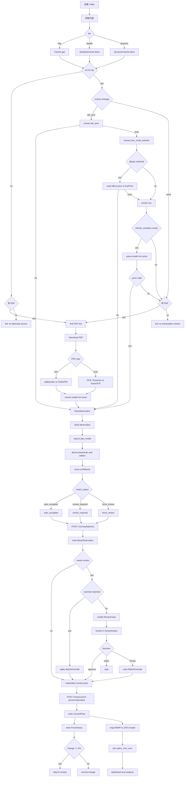

# MSRP SUV-Only Country Model Top 30 执行计划

Date: 2026-04-12

Status: 执行中 — Batch 1+2 keyword filling 完成 (206/629)，dry-run 通过 97/212 (45.8%)

Update: 2026-04-13 Volkswagen configurator 专项补充已记录；BE/DK/FR 子集已 promotion 到 sources，IT/FI 子集验证完成，SI/SK 与 PL 进入定向挂起。

---

## 0.1 2026-04-13 Volkswagen 暂存说明

### 已完成

- BE: Volkswagen ID.4 / T-Roc / Tiguan 已完成 production promotion to `07_ScrapingToolkit/sources/`，对应 draft 不再作为 batch_dryrun 待跑项。
- DK: Volkswagen ID.4 / T-Roc 已完成 production promotion to `07_ScrapingToolkit/sources/`，定向 dry-run 结果为 7/7、4/4。
- FR: Volkswagen T-Roc / Tiguan / T-Cross 已切到 trim-overview Playwright preset，定向 dry-run 结果为 4/4、7/7、6/6。
- FR: Volkswagen T-Roc / Tiguan / T-Cross 已完成 production promotion to `07_ScrapingToolkit/sources/`。
- IT: Volkswagen T-Roc / Tiguan / T-Cross 已切到 trim -> engine Playwright preset，定向 dry-run 结果为 5/5、24/24、12/12。
- FI: Volkswagen ID.4 / Tiguan / T-Cross / Taigo 已切到 numeric __app Playwright preset，并补上 OneTrust dismiss 支持，定向 dry-run 结果为 9/9、9/9、7/7、7/7。

### 暂存 / 后续

- SI / SK: Volkswagen 页面属于 Porsche configurator family，不再硬套当前 VW shared preset；后续单独抽一套 Porsche configurator shared preset 或 extractor。
- PL: Volkswagen 页面在 total price 区域混入 finance 月供文案；后续先把总价 MSRP 与 finance 月供做干净分离，再执行 YAML 转换。

> 这两项作为 handoff 保存在本计划中，后续恢复 Volkswagen backlog 时先按这里继续，不再重新判型。

---

## 1. 策略概述

### 1.1 范围定义

> **只覆盖 SUV 细分市场，每国 Top 30 畅销车型**，
> 用最小工作量拿到最有分析价值的价格数据。

**依据**: JATO 数据中 SUV segment 占各国新车销量 40-60%。覆盖 Top 30 即可代表大部分市场体量。

### 1.2 文件规模

| 类别          |                                            数量 |
| ------------- | ----------------------------------------------: |
| 国家          |                                              21 |
| 每国 YAML     |             ~30（Top 30 车型，少数国家不足 30） |
| 总 draft YAML |                                             629 |
| 存放目录      | `source_drafts/suv_only_country_model_top30/` |

### 1.3 每个 YAML 的标准化流程

```
scaffold 生成 → keyword filling → CSS selector 填充 → dry-run 测试 → promotion to sources/
```

| 阶段              | 自动化程度  | 说明                                              |
| ----------------- | ----------- | ------------------------------------------------- |
| scaffold 生成     | 全自动      | `source_bootstrap.py`，已完成全部 626 个        |
| keyword filling   | 半自动      | 按国家执行脚本，需要人工提供本地化关键词          |
| CSS selector 填充 | 手动/半自动 | Playwright 检查页面结构，同品牌跨国可复用         |
| dry-run 测试      | 全自动      | `run.py --dry-run`，validation pipeline         |
| promotion         | 手动        | 验证通过后从 `source_drafts/` 移入 `sources/` |

---

## 2. 国家批次划分

### Batch 1 — dry-run 完成 ✅

| ISO | 国家     | 文件数 | 货币 | Keyword | CSS/URL 修复 | Dry-run                 |
| --- | -------- | -----: | ---- | ------- | ------------ | ----------------------- |
| SE  | 瑞典     |     29 | SEK  | ✅      | ✅ 多品牌    | **21/29** (72.4%) |
| HR  | 克罗地亚 |     30 | EUR  | ✅      | 部分         | **5/30** (16.7%)  |

### Batch 2 — dry-run 完成 ✅

| ISO | 国家   | 文件数 | 货币 | Keyword | CSS/URL 修复 | Dry-run                 |
| --- | ------ | -----: | ---- | ------- | ------------ | ----------------------- |
| HU  | 匈牙利 |     31 | HUF  | ✅      | ✅ 多品牌    | **16/31** (51.6%) |
| NO  | 挪威   |     30 | NOK  | ✅      | ✅ 多品牌    | **13/30** (43.3%) |
| AT  | 奥地利 |     31 | EUR  | ✅      | ✅ 多品牌    | **8/31** (25.8%)  |
| CZ  | 捷克   |     30 | CZK  | ✅      | ✅ 多品牌    | **19/30** (63.3%) |
| CH  | 瑞士   |     31 | CHF  | ✅      | ✅ 多品牌    | **15/31** (48.4%) |

### Batch 3 — 待执行

| ISO | 国家       | 文件数 | 货币 | Keyword | CSS Selector | Dry-run |
| --- | ---------- | -----: | ---- | ------- | ------------ | ------- |
| SI  | 斯洛文尼亚 |     30 | EUR  | ⬜      | ⬜           | ⬜      |
| RO  | 罗马尼亚   |     30 | RON  | ⬜      | ⬜           | ⬜      |

### Batch 4 — 批量执行

| ISO | 国家   | 文件数 | 货币 | Keyword | CSS Selector | Dry-run |
| --- | ------ | -----: | ---- | ------- | ------------ | ------- |
| DE  | 德国   |     30 | EUR  | ⬜      | ⬜           | ⬜      |
| FR  | 法国   |     30 | EUR  | ⬜      | △ VW 子集已完成 | △ VW 子集已 promotion |
| IT  | 意大利 |     30 | EUR  | ⬜      | ⬜           | ⬜      |
| ES  | 西班牙 |     30 | EUR  | ⬜      | ⬜           | ⬜      |
| NL  | 荷兰   |     30 | EUR  | ⬜      | ⬜           | ⬜      |
| BE  | 比利时 |     30 | EUR  | ⬜      | △ VW 子集已完成 | △ VW 子集已 promotion |
| PL  | 波兰   |     30 | PLN  | ⬜      | ⬜           | ⬜      |
| DK  | 丹麦   |     30 | DKK  | ⬜      | △ VW 子集已完成 | △ VW 子集已 promotion |
| FI  | 芬兰   |     30 | EUR  | ⬜      | ⬜           | ⬜      |
| PT  | 葡萄牙 |     30 | EUR  | ⬜      | ⬜           | ⬜      |
| IE  | 爱尔兰 |     30 | EUR  | ⬜      | ⬜           | ⬜      |
| GB  | 英国   |     30 | GBP  | ⬜      | ⬜           | ⬜      |

---

## 3. 进度汇总

```
                      Keyword Filling         CSS/URL 修复        Dry-run OK
Batch 1 (2国/59文件)   ██████████ 100%        ████████░░  80%     ████░░░░░░  44% (26/59)
Batch 2 (5国/153文件)  ██████████ 100%        ██████░░░░  60%     █████░░░░░  46% (71/153)
Batch 3 (2国/60文件)   ░░░░░░░░░░   0%        ░░░░░░░░░░   0%     ░░░░░░░░░░   0%
Batch 4 (12国/360文件) ░░░░░░░░░░   0%        ░░░░░░░░░░   0%     ░░░░░░░░░░   0%
────────────────────────────────────────────────────────────────────────────
总计 (21国/632文件)     ███░░░░░░░  33%        ██░░░░░░░░  ~15%    ██░░░░░░░░  15% (97/632)
```

> 注：Batch 1+2 的 212 个 source 中 97 个 dry-run 通过（45.8%），剩余 115 个多数为品牌官网不可用或无结构化价格数据。

---

## 4. 汇率自动转换

| 项目                   | 说明                                                |
| ---------------------- | --------------------------------------------------- |
| 模块                   | `jato_scraper/currency_converter.py`              |
| 主 API                 | `open.er-api.com/v6/latest/EUR`（ECB 数据，免费） |
| 备用 API               | `api.exchangerate-api.com/v4/latest/EUR`          |
| 缓存                   | 单次 run 只请求一次，会话级缓存                     |
| 新 RawObservation 字段 | `msrp_value_eur`, `fx_rate_to_eur`              |
| EUR 区国家             | rate=1.0，无需 API 调用                             |
| 已验证货币             | SEK (10.8680), CZK, HUF, NOK, CHF, EUR              |

---

## 5. CSS Selector 填充策略（计划中）

### 5.0 提取管线全流程图



### 5.1 核心思路

同品牌不同国家市场的官网结构通常高度相似。利用这一点，可以按品牌模板 "一次适配、跨国复用"：

```
适配 Volvo SE selector → 复用到 Volvo NO/HR/AT/... → 微调差异
适配 BMW DE selector  → 复用到 BMW AT/CH/NL/...  → 微调差异
```

### 5.2 品牌可行性（基于 dry-run 验证）

| 可行性    | 品牌         | 提取方式                  | 覆盖市场             | 备注                                                                      |
| --------- | ------------ | ------------------------- | -------------------- | ------------------------------------------------------------------------- |
| ✅ 已验证 | Toyota       | ld+json (Vehicle)         | SE/CZ/HU/NO/CH/HR/AT | 最可靠，跨市场一致                                                        |
| ✅ 已验证 | Volvo        | ld+json (Product)         | SE/CZ/HU/NO/CH/AT    | CSS `[data-testid]`                                                     |
| ✅ 已验证 | Skoda        | ld+json (Vehicle)         | SE/CZ/CH/NO          | URL 已重构 `/modely/X/X`                                                |
| ✅ 已验证 | KIA          | ld+json (Product)         | SE/CZ/NO             | `hyundai.com` 子域                                                      |
| ✅ 已验证 | Hyundai      | ld+json (Product)         | SE/CZ/NO/CH          | `hyundai.com/{cc}`                                                      |
| ✅ 已验证 | Dacia        | ld+json (Product)         | AT/CZ/HU/CH          | `de.dacia.ch` 等                                                        |
| ✅ 已验证 | Ford         | CSS `.dse-price-module` | AT/CZ/HU/NO          | 跨国一致                                                                  |
| ✅ 已验证 | Peugeot      | CSS `.font-21`          | SE                   | 仅 SE 验证                                                                |
| ✅ 已验证 | Nissan       | ld+json / CSS             | HU/NO                | 部分市场                                                                  |
| ✅ 已验证 | Opel         | CSS（两种模式）           | HU/HR                | HU `.q-value`，HR `.wl-font-36`                                       |
| ✅ 已验证 | Mercedes     | ld+json (Product)         | SE/HU/AT/CH          | SE EQA, AT GLC/EQA, CH GLA/GLE/EQA; HR/NO/CZ 不可用                       |
| ✅ 已验证 | Renault      | ld+json                   | CZ/HU                | 仅部分市场                                                                |
| ❌ 不可用 | Tesla        | 403 Forbidden             | 全部                 | 反爬严格                                                                  |
| ❌ 不可用 | VW           | styled-components         | 大部分               | 仅 SE Tiguan 有 ld+json; ID.4/T-Roc/Tayron 仅 FAQPage                     |
| ❌ 不可用 | BMW          | 无价格 ld+json            | 全部                 | 页面200但仅 VideoObject; URL `/sv/alla-modeller/x-serie/x1/bmw-x1.html` |
| ❌ 不可用 | Audi         | 404 / 无价格              | 大部分               | 同上                                                                      |
| ❌ 不可用 | CUPRA/SEAT   | 404                       | 大部分               | 站点结构不稳定                                                            |
| ❌ 不可用 | MG/Geely/BYD | 连接失败/SSL              | 大部分               | 中国品牌海外站不稳定                                                      |

### 5.2.1 PDF 价目表回退通道（VW Group）

网页爬取失败的品牌，可通过官方 PDF 价目表获取 MSRP。已发现 VW Group（Porsche Holding）在奥地利市场提供统一的 PDF CDN：

| 品牌    | 型号  | 获取方式                             | PDF 文件                                         |
| ------- | ----- | ------------------------------------ | ------------------------------------------------ |
| Audi AT | Q8    | `/q8/q8/preisliste` 页面           | `2145_audi_q8_pa_katalog_inkl__preisliste.pdf` |
| Audi AT | Q3    | `/q3/q3/preisliste` 页面           | `2503_q3_preisliste_final.pdf`                 |
| SEAT AT | Arona | `/kataloge-preislisten/arona` 页面 | `arona_neu_dupl.pdf`                           |
| SEAT AT | Ateca | `/kataloge-preislisten/ateca` 页面 | `ateca_dupl.pdf`                               |

**CDN 模式**:

```
https://gpt-live.porsche.co.at/at/brand/{BRAND_CODE}/pricelist/{FILENAME}.pdf
https://porschegpt-prod.etn.cz/at/brand/{BRAND_CODE}/pricelist/{FILENAME}.pdf
```

- 品牌代码: `A`=Audi, `S`=SEAT, 推测 `V`=VW, `C`=CUPRA, `K`=Skoda
- Porsche Holding = VW Group 奥地利分销商，统一承载所有 VW 集团品牌价目表
- **提取方案**: pdfplumber 文本型 PDF → 表格解析 → 提取 model/trim/price → RawObservation

**未发现 PDF 的品牌**: BMW（404）、Tesla（403）、Hyundai（404）、BYD/MG/Geely（无价目表页面）

### 5.3 工具链

- **CSS Selector Toolchain**: `jato_scraper/css_toolchain/` 提供交互式 Playwright inspector 脚本
- **Playwright codegen**: 可录制浏览器操作自动生成 selector
- **dry-run 验证**: `python run.py --sources <yaml> --dry-run -v` 即时验证

---

## 6. 与旧计划的关系

本文档 **替代** 之前的 `MSRP_COUNTRY_BRAND_SOURCE_PRIORITY_PLAN_2026-04-11.md`。

| 维度       | 旧计划 (04-11)                 | 新计划 (04-12)                   |
| ---------- | ------------------------------ | -------------------------------- |
| 范围       | 国家 × 品牌系族               | SUV-only × country model top 30 |
| 批次单位   | 10 个 brand-family source 每批 | 按国家分批                       |
| draft 数量 | 估算 ~1000+                    | 实际 626                         |
| 汇率       | Frankfurter API（未集成）      | open.er-api.com（已集成并验证）  |
| 状态       | 已归档                         | 当前执行中                       |

---

## 7. Dry-run 详细结果（2026-04-12）

### 7.1 各市场通过清单

| 市场 | 通过率                  | 通过品牌                                                                           |
| ---- | ----------------------- | ---------------------------------------------------------------------------------- |
| SE   | **21/29** (72.4%) | KIA×4, Skoda×2, Toyota×4, Volvo×6, VW Tiguan, Peugeot×3, Mercedes EQA         |
| CZ   | **19/30** (63.3%) | Dacia×2, Ford×2, Hyundai×2, KIA×2, Renault, Skoda×5, Toyota×3, Volvo×2      |
| HU   | **16/31** (51.6%) | Dacia×2, Ford×2, Mercedes EQA, Nissan×2, Opel, Renault, Toyota×5, Volvo×2     |
| NO   | **13/30** (43.3%) | Hyundai×2, KIA, Nissan, Peugeot, Skoda×2, Toyota, Volvo×3, Ford×2              |
| CH   | **15/31** (48.4%) | Dacia×2, Hyundai×2, Mercedes EQA/GLE, Skoda×4, Toyota×2, Volvo×2              |
| AT   | **8/31** (25.8%)  | Dacia×2, Ford Puma, Mercedes EQA/GLC, Peugeot 3008, Toyota Yaris Cross, VW Tiguan |
| HR   | **5/30** (16.7%)  | Nissan, Opel, Toyota×3                                                            |

### 7.2 修复手段总结

| 修复类型           | 数量 | 示例                                                                |
| ------------------ | ---: | ------------------------------------------------------------------- |
| URL 域名/路径修正  |  ~25 | Dacia `www→de.dacia.ch`，Skoda `/modely/X→/modely/X/X`        |
| CSS 提取策略新增   |  ~12 | Ford `.dse-price-module`，Peugeot `.font-21`，Opel `.q-value` |
| ld+json @type 扩展 |    1 | 支持 Vehicle/AggregateOffer/IndividualProduct                       |
| lowPrice fallback  |    1 | VW AggregateOffer `offers.lowPrice`                               |
| HTML 标签清洗      |    1 | CSS `.get()` 返回 HTML，需 `_HTML_TAG_RE.sub()`                 |

### 7.3 确认不可用的品牌

> 以下品牌经 2026-04-12 多轮 StealthyFetcher 探测确认不可用，已尝试所有已知 URL 模式。

| 品牌                   | 失败原因           | 探测详情                                                                                              |
| ---------------------- | ------------------ | ----------------------------------------------------------------------------------------------------- |
| Tesla                  | 403 Forbidden      | 官网+库存 API 均返回 403                                                                              |
| BMW                    | 页面无价格 ld+json | 页面 200 OK 但 ld+json 仅有 VideoObject(5-8块); URL 路径 `/sv/alla-modeller/x-serie/x1/bmw-x1.html` |
| Audi                   | 301 重定向         | q4-e-tron 等页面 301 到非价格页                                                                       |
| CUPRA                  | 404/308            | formentor/terramar 均 308 重定向或 404                                                                |
| SEAT                   | 404                | 所有尝试的 URL 均 404                                                                                 |
| Polestar               | 无价格 ld+json     | 页面 200 OK, ld+json 仅 VideoObject/BreadcrumbList; h2 有租赁价 "5 495 kr/mån" 但非 MSRP             |
| Mazda                  | 无可提取价格       | SE/CZ 页面 200 OK 但无 ld+json, CSS 仅有配置器按钮                                                    |
| VW (非 Tiguan)         | 无 Vehicle ld+json | ID.4/T-Roc/Tayron 页面 200 OK 但 ld+json 仅 FAQPage; body 中 "kr" 均为租赁价                          |
| MG/Geely/BYD           | 连接失败/SSL       | 中国品牌海外站不稳定                                                                                  |
| Porsche                | 无价格             | 配置器模式，无标准 DOM 价格                                                                           |
| Xpeng/Jaecoo/KGM/OMODA | 连接失败           | 新品牌海外站点不稳定                                                                                  |

### 7.4 DynamicFetcher (Playwright 全渲染) 实验结果

现有 dry-run 使用 `tier: stealth` (StealthyFetcher)。对标记为"不可用"的品牌，切换 `tier: dynamic` (DynamicFetcher, Playwright 全渲染) 重新探测：

#### VW — 已发现价格

| 车型     | 市场 | stealth 结果         | dynamic 结果                    | 发现价格         |
| -------- | ---- | -------------------- | ------------------------------- | ---------------- |
| VW ID.4  | SE   | ❌ 仅 FAQPage ld+json | ✅ DOM 含 PriceVatIncluded 属性 | **538,700 SEK**  |
| VW T-Roc | SE   | ❌ 仅 FAQPage ld+json | ✅ DOM 含 PriceVatIncluded 属性 | **389,900 SEK**  |

价格藏在 JS 渲染后的 DOM data 属性结构中：

```json
{"PriceVatIncluded", "label": "Pris från", "value": "538 700"}
```

**操作计划**：
1. VW SE 全系 YAML 配置 `tier: dynamic`
2. 新增提取规则匹配 `PriceVatIncluded` data 属性 → `attr_json` 或 CSS 策略
3. 验证后可推广至 VW 其他市场 (NO/CZ/HU/CH)

#### 其他品牌 — DynamicFetcher 仍无法突破

| 品牌  | 市场 | dynamic 结果               | 判定          |
| ----- | ---- | -------------------------- | ------------- |
| BMW   | SE   | 200 OK 但仅通用数字无 MSRP | ❌ 不可突破   |
| Tesla | SE   | 403 Forbidden              | ❌ 反爬严格   |
| VW    | AT   | 404 页面不存在             | ❌ URL 失效   |
| BMW   | AT   | 404 页面不存在             | ❌ URL 失效   |
| Audi  | AT   | 404 页面不存在             | ❌ URL 失效   |

#### 预期提升

VW 切换 dynamic 后，理论上可补回一部分此前失败的 YAML（重点是 ID.4、T-Roc、Tayron、T-Cross 一类页面），但具体增幅必须以复跑结果为准，不能直接把实验样本外推成正式通过率。

### 7.5 LLM 集成评估

当前工具箱中 **无任何 LLM 集成代码**。以下为各场景评估：

| 应用场景                 | 方案                                    | 可行性  | ROI  | 备注                                          |
| ------------------------ | --------------------------------------- | ------- | ---- | --------------------------------------------- |
| PDF 表格理解             | LLM 解析 OCR输出 → 结构化价格表        | ✅ 高   | ⭐⭐⭐ | VW Group AT 大量 PDF，人工 pdfplumber 成本高  |
| 非结构化 HTML 提取       | LLM 分析渲染后 DOM → 定位价格节点       | ⚠️ 中等 | ⭐⭐  | BMW/Mazda 等有页面但无结构化数据的品牌        |
| CSS Selector 自动建议    | LLM 分析页面 → 推荐 selector            | ✅ 高   | ⭐⭐  | 加速新品牌适配，减少手工 Playwright 调试      |
| 品牌/车型名模糊对齐      | LLM 匹配 source name → JATO model code | ⚠️ 中等 | ⭐   | confidence 低时辅助 human review              |

**建议优先级**：PDF 解析 (P1) → DynamicFetcher VW 适配 (P1) → LLM HTML 提取 (P2) → CSS 自动建议 (P3)

### 7.6 Batch 1+2 落地策略

Batch 1+2 不必等到 dry-run 全绿后再入系统。当前后端已经支持“先落 observation，再走 review”的链路，和 XC60 的处理思路一致。

#### 路径 A：现有 valid observation 直接入库

- 入口脚本：`03_Scripts/batch_ingest.py`
- 行为：对指定国家重新执行非 dry-run 抓取
- 条件：只要某个 source 产出 `report.valid`，就会 `POST /v1/msrp/batches`
- 结果：
    - `auto_accepted` 直接写入 `CurrentPrice`
    - `review_required` 自动创建 `ReviewCase`
    - `override_applied` 自动复用历史规则

这条路适合已经能抽到价格、但匹配信心不足的样本。它们不需要继续卡在 scraper 侧，可以先进系统审核。

#### 路径 B：人工整理价格后手工入批次

对网页抓不到、但 PDF 或人工核验能拿到价格的品牌，可跳过 scraper DOM 提取，直接构造 observation payload 提交到 `POST /v1/msrp/batches`。

适用对象：

- VW Group AT 的 PDF 价目表
- 其他能人工确认 MSRP、但网页结构不稳定的样本

建议做法：

1. 先把 PDF 或人工采集结果整理成结构化表
2. 将 `match_status` 统一打成 `review_required`
3. 批量入库后在 `review/cases` 页面集中审核

这条路本质上是把“抓取问题”与“业务审核”拆开，先保证数据能进系统。

#### 路径 C：按品牌白名单推进国家落地

Batch 1+2 建议不要按“国家全量是否完成”推进，而是按“品牌白名单”推进：

- 第一组：Toyota / Dacia / Skoda / Volvo / Ford
- 第二组：Mercedes / Hyundai / KIA / Peugeot / Nissan / Opel
- 第三组：VW dynamic 试点

这样可以先把确定性高的 observation 批量导入，尽快让各国在系统里出现可审核数据，而不是被 Tesla、BMW、Audi 这类难点品牌拖住整国进度。

#### 推荐执行顺序

1. 先用 `batch_ingest.py` 导入 Batch 1+2 已经有 valid observation 的国家和品牌
2. 再把 VW dynamic 试点补进去，观察能否新增一批 review case
3. 对 PDF 可得品牌，补一条“人工整理后入库”的旁路
4. 在前端 review workbench 中集中做 remap / approve / reject

---

## 8. 近期里程碑

| 里程碑 | 目标                                      | 状态                       |
| ------ | ----------------------------------------- | -------------------------- |
| M1     | Batch 1+2 keyword filling (7 国 206 文件) | ✅ 已完成                  |
| M2     | Batch 1+2 CSS/URL 修复 + dry-run          | ✅ 已完成 (97/212 = 45.8%) |
| M3     | 通过 source promotion to `sources/`     | 待启动                     |
| M4     | Batch 3 keyword filling (SI + RO)         | 待启动                     |
| M5     | Batch 4 keyword filling (12 国)           | 待启动                     |
| M6     | 全部 626 个 draft YAML dry-run pass       | 长期目标                   |
