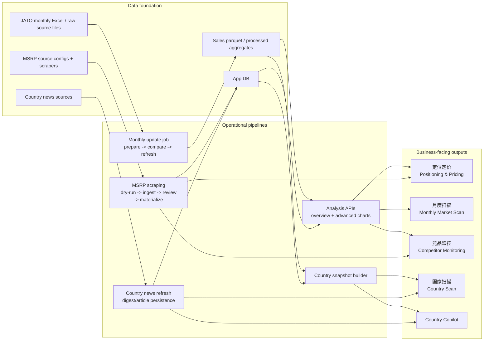
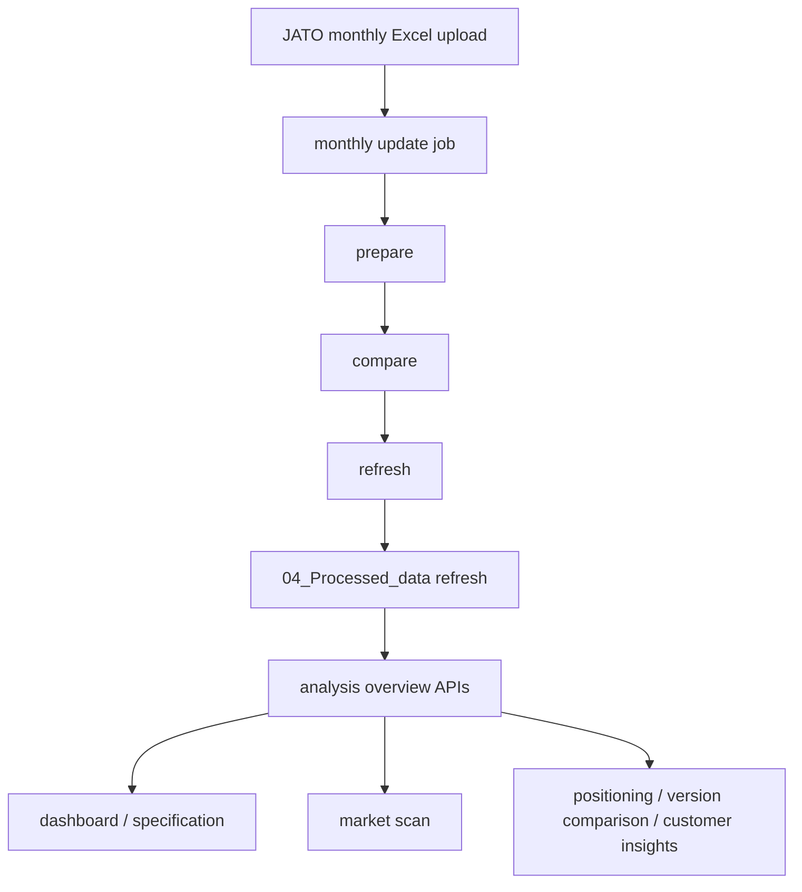
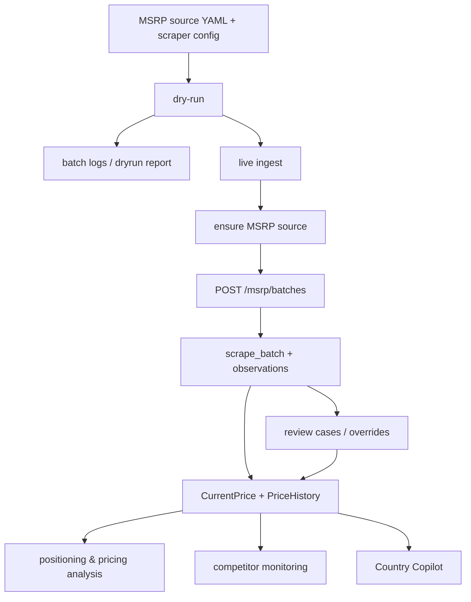
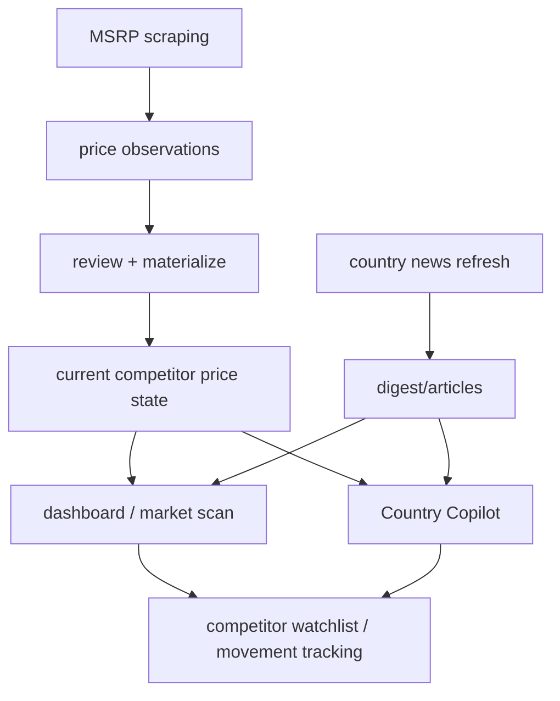
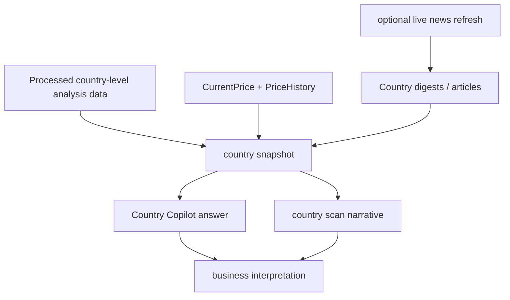

# Business Pipeline Workflows

This document explains the system from a **business workflow** perspective instead of a repository/module perspective.

The goal is to answer:

- How JATO monthly import becomes analysis-ready data
- How MSRP scraping becomes pricing intelligence
- How sales + prices become positioning/pricing analysis
- How monthly scan and competitor monitoring are implemented
- How country scan and Copilot are grounded by data, prices, and news

---

## 1. Business capability to pipeline map

---

## 2. Business work decomposition table

| Business work | Core business question | Main data inputs | Pipeline implementation | Product surface |
| --- | --- | --- | --- | --- |
| JATO monthly import | How do we refresh the sales/market baseline for the latest month? | Monthly JATO Excel, raw source files | Upload -> monthly update job -> prepare / compare / refresh -> processed dataset refresh | Monthly update page, downstream dashboard/chart pages |
| Positioning & pricing | Where are we positioned by segment/brand/model/version and what should the pricing logic look like? | Processed sales data, current MSRP, review/materialized price history | Analysis APIs + MSRP workflow + advanced chart / deck generation | Positioning/Pricing pages, Market Scan, Version Comparison |
| Monthly market scan | What changed this month in market structure, pricing, versions, and trends? | Refreshed processed dataset, current price state | Monthly import refresh + overview/advanced APIs + market-scan page logic | Dashboard, Market Scan, Customer Insights |
| Competitor monitoring | What are competitors doing on price, lineup, and signal/news level? | MSRP scraping, review cases, current prices, country news digests | Scrape -> ingest -> review/materialize + news refresh + analysis pages | MSRP, Review, Dashboard, Copilot |
| Country scan | What is happening in one country across market, prices, and current news? | Processed country snapshot, DB prices, country digests/articles | Country snapshot builder + optional news refresh + grounded country chat | Country Copilot, country-level analysis pages |

---

## 3. JATO import -> monthly scan

Business meaning:

- This is the baseline refresh path.
- Once the monthly dataset is refreshed, all downstream scan and comparison work becomes updated.

---

## 4. MSRP -> pricing intelligence

Business meaning:

- MSRP is not useful at scrape time alone.
- It becomes business-usable only after ingest, review/override, and materialization into current/historical price state.

---

## 5. Positioning & pricing workflow

Business meaning:

- Sales data provides market structure.
- MSRP provides the live/historical pricing layer.
- Advanced analysis pages convert those inputs into an actionable positioning/pricing decision.

---

## 6. Competitor monitoring workflow

Business meaning:

- Competitor monitoring is not one page.
- It is the combination of **current price state** plus **fresh news signal** plus **analytical views**.

---

## 7. Country scan and Copilot workflow

Business meaning:

- Country Copilot is grounded on structured market data first.
- News and price state enrich the scan so it can answer practical country-level questions instead of generic chat.

---

## 8. Practical reading order for business users

1. Start with **JATO monthly import -> monthly scan**
2. Then read **MSRP -> pricing intelligence**
3. Then read **Positioning & pricing workflow**
4. Then read **Competitor monitoring workflow**
5. Finish with **Country scan and Copilot workflow**

That order matches the business logic:

1. refresh baseline
2. refresh price layer
3. analyze position/pricing
4. watch competitors
5. explain one country deeply

