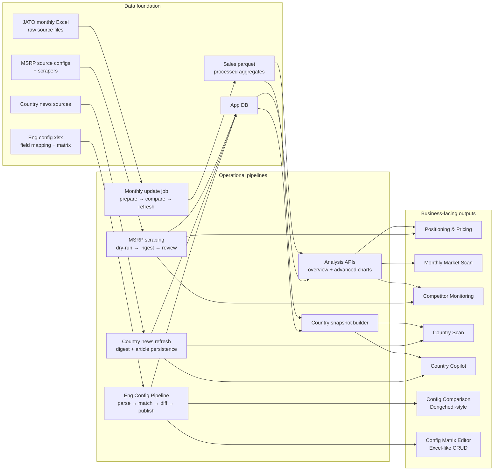
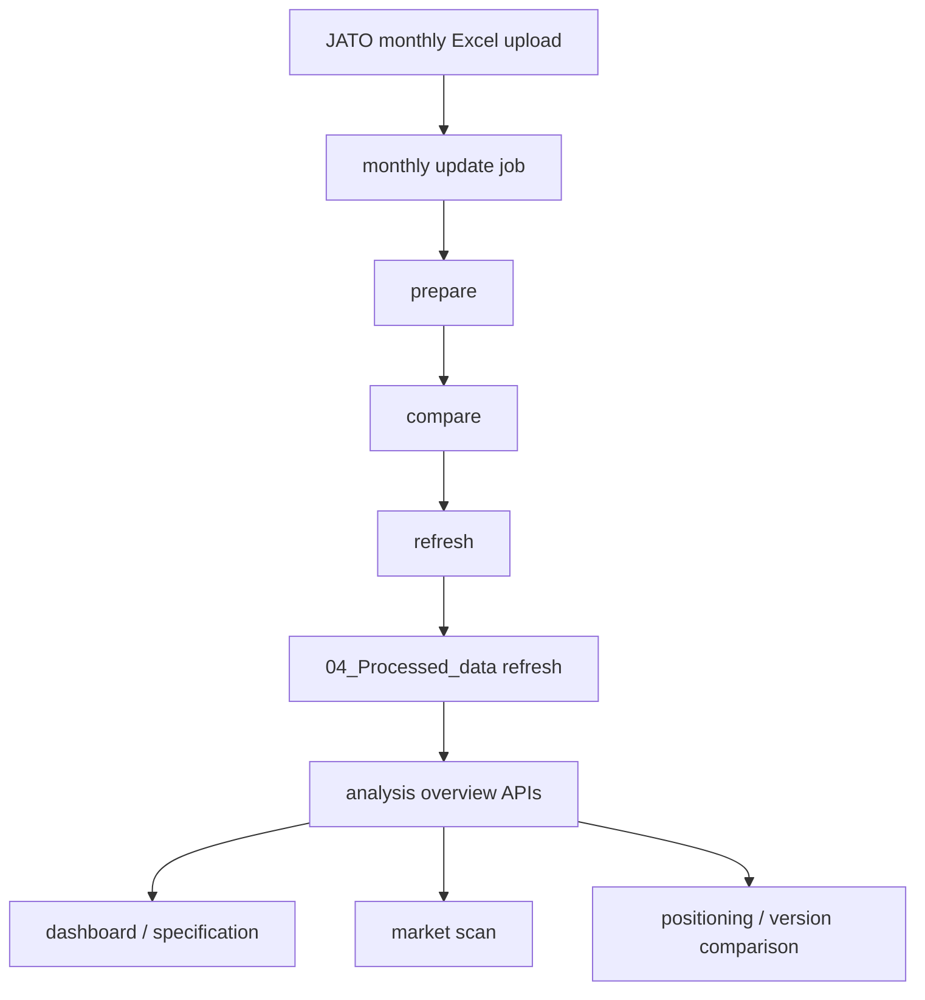
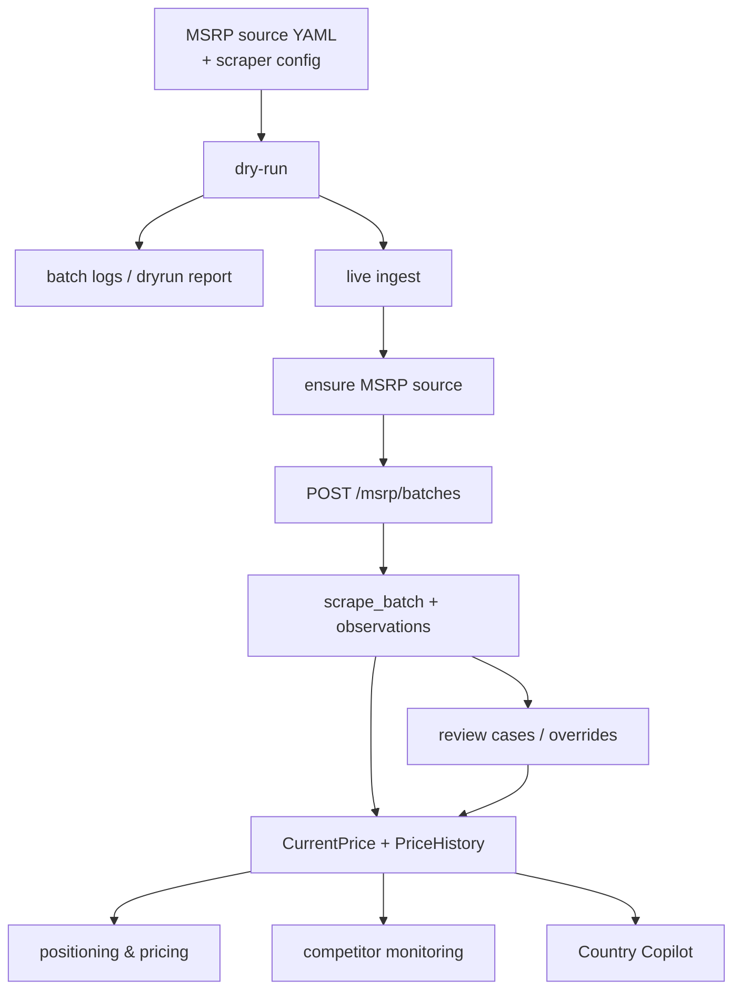
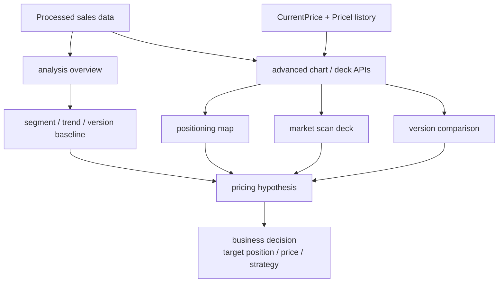
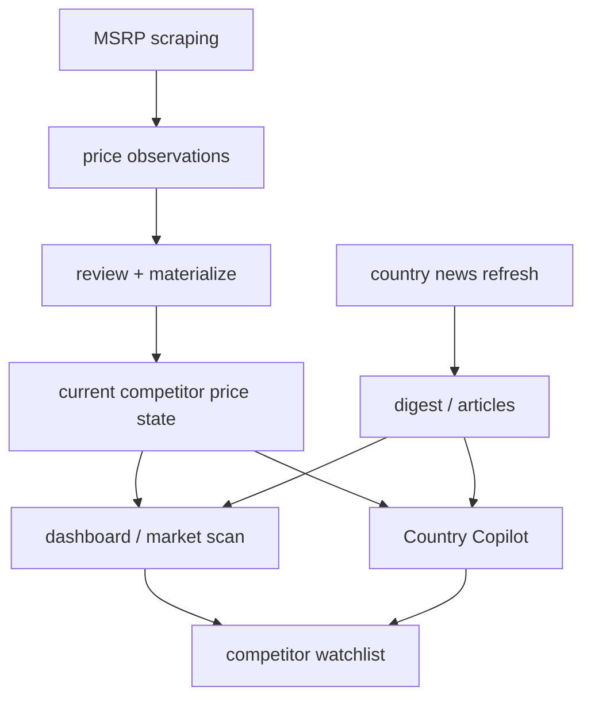
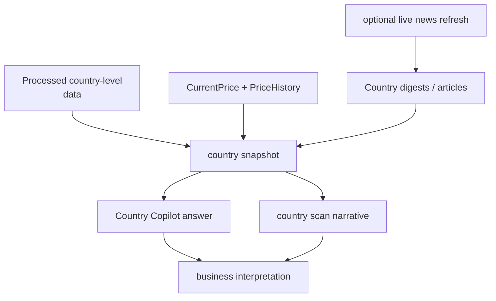
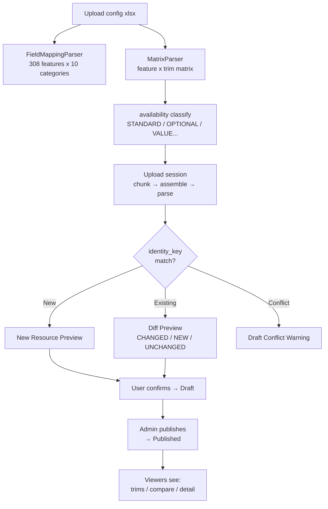

# Business Pipeline Workflows

This document explains the system from a **business workflow** perspective instead of a repository/module perspective.

The goal is to answer:

- How JATO monthly import becomes analysis-ready data
- How MSRP scraping becomes pricing intelligence
- How sales + prices become positioning/pricing analysis
- How monthly scan and competitor monitoring are implemented
- How country scan and Copilot are grounded by data, prices, and news
- How vehicle engineering configurations are managed and compared

---

## 1. Business capability to pipeline map

---

## 2. Business work decomposition table

| Business work | Core business question | Main data inputs | Pipeline implementation | Product surface |
| --- | --- | --- | --- | --- |
| JATO monthly import | How do we refresh the sales/market baseline? | Monthly JATO Excel, raw source files | Upload → monthly update job → prepare/compare/refresh | Monthly update page, dashboard |
| Positioning & pricing | Where are we positioned and what should pricing be? | Processed sales data, current MSRP, price history | Analysis APIs + MSRP workflow + advanced chart/deck | Positioning/Pricing, Market Scan, Version Comparison |
| Monthly market scan | What changed this month in market structure? | Refreshed dataset, current price state | Monthly import refresh + overview/advanced APIs | Dashboard, Market Scan, Customer Insights |
| Competitor monitoring | What are competitors doing on price and lineup? | MSRP scraping, review cases, news digests | Scrape → ingest → review + news refresh + analysis | MSRP, Review, Dashboard, Copilot |
| Country scan | What is happening in one country? | Country snapshot, DB prices, news digests | Snapshot builder + news refresh + grounded chat | Country Copilot |
| **Eng Config Mgmt** | **What features does each trim have?** | **Config xlsx, field mapping, DB state** | **Parse → identity match → diff → draft → publish** | **Config page: trims/compare/matrix/diff** |

---

## 3. JATO import -> monthly scan

Business meaning:

- This is the baseline refresh path.
- Once the monthly dataset is refreshed, all downstream scan and comparison work becomes updated.

---

## 4. MSRP -> pricing intelligence

Business meaning:

- MSRP is not useful at scrape time alone.
- It becomes business-usable only after ingest, review/override, and materialization into current/historical price state.

---

## 5. Positioning & pricing workflow

Business meaning:

- Sales data provides market structure.
- MSRP provides the live/historical pricing layer.
- Advanced analysis pages convert those inputs into an actionable positioning/pricing decision.

---

## 6. Competitor monitoring workflow

Business meaning:

- Competitor monitoring is not one page.
- It is the combination of **current price state** plus **fresh news signal** plus **analytical views**.

---

## 7. Country scan and Copilot workflow

Business meaning:

- Country Copilot is grounded on structured market data first.
- News and price state enrich the scan so it can answer practical country-level questions.

---

## 8. Engineering Configuration Management

**Identity key:** `material_no|vehicle_code|market|model_year|trim_name`

**Version state machine:** `draft → published → archived`

**Frontend tabs:** Trims → Compare → Matrix Editor → Upload → Diff History

**Key rules:**
- Never overwrite Published directly — always go through Draft
- Optimistic locking on cell edits (`version` field)
- Every change logged in `ConfigAuditLog`
- Rollback writes old_value back, records source audit_log_id

---

## 9. Practical reading order for business users

1. Start with **JATO monthly import -> monthly scan**
2. Then read **MSRP -> pricing intelligence**
3. Then read **Positioning & pricing workflow**
4. Then read **Competitor monitoring workflow**
5. Then read **Engineering Configuration Management**
6. Finish with **Country scan and Copilot workflow**

That order matches the business logic:

1. refresh baseline
2. refresh price layer
3. analyze position/pricing
4. watch competitors
5. manage vehicle configurations
6. explain one country deeply
