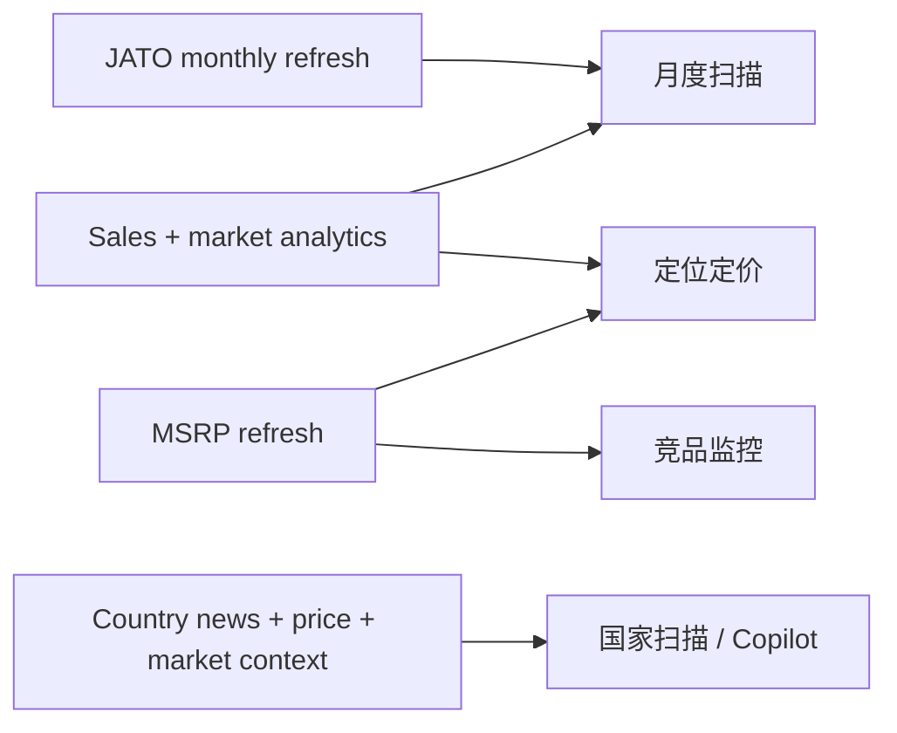
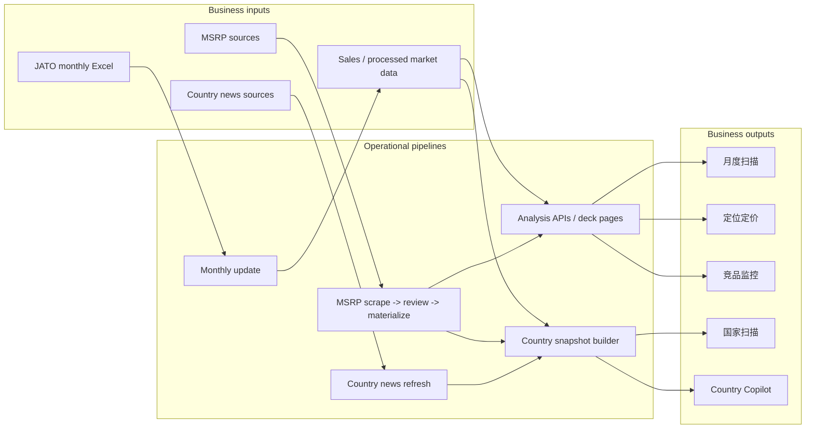
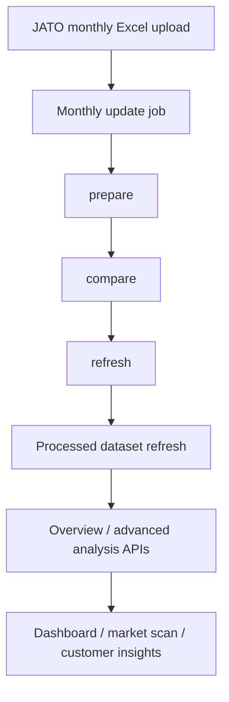
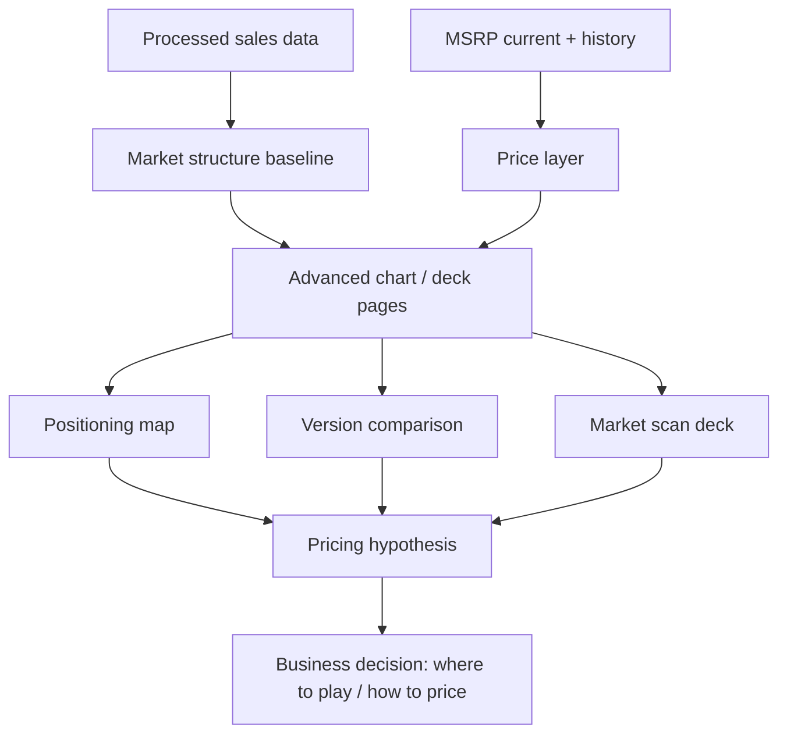
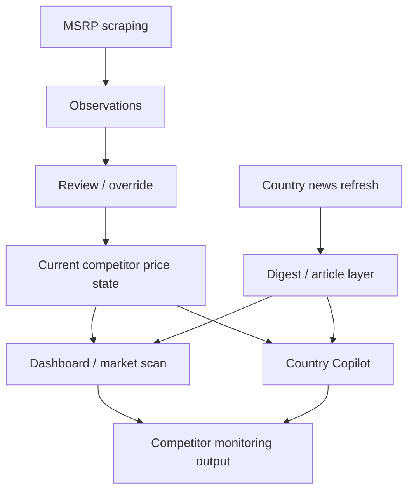
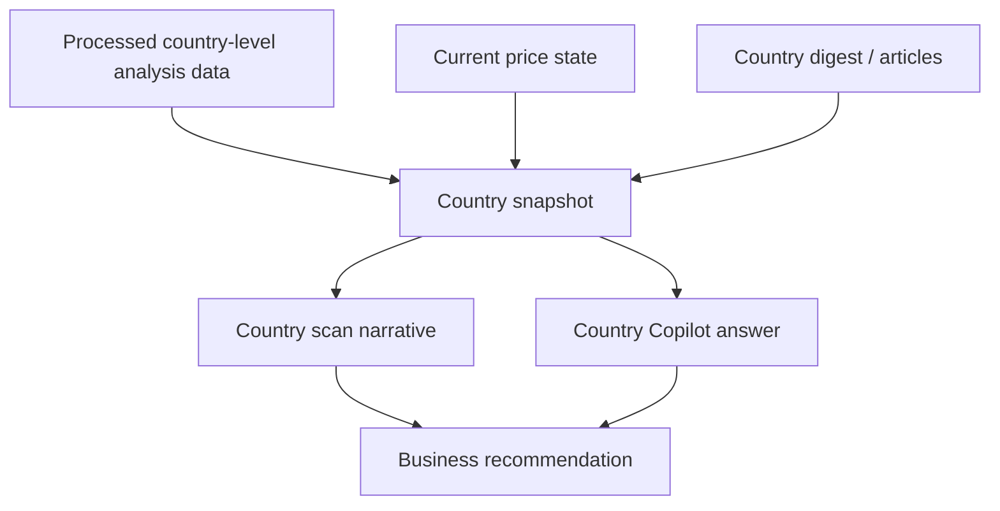

# JATO Business Workflow Deck

This file is written in a **presentation / PPT style**, not an engineering-document style.

Use it when you want to explain the system to business stakeholders.

---

# Slide 1 - What this system is really for

**One-line message:**  
This platform is not just a dashboard; it is a business workflow engine for **monthly market refresh, pricing intelligence, competitor monitoring, and country-level decision support**.

---

# Slide 2 - The four business jobs

**One-line message:**  
All core business work can be grouped into four recurring jobs.

| Business job | Real business question | What the team needs |
| --- | --- | --- |
| 月度扫描 | What changed this month in market volume, structure, versions, and prices? | A refreshed baseline and clear delta view |
| 定位定价 | Where should we position and price our models? | Sales structure + live price layer + comparison views |
| 竞品监控 | What are competitors doing now? | Fresh price state + news signal + market views |
| 国家扫描 / Copilot | What is happening in a specific country right now? | Country snapshot + price context + news context |

---

# Slide 3 - The business pipeline in one picture

**One-line message:**  
The whole system works by combining **baseline refresh**, **price refresh**, and **country/news enrichment** into business-facing outputs.

---

# Slide 4 - Monthly scan

**One-line message:**  
Monthly scan starts from **JATO monthly import**, not from charting.

**Business interpretation:**  
- First refresh the baseline  
- Then make the new month visible  
- Then compare, explain, and report

---

# Slide 5 - Positioning & pricing

**One-line message:**  
Positioning & pricing is the combination of **market structure** and **current price truth**.

**Business interpretation:**  
- Sales tells you **where the market is**  
- MSRP tells you **where the price is**  
- The analysis pages turn both into **pricing action**

---

# Slide 6 - Competitor monitoring

**One-line message:**  
Competitor monitoring is not a single dataset; it is the merge of **price movement** and **market/news signal**.

**Business interpretation:**  
- Price change alone is not enough  
- News alone is not enough  
- Together they become a usable competitor watch view

---

# Slide 7 - Country scan and Copilot

**One-line message:**  
Country Copilot is valuable because it sits on top of a structured country snapshot, not generic chat.

**Business interpretation:**  
- It combines market baseline, price context, and current news  
- That makes country-level scanning faster and more decision-ready

---

# Slide 8 - How the modules map to business work

**One-line message:**  
Different product surfaces support different business jobs.

| Product surface | Business role |
| --- | --- |
| Monthly update page | Refresh the latest JATO baseline |
| Dashboard / Specification | Read the refreshed market structure |
| Market Scan / Positioning / Version Comparison / Customer Insights | Turn data into business analysis and deck views |
| MSRP / Review | Convert scraped prices into trusted current price state |
| Country Copilot | Convert structured country snapshot + news into business narrative |
| Data Management | Operate the pipelines and data sources |

---

# Slide 9 - Executive summary

**One-line message:**  
The system works because it separates the business problem into three layers:

1. **Refresh the baseline**  
   JATO monthly import -> processed data refresh
2. **Refresh the price layer**  
   MSRP scrape -> review -> materialize
3. **Refresh the narrative layer**  
   Country news/digest + country snapshot + Copilot

And those three layers together support:

- 月度扫描
- 定位定价
- 竞品监控
- 国家扫描 / Copilot

---

# Slide 10 - Suggested presentation order

If you present this to business stakeholders, use this order:

1. Slide 1 - What this system is really for
2. Slide 2 - The four business jobs
3. Slide 3 - The business pipeline in one picture
4. Slide 4 - Monthly scan
5. Slide 5 - Positioning & pricing
6. Slide 6 - Competitor monitoring
7. Slide 7 - Country scan and Copilot
8. Slide 8 - Module-to-business mapping
9. Slide 9 - Executive summary

