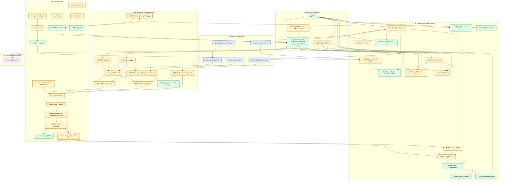
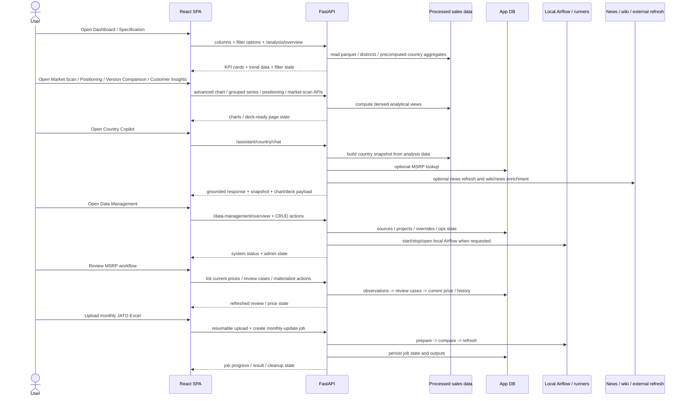
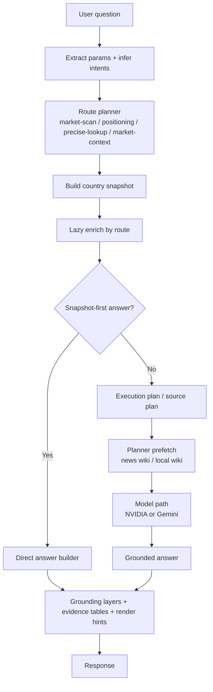
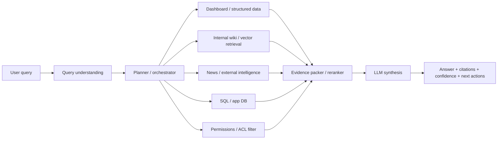
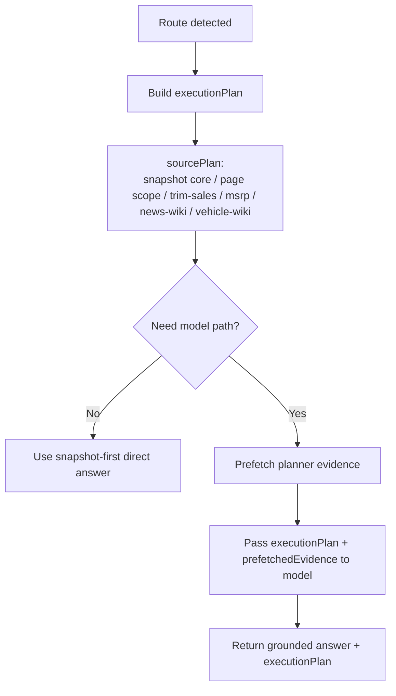
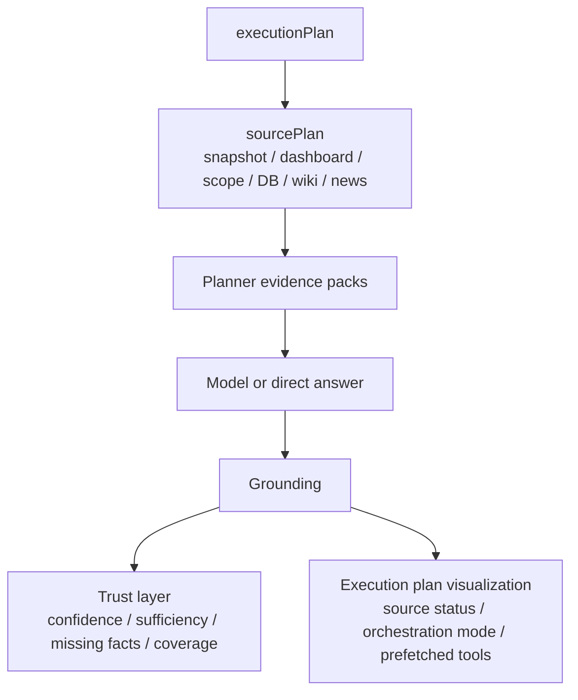
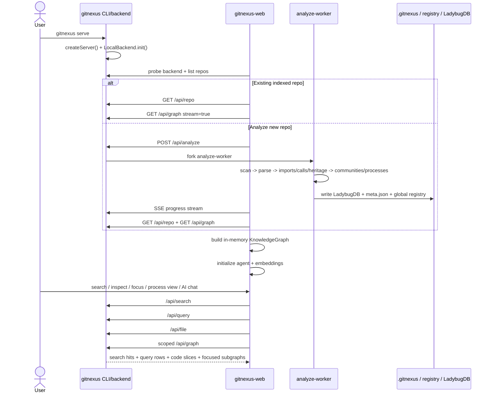

# Repository System Workflow

This is the detailed assembled technical map for the repository.

It is split into three layers:

1. Business/data execution chain
2. AppPlatform runtime interaction chain
3. GitNexus independent code-intelligence chain

## 1. Business/data execution chain

Legend:

- Yellow = main business layer
- Green = important data/output landing points
- Blue = orchestration
- Purple = legacy

## 2. AppPlatform runtime interaction chain

### 2.1 Country Copilot current architecture

**What this means now**

- The current assistant is already **scope-first**, not free-form chat-first.
- `market-scan-scope`, `positioning-focus`, and `precise-lookup` are answered from the correct page/data scope first.
- A new explicit **execution plan** now sits between routing and model answering:
  - it lists the planned evidence sources
  - marks which ones are already ready vs need prefetch
  - prefetches `news_wiki` / `local_wiki` before the model path when needed

### 2.2 Target top-tier internal knowledge assistant architecture

**Gap view**

1. Current Country Copilot already has strong **route + scope + structured evidence**.
2. The first top-tier upgrade is the **planner/orchestrator** layer.
3. The planner should decide, before generation:
   - whether the answer is direct or model-grounded
   - which source stack to use
   - which evidence to prefetch
   - which tools are still allowed after prefetch

### 2.3 Planner-first upgrade now implemented

**Planner-first principle**

- The model is no longer the first component deciding where to look.
- The backend planner now decides the evidence stack first, then gives the model a bounded plan.
- This is the first step from **analytics copilot** toward a **top-tier internal knowledge assistant**.

### 2.4 Trust layer + hybrid retrieval now implemented

**What changed in this step**

- Country Copilot now carries a visible **trust layer** in grounding, not just hidden backend routing.
- Planner context is now **hybrid retrieval** oriented:
  - dashboard analytics
  - page/scope evidence
  - DB current price state
  - prefetched wiki/news facts
- The frontend can now show **how the answer was assembled**, including:
  - orchestration mode
  - source readiness / prefetch state
  - missing facts when evidence is still thin
- This closes the next four gaps after planner-first:
  1. trust layer
  2. hybrid retrieval packaging
  3. execution-plan visualization
  4. regression coverage for the new planner contract

## 3. GitNexus independent code-intelligence chain

## Interpretation

### Main business chain

`01_RAW_DATA / 04_Processed_data / 03_Scripts / 07_ScrapingToolkit / airflow / 06_AppPlatform`

### Supporting but non-mainline chains

- `05_DashBoard` = legacy Streamlit consumer of processed data
- `08_GitNexus` = separate code-intelligence product
