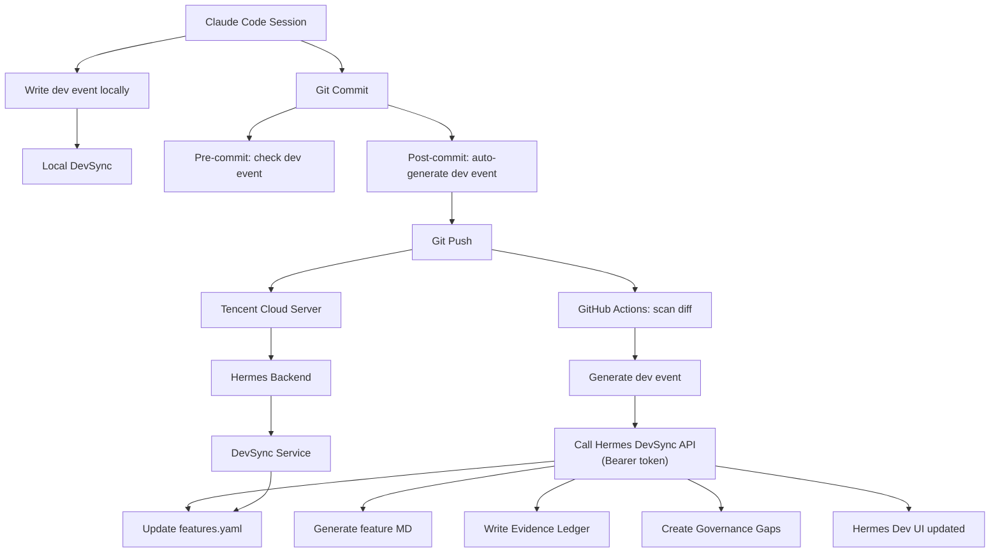

# Hermes DevSync — Claude Code Integration Contract

## Architecture



## Purpose

When Claude Code completes an implementation, it must write a **dev event** to
`hermes/dev_events/dev_events.jsonl` so Hermes can track the development
lifecycle. Hermes DevSync then reads these events and:

1. Upserts features into `hermes/registry/features.yaml`
2. Generates Markdown docs in `Markdown_Readme/features/{featureId}.md`
3. Writes evidence records to `hermes/evidence_ledger.jsonl`
4. Creates governance gaps for features missing docs or tests

## Dev Event Format

Write one JSON object per line to `hermes/dev_events/dev_events.jsonl`:

```json
{
  "eventId": "dev_evt_20260515_001",
  "eventType": "implementation_completed",
  "source": "claude_code",
  "title": "Short feature title (used for featureId inference)",
  "summary": "1-3 sentence summary of what was done.",
  "linkedFeatureIds": ["feature-id-1", "feature-id-2"],
  "changedFiles": ["path/to/modified/file.py"],
  "addedFiles": ["path/to/new/file.tsx"],
  "deletedFiles": [],
  "addedEndpoints": ["POST /hermes/new-endpoint"],
  "updatedEndpoints": [],
  "frontendChanges": ["Description of UI changes"],
  "backendChanges": ["Description of backend changes"],
  "tests": {
    "backend": "647 passed",
    "frontendTsc": "clean",
    "frontendBuild": "succeeds",
    "frontendVitest": "126/127 passed"
  },
  "risks": ["Any remaining risks"],
  "nextSteps": ["Recommended next steps"],
  "createdAt": "2026-05-15T17:00:00+08:00"
}
```

### Required fields

| Field | Type | Description |
|-------|------|-------------|
| `eventId` | string | Unique ID: `dev_evt_{YYYYMMDD}_{NNN}` |
| `eventType` | string | One of: `implementation_completed`, `test_run`, `bug_fix`, `refactor`, `docs_update`, `verification_completed` |
| `source` | string | Always `"claude_code"` for local Claude Code work |
| `title` | string | Short feature title. Used to infer `featureId` if `linkedFeatureIds` is empty |
| `summary` | string | What was done |
| `changedFiles` | string[] | Paths relative to repo root |
| `createdAt` | string | ISO 8601 datetime |

### Optional but recommended fields

| Field | Type | Description |
|-------|------|-------------|
| `linkedFeatureIds` | string[] | Feature IDs this event belongs to. If empty, DevSync infers from title |
| `addedFiles` | string[] | New files created |
| `deletedFiles` | string[] | Files deleted |
| `addedEndpoints` | string[] | New API endpoints |
| `updatedEndpoints` | string[] | Modified API endpoints |
| `frontendChanges` | string[] | Human-readable frontend changes |
| `backendChanges` | string[] | Human-readable backend changes |
| `tests` | object | Test results: `{backend, frontendTsc, frontendBuild, frontendVitest}` |
| `risks` | string[] | Remaining risks after implementation |
| `nextSteps` | string[] | Recommended next steps |

## Feature Status Lifecycle

DevSync maps event types to feature statuses:

| Event Type | Feature Status |
|------------|---------------|
| `implementation_completed` | `implemented` |
| `test_run` | `implemented` |
| `bug_fix` | `implemented` |
| `refactor` | `implemented` |
| `docs_update` | `implemented` |
| `verification_completed` | `verified` |

Full lifecycle: `idea → planned → in_progress → implemented → verified → done`

DevSync auto-creates governance gaps (`hermes/governance_gaps.yaml`) when:
- A feature has no docs → `gap.devsync.{featureId}.missing_docs` (severity: medium)
- A feature has no test results → `gap.devsync.{featureId}.missing_tests` (severity: high)

## How Hermes Syncs

1. User clicks **Sync Now** in the Hermes Dev tab (or calls `POST /hermes/dev/sync`)
2. DevSync reads all events from `hermes/dev_events/dev_events.jsonl`
3. For each event: upserts the linked feature in `hermes/registry/features.yaml`
4. Generates `Markdown_Readme/features/{featureId}.md` from feature data
5. Writes evidence record to `hermes/evidence_ledger.jsonl`
6. Creates governance gaps if docs/tests are missing

## Example: Full Claude Code Implementation Session

After implementing a feature, write the dev event:

```bash
cat >> hermes/dev_events/dev_events.jsonl << 'EOF'
{"eventId":"dev_evt_20260515_002","eventType":"implementation_completed","source":"claude_code","title":"Hermes DevSync implementation","summary":"Added development governance loop: dev events JSONL → feature registry → auto markdown → evidence → gaps. New Dev tab in Hermes UI with feature table, event feed, missing items, and sync button.","linkedFeatureIds":["hermes-devsync"],"changedFiles":["06_AppPlatform/backend/app/services/hermes_devsync_service.py","06_AppPlatform/backend/app/api/routes/hermes.py","06_AppPlatform/frontend/src/pages/DataManagementPage.tsx","06_AppPlatform/frontend/src/types/hermes.ts","06_AppPlatform/frontend/src/api/client.ts","hermes/registry/features.yaml","hermes/dev_events/dev_events.jsonl"],"addedFiles":["06_AppPlatform/backend/app/services/hermes_devsync_service.py","hermes/registry/features.yaml","hermes/dev_events/dev_events.jsonl","Markdown_Readme/features/"],"addedEndpoints":["POST /hermes/dev/events","GET /hermes/dev/events","POST /hermes/dev/sync","GET /hermes/dev/features","GET /hermes/dev/features/{featureId}"],"frontendChanges":["Dev subtab with feature table","Dev events feed","Missing items detection","Sync button"],"backendChanges":["hermes_devsync_service.py with full sync pipeline","5 new endpoints in hermes.py"],"tests":{"backend":"pending","frontendTsc":"clean","frontendBuild":"succeeds"},"risks":["Feature inference from title is heuristic-based"],"nextSteps":["Write backend tests","Wire into real Claude Code session post-implementation hook"],"createdAt":"2026-05-15T18:00:00+08:00"}
EOF
```

Then trigger sync from the Hermes UI (Dev tab → Sync Now) or via API:

```bash
curl -X POST http://localhost:8000/v1/hermes/dev/sync
```

After sync, the Hermes UI Dev tab will show:
- Feature Registry: `hermes-devsync` with status `implemented`
- Dev Events: the new event with changed files count
- Missing Items: flagged if docs/tests are missing
