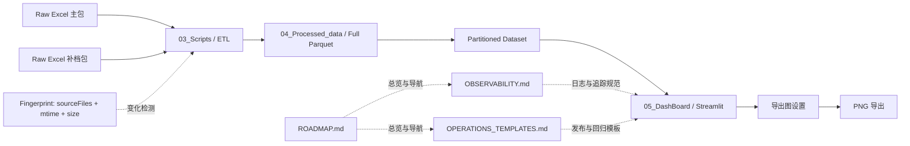

# JATO Analysis System Roadmap（总览与导航）

> 本文件是文档总入口：负责汇总阶段状态、执行优先级和跨文档导航。
> 详细实现细节放在专题文档，本页仅保留摘要与跳转。

## 1. 当前状态快照（2026-03-08）

- 项目阶段：`Phase 4（推进中）`
- 已完成能力：
	- 分区优先读取、过滤下推、列裁剪投影、版本令牌缓存失效
	- URL 参数化筛选、慢图定位、空数据提示标准化、时间轴回退
	- 数据刷新作业、历史归档清理、多用户缓存策略、CI smoke
	- 多 Excel 合并输入（`--input-files` / `--merge-all-xlsx`）与可选去重（`--dedupe-keys`）
	- 输入源集合指纹（补档新增/删除自动触发刷新）
	- 导出能力评估（前置）已完成，导出图设置已落地
	- PNG 导出全图接入、基础可观测日志接入
- 推进中能力：
	- 增量入库 `M3`（冲突检测与回滚已落地，P3 细粒度报告 v1 已落地）
- 规划中能力：
	- 对象存储直读与查询引擎接入
	- 对象存储场景性能回归基线

## 2. 文档架构（分层组织）

- `L0 总览层`：`ROADMAP.md`（状态看板 + 导航入口）
- `L1 方案层`：数据、部署、可观测、增量、可视化专项方案
- `L2 操作层`：操作模板、导出功能说明、评估记录

## 3. 系统与文档架构图

## 4. 文档导航矩阵（点击跳转）

| 模块 | 内容摘要 | 文档 |
|---|---|---|
| 数据处理主链路 | Raw -> ETL -> 分区 -> 刷新作业全流程 | [ETL.md](./ETL.md) |
| 增量入库 | M1/M2 已落地，M3 待推进 | [INCREMENTAL_INGESTION.md](./INCREMENTAL_INGESTION.md) |
| 部署方案 | Streamlit Cloud / VM 部署与容量建议 | [DEPLOYMENT.md](./DEPLOYMENT.md) |
| 可观测方案 | 日志字段、接入路径、脱敏与作业日志 | [OBSERVABILITY.md](./OBSERVABILITY.md) |
| 运维模板 | 回归清单、发布模板、告警模板 | [OPERATIONS_TEMPLATES.md](./OPERATIONS_TEMPLATES.md) |
| 导出设置说明 | 导出图设置（Excel 风格）能力清单 | [EXPORT_CHART_SETTINGS.md](./EXPORT_CHART_SETTINGS.md) |
| 全球可视化总控 | 全球/大洲/国家可视化 Phase 方案 | [JATO_GLOBAL_VISUALIZATION.md](./JATO_GLOBAL_VISUALIZATION.md) |

## 5. 按角色阅读路径（快速入口）

- 产品/业务负责人（先看结果与节奏）
	- 第一步：[ROADMAP.md](./ROADMAP.md)
	- 第二步：[DEPLOYMENT.md](./DEPLOYMENT.md)
	- 第三步：[OPERATIONS_TEMPLATES.md](./OPERATIONS_TEMPLATES.md)
- 数据/后端开发（先看链路与增量）
	- 第一步：[ETL.md](./ETL.md)
	- 第二步：[INCREMENTAL_INGESTION.md](./INCREMENTAL_INGESTION.md)
	- 第三步：[OBSERVABILITY.md](./OBSERVABILITY.md)
- 前端/分析开发（先看图表与可视化）
	- 第一步：[EXPORT_CHART_SETTINGS.md](./EXPORT_CHART_SETTINGS.md)
	- 第二步：[JATO_GLOBAL_VISUALIZATION.md](./JATO_GLOBAL_VISUALIZATION.md)

## 6. 路线图摘要（Phase）

### Phase 1（已完成）

- 分区优先读取
- 过滤下推
- 列裁剪投影
- 版本令牌缓存失效
- 读取耗时与行数可视化
- 明细按需全列

### Phase 2（已完成）

- URL 参数化筛选（可分享视图）
- 图表渲染耗时采样与慢图定位
- 空数据提示标准化
- 时间轴缺失回退策略增强

### Phase 3（已完成）

- 数据刷新作业脚本（`run_data_refresh_job.py`）
- 历史归档清理脚本（`cleanup_history_archive.py`）
- 多用户缓存策略（按 scope/version 分层）
- CI smoke（本地 + GitHub Actions）

### Phase 4（推进中）

- 增量入库（M1/M2 已完成，M3 推进中）
- M3-v1 已落地：冲突检测策略（report_only/fail/last_wins）
- M3-v1 已落地：刷新失败自动回滚（可通过参数关闭）
- P3-v1 已落地：changed partition keys / countries / affected rows 报告增强
- 对象存储直读 + 查询引擎接入（规划）
- 导出能力扩展（PNG + 导出图设置已落地）
- 可观测接入（基础能力已落地，持续增强）

## 7. 当前执行优先级

1. 完成增量入库 `M3`：冲突检测与回滚机制
2. 打通对象存储路径配置并完成一次端到端 smoke
3. 建立对象存储场景性能基线（加载耗时、内存、慢图）
4. 补充全球可视化 Phase 0/1 验证样例与回归点

## 8. 文档维护规范

- 本文档只放：状态摘要、优先级、导航入口。
- 专题文档只放：实现细节、命令示例、验收标准。
- Markdown 文档命名规范：新建文档优先 `UPPER_SNAKE_CASE.md`，存量文档按需渐进迁移。
- 新增专题时，必须同时更新：
	- `ROADMAP.md` 的“文档导航矩阵”
	- 专题文档头部“返回 ROADMAP”链接
- 更新节奏：每次 Phase 完成后，先更新专题，再回填 ROADMAP。

## 9. 改进 Preplan（执行中）

| Phase | 目标 | 进展 | 主要交付 |
|---|---|---|---|
| P1 输入批次治理 | 主包+补档可追溯 | 已完成 | 多文件输入、合并元数据、sourceExcels |
| P2 冲突检测与回滚 | 跨文件冲突可控 + 失败可恢复 | 已完成（v1） | conflict policy + conflict report + refresh rollback |
| P3 增量精细化 | 降低无效重算 | 已完成（v1） | changed keys / changed countries / affected rows 报告增强 |
| P4 可观测增强 | 快速定位补档与冲突影响范围 | 规划中 | 冲突/去重/回滚指标日志化 |
| P5 运维SOP固化 | 团队标准化执行 | 进行中 | 运行模板与验收清单统一 |
