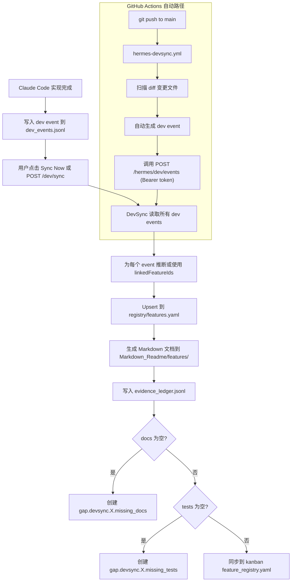
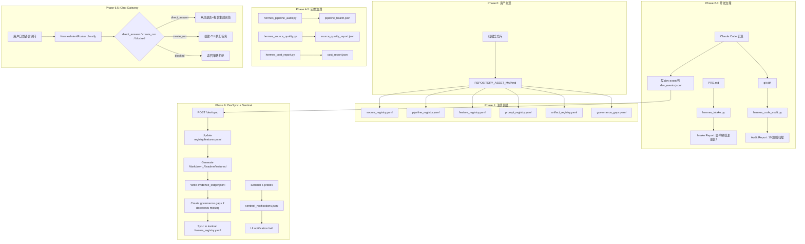

# Hermes 治理层完整功能设计文档

> 生成日期: 2026-05-17
> 基于: 全仓库代码、文档、注册表、git 历史分析
> 版本: v1.0

---

## 目录

1. [概述与设计哲学](#1-概述与设计哲学)
2. [核心架构：四大 Governor](#2-核心架构四大-governor)
3. [阶段演进史（Phase 0 → 6.5）](#3-阶段演进史phase-0--65)
4. [注册表系统（8 个 YAML Registry）](#4-注册表系统8-个-yaml-registry)
5. [账本系统（3 个 JSONL Ledger）](#5-账本系统3-个-jsonl-ledger)
6. [API 设计（30+ 端点）](#6-api-设计30-端点)
7. [DevSync：Claude Code 开发治理闭环](#7-devsyncclaude-code-开发治理闭环)
8. [Sentinel：主动监控与告警](#8-sentinel主动监控与告警)
9. [Chat Gateway：意图路由与对话](#9-chat-gateway意图路由与对话)
10. [CLI 工具链（13 个脚本）](#10-cli-工具链13-个脚本)
11. [前端集成（DataManagementPage）](#11-前端集成datamanagementpage)
12. [模型路由与成本治理](#12-模型路由与成本治理)
13. [完整流程图](#13-完整流程图)
14. [端到端示例](#14-端到端示例)

---

## 1. 概述与设计哲学

### 1.1 Hermes 是什么

Hermes 是 JATO Analysis System 的**治理层（Governance Layer）**。它是一个只读优先、只审计、只建议的系统，**不会自动修改代码、基础设施、生产环境、数据库 schema 或部署状态**。

### 1.2 核心原则

| 原则 | 含义 |
|------|------|
| 只登记 (Register only) | 所有资源必须在注册表中登记 |
| 只评分 (Score only) | 对管道/源/功能进行质量评分 |
| 只审计 (Audit only) | 扫描代码 diff、管道健康、源质量 |
| 只建议 (Recommend only) | 生成提案，需要人类审核 |
| 不自动改代码 | 无自动代码生成或修改 |
| 不自动 merge | 无自动 PR merge |
| 不自动 deploy | 无自动部署 |
| 不自动改生产环境 | 无自动数据库/基础设施变更 |

### 1.3 系统边界

```
                        ┌──────────────────────────────┐
                        │      Hermes Governance        │
                        │                              │
    PRD ──────────────▶ │  intake ──▶ impact report    │
    git diff ─────────▶ │  code_audit ──▶ audit report │
    Registries ◀──────▶ │  pipeline_audit              │
    Claude Code ◀─────▶ │  DevSync (dev_events.jsonl)  │
    User Chat ────────▶ │  Chat Gateway (intent route) │
                        │  Sentinel (5 probes)          │
                        └──────────────────────────────┘
                                  │
                                  ▼
              只读访问。从不自动修改生产系统。
```

---

## 2. 核心架构：四大 Governor

Hermes 按职责分为四个 Governor，每个 Governor 有自己的脚本、输入、输出和回答的问题。

### 2.1 Code Governor（代码治理）

| 维度 | 内容 |
|------|------|
| **阶段** | Phase 2-3 |
| **脚本** | `hermes_intake.py`, `hermes_code_audit.py` |
| **输入** | PRD.md, git diff (base..HEAD), 8 个注册表 YAML |
| **输出** | intake report (.md + .json), code audit report (.md + .json) |
| **回答的问题** | 「这个 PRD 会影响哪些功能/管道/源/prompt？」「Claude Code 改完有没有漏 registry/docs/tests？」「有没有 secret 泄露或 schema 变更无 migration？」 |
| **触发** | 每次写新 PRD 或 push 代码后手动运行 |

### 2.2 Pipeline Governor（管道治理）

| 维度 | 内容 |
|------|------|
| **阶段** | Phase 4-4.5 |
| **脚本** | `hermes_pipeline_audit.py` |
| **输入** | `pipeline_registry.yaml`, `.github/workflows/`, `airflow/dags/`,  systemd timer 配置, `scheduled_fetch_status.json` |
| **输出** | pipeline health report (.md), `pipeline_health.json` |
| **回答的问题** | 「哪些 pipeline 在生产？哪些是手动后备？」「Country News 有没有重复调度？」「哪个 artifact 被哪个 feature 消费？」「VOC 源错误有没有被结构化追踪？」 |
| **触发** | 定期运行（建议每周）或 pipeline 变更后 |

### 2.3 Intelligence Governor（智能治理）

| 维度 | 内容 |
|------|------|
| **阶段** | Phase 5-5.5 |
| **脚本** | `hermes_source_quality.py`, `hermes_evidence_writer.py`, `hermes_answer_audit.py`, `hermes_cost_report.py` |
| **输入** | 注册表, `answer_audit.jsonl`, `model_pricing.yaml`, VOC/News/MSRP 数据 |
| **输出** | source quality report, evidence ledger, answer audit, cost report |
| **回答的问题** | 「VOC/News/MSRP 源质量如何？哪个该降级？」「国家助手回答有没有证据？幻觉风险多高？」「Flash/Pro token 花了多少钱？」 |
| **触发** | 定期运行，与 pipeline audit 联动 |

### 2.4 Sentinel Governor（哨兵治理）

| 维度 | 内容 |
|------|------|
| **阶段** | Phase 6+ |
| **脚本** | `hermes_sentinel_service.py`（后端服务，非 CLI 脚本） |
| **输入** | DevSync features, git workspace state, governance gaps, evidence ledger, GHA status |
| **输出** | `sentinel_notifications.jsonl`, 聚合状态报告 |
| **回答的问题** | 「有没有未链接的 dev event？未提交的代码？」「governance gap 是否积累？」「evidence ledger 是否过期？」 |
| **触发** | 按需轮询（API 端点） |

### 2.5 模块依赖关系

```
Code Governor ──────┬──▶ Pipeline Governor ──────┬──▶ Intelligence Governor
(intake,            │   (pipeline_audit)         │   (source_quality,
 code_audit)        │                             │    evidence, cost,
                    │                             │    answer_audit)
                    │                             │
                    └─────────────────────────────┘
                                      │
                                      ▼
                              Sentinel Governor
                         (统一监控，唯一主动告警模块)
```

---

## 3. 阶段演进史（Phase 0 → 6.5）

### 3.1 Phase 0 — 资产发现（2026-05-14）

**产出:** `REPOSITORY_ASSET_MAP.md` — 全仓库资产扫描。

扫描了 10 个目录系统，发现:
- 12 个产品功能
- 8 个定时任务（4 systemd + 3 Airflow + 1 GitHub Actions）
- 7 个爬虫入口点
- 3 个未版本化的 LLM prompt
- 10+ 种数据 artifact
- 100+ API 端点
- 15+ 个治理漏洞

### 3.2 Phase 1 — 注册表层（2026-05-14）

**产出:** 6 个 YAML 注册表 + 1 个治理漏洞清单

- `source_registry.yaml` — 7 个源条目（VOC/News/MSRP/EVKX）
- `pipeline_registry.yaml` — 8 个管道条目（4 systemd + 3 Airflow + 1 GHA + 1 ETL）
- `feature_registry.yaml` — 12 个功能条目
- `prompt_registry.yaml` — 5 个 prompt 条目
- `artifact_registry.yaml` — 10+ 个数据 artifact 条目
- `proposal_registry.yaml` — 8 个改进提案
- `governance_gaps.yaml` — 8 个初始治理漏洞

### 3.3 Phase 2 — PRD Intake（2026-05-14）

**产出:** `hermes_intake.py`

功能: 读取 PRD Markdown → 交叉匹配全部 8 个注册表 → 生成影响分析报告。

### 3.4 Phase 3 — Code Audit（2026-05-14）

**产出:** `hermes_code_audit.py`

10 条审计规则:
1. Secret 检测（API key, password, private key）
2. `.env.example` 同步检查
3. 注册表交叉引用（改文件是否更新了对应注册表？）
4. Schema 变更检测（无 migration）
5. 路由变更检测
6. 前端类型同步检查
7. Backend 依赖检测
8. 硬编码 URL 检测
9. TODO/FIXME 提取
10. 文件大小异常检测

### 3.5 Phase 4 — Pipeline Audit（2026-05-14）

**产出:** `hermes_pipeline_audit.py`，`PIPELINE_SCHEDULER_DECISION_2026-05-14.md`

重大发现: **Country News Sync 重复调度** — systemd timer (23:15 UTC) + Airflow DAG (06:15 UTC)，双写 `ops.country_news_digest`。

决策: systemd = 生产调度器，Airflow = 手动后备。

### 3.6 Phase 5 — Intelligence Governance（2026-05-14）

**产出:**
- `hermes_source_quality.py` — 源质量评分
- `hermes_evidence_writer.py` — 证据提取
- `hermes_answer_audit.py` — 答案审计
- `hermes_cost_report.py` — 成本追踪

### 3.7 Phase 5.5 — 成本治理 & 模型路由（2026-05-14）

**产出:** `model_pricing.yaml`，`MODEL_ROUTING_POLICY_2026-05-14.md`

DeepSeek Flash vs Pro 路由策略，月度预算 500 CNY，75% 预警。

### 3.8 Phase 5.6 — CI/Deploy 治理（2026-05-14）

**产出:** `CI_DEPLOY_WORKFLOW_GOVERNANCE_2026-05-14.md`

- CI 从质量门转为非阻塞诊断
- Legacy EC2 deploy 转为手动触发
- 明确 `deploy-fullstack-tencent` 是唯一的部署真相源

### 3.9 Phase 6 — Data Management UI 集成（2026-05-14~15）

**产出:**
- 后端: `hermes.py` 路由（30+ 端点），`hermes_chat_service.py`，`hermes_devsync_service.py`
- 前端: `DataManagementPage.tsx` Hermes 标签页（5 个子标签），`HermesAskResponseCard.tsx`，`HermesMermaidBlock.tsx`

### 3.10 Phase 6.5 — 运维 UI（2026-05-15）

**产出:**
- 浏览器内执行 CLI 脚本（`POST /hermes/run/{command}`）
- 服务器快照同步（`hermes_sync_server_snapshot.py`）
- Hermes Chat Gateway（`hermes_chat_service.py`）— 意图路由 + 直接回答 + 命令执行

### 3.11 DevSync 阶段（2026-05-15+）

**产出:**
- `hermes_devsync_service.py` — DevSync 同步管道
- `hermes_sentinel_service.py` — Sentinel 5 探针
- `hermes/dev_events/dev_events.jsonl` — 开发事件账本
- `hermes/registry/features.yaml` — DevSync 生成的特性注册表
- GitHub Actions `hermes-devsync.yml` — 推送自动生成 dev event
- Pre-commit / Post-commit hooks

---

## 4. 注册表系统（8 个 YAML Registry）

### 4.1 总览

```
hermes/
├── source_registry.yaml       # 数据源注册（谁产生数据、数据在哪）
├── pipeline_registry.yaml     # 管道注册（定时任务、调度器角色）
├── feature_registry.yaml      # 功能注册（看板：功能→API→数据→测试→文档）
├── prompt_registry.yaml       # Prompt 注册（版本、模型、质量）
├── artifact_registry.yaml     # 数据产物注册（路径、schema、生产者/消费者）
├── governance_gaps.yaml       # 治理漏洞清单
├── proposal_registry.yaml     # 改进提案注册（draft→implemented）
├── model_pricing.yaml         # 模型定价与路由策略
└── registry/
    └── features.yaml          # DevSync 自动生成的特性注册表
```

### 4.2 ID 命名规范

```
source.<type>.<country>.<name>       # 源: source.voc.batch_a
pipeline.<domain>.<system>           # 管道: pipeline.news.country_systemd
feature.<name>                       # 功能: feature.country_copilot
prompt.<domain>.<name>               # Prompt: prompt.country_copilot.deepseek_system
artifact.<domain>.<name>             # 产物: artifact.jato.parquet
gap.<category>.<short_name>          # 漏洞: gap.pipeline.duplicate_news_scheduling
proposal.<category>.<short_name>     # 提案: proposal.prompt.versioning
```

### 4.3 状态值（通用）

| 值 | 含义 |
|----|------|
| `active` | 生产环境正常运行 |
| `watch` | 运行中但需要监控 |
| `degraded` | 运行中有已知问题 |
| `disabled` | 有意关闭 |
| `planned` | PRD 存在，未实现 |
| `deprecated` | 计划移除 |
| `archived` | 仅历史参考 |
| `unknown` | 需要调查 |

### 4.4 feature_registry.yaml 示例条目

```yaml
features:
  - featureId: feature.country_copilot
    name: "Country Copilot / Country Chat"
    status: active
    implementationStatus: implemented
    riskLevel: medium
    routes:
      - "/copilot"
    backendApis:
      - "POST /v1/assistant/country/chat/stream"
      - "POST /v1/assistant/country/chat"
    scheduledJobs:
      - "pipeline.news.country_systemd"
      - "pipeline.news.country_airflow"
    dataSources:
      - "JATO partitioned parquet"
      - "PostgreSQL: ops.country_news_digest"
    artifacts:
      - "artifact.jato.parquet"
    docs: ["01_DevWorkflow/COUNTRY_COPILOT_*.md"]
    tests:
      - "Backend: test_country_chat_service.py"
      - "Frontend: countryChatRendering.test.tsx"
    dependencies:
      - "pipeline.jato.etl"
      - "DeepSeek API"
    knownIssues:
      - "3 LLM prompts hardcoded in Python, not versioned"
    lastAuditAt: "2026-05-14"
```

### 4.5 pipeline_registry.yaml 示例条目（含调度器决策）

```yaml
pipelines:
  - pipelineId: pipeline.news.country_systemd
    name: "Country News Sync (systemd timer)"
    type: systemd_timer
    role: production_scheduler           # Phase 4.5 新增
    schedulerDecision: "Systemd timer is the recommended production scheduler..."
    schedule: "OnCalendar=*-*-* 23:15:00 UTC"
    outputs:
      - "PostgreSQL: ops.country_news_digest"
    consumers:
      - "feature.country_copilot"
    status: active
    riskLevel: medium
    lastObserved:
      lastRunAt: "2026-05-13T15:18:03Z"
      lastSuccessAt: "2026-05-13T15:18:03Z"
```

### 4.6 注册表之间的关系

```
source_registry ──── 被消费 ────▶ artifact_registry
     │                                  │
     │ 产生                             │ 被消费
     ▼                                  ▼
pipeline_registry ──── 驱动 ────▶ feature_registry
     │                                  │
     │ 使用                             │ 使用
     ▼                                  ▼
prompt_registry ◀──────────── model_pricing.yaml
     │
     │ 暴露
     ▼
governance_gaps ◀──── proposal_registry（修复方案）
```

---

## 5. 账本系统（3 个 JSONL Ledger）

### 5.1 dev_events.jsonl — 开发事件账本

**路径:** `hermes/dev_events/dev_events.jsonl`

记录每次 Claude Code 实现的开发事件。DevSync 读取这个文件来同步特性注册表。

```json
{
  "eventId": "dev_evt_20260515_001",
  "eventType": "implementation_completed",
  "source": "claude_code",
  "title": "Hermes DevSync implementation",
  "summary": "Added development governance loop...",
  "linkedFeatureIds": ["hermes-devsync"],
  "changedFiles": ["06_AppPlatform/backend/app/services/hermes_devsync_service.py"],
  "addedFiles": ["hermes/registry/features.yaml"],
  "deletedFiles": [],
  "addedEndpoints": ["POST /hermes/dev/sync"],
  "frontendChanges": ["Dev subtab with feature table"],
  "backendChanges": ["hermes_devsync_service.py"],
  "tests": {
    "backend": "647 passed",
    "frontendTsc": "clean",
    "frontendBuild": "succeeds"
  },
  "risks": ["Feature inference from title is heuristic-based"],
  "nextSteps": ["Write backend tests"],
  "createdAt": "2026-05-15T17:00:00+08:00"
}
```

**事件类型映射到特性状态:**

| 事件类型 | 特性状态 |
|----------|----------|
| `implementation_completed` | `implemented` |
| `test_run` | `implemented` |
| `bug_fix` | `implemented` |
| `refactor` | `implemented` |
| `docs_update` | `implemented` |
| `verification_completed` | `verified` |

**完整生命周期:** `idea → planned → in_progress → implemented → verified → done`

### 5.2 evidence_ledger.jsonl — 证据账本

**路径:** `hermes/evidence_ledger.jsonl`

存储从开发事件中提取的结构化证据记录。

```json
{
  "evidenceId": "evidence.dev_evt_20260515_001",
  "evidenceType": "dev_event",
  "claim": "Feature 'Hermes DevSync' implementation_completed: Added dev governance loop",
  "sourceRef": "dev_events.jsonl::dev_evt_20260515_001",
  "artifactId": "feature.hermes-devsync",
  "confidence": 1.0,
  "supportCount": 0,
  "contradictionCount": 0,
  "createdAt": "2026-05-15T17:00:00Z"
}
```

### 5.3 sentinel_notifications.jsonl — 哨兵通知

**路径:** `hermes/sentinel_notifications.jsonl`

Sentinel 探针检测到异常时生成的通知。包含冷却机制（同探针 30 分钟内不重复，同标题 60 分钟内不重复）。

```json
{
  "id": "notif_20260515_120000_abc123",
  "severity": "medium",
  "source": "devsync",
  "title": "Missing Docs",
  "body": "15 features have no documentation.",
  "actions": ["View details"],
  "status": "new",
  "createdAt": "2026-05-15T12:00:00Z"
}
```

---

## 6. API 设计（30+ 端点）

**Base URL:** `/v1/hermes`

### 6.1 治理数据 API

| 方法 | 端点 | 描述 | 鉴权 |
|------|------|------|------|
| GET | `/overview` | 聚合概览（注册表条目数、报告可用性、proposal/gap 统计） | viewer+ |
| GET | `/pipeline-health` | 管道健康报告 JSON | viewer+ |
| GET | `/source-quality` | 源质量报告 JSON | viewer+ |
| GET | `/cost` | 成本报告 JSON | viewer+ |
| GET | `/code-audit` | 代码审计报告 JSON | viewer+ |
| GET | `/proposals?status=draft` | 改进提案列表（可按状态过滤） | viewer+ |
| GET | `/gaps?status=open&category=test` | 治理漏洞列表（可按状态/类别过滤） | viewer+ |
| GET | `/features` | 功能注册表条目 | viewer+ |

### 6.2 可视化与分析 API

| 方法 | 端点 | 描述 | 鉴权 |
|------|------|------|------|
| GET | `/toolchain` | 工具链清单（脚本+注册表+报告+工作流步骤） | viewer+ |
| GET | `/architecture` | 四大 Governor 架构描述（模块+依赖+路由） | viewer+ |
| GET | `/activity-heatmap?days=30` | 活动热力图数据 | viewer+ |
| GET | `/cost-heatmap?days=30` | 成本热力图数据 | viewer+ |
| GET | `/daily-summary` | 每日摘要（活动+成本+预算状态） | viewer+ |
| GET | `/feature-kanban` | 功能看板数据（4 列: active/beta/planned/archived） | viewer+ |
| GET | `/evidence-ledger?days=7` | 证据账本查询 | viewer+ |
| GET | `/markdown-diagrams` | 从 Markdown 文档中提取 Mermaid 流程图 | viewer+ |
| GET | `/source/{source_id}` | 单个数据源详情 | viewer+ |
| GET | `/source/{source_id}/health-history` | 数据源健康历史 | viewer+ |

### 6.3 CLI 执行 API

| 方法 | 端点 | 描述 | 鉴权 |
|------|------|------|------|
| GET | `/run` | 列出可执行的命令 | viewer+ |
| GET | `/run/{command}/help` | 命令帮助 | viewer+ |
| POST | `/run/{command}` | **执行 CLI 脚本**（浏览器内触发） | admin+ |

可用命令: `pipeline-audit`, `source-quality`, `cost-report`, `code-audit`, `intake`, `evidence`, `answer-audit`

### 6.4 Chat Gateway API

| 方法 | 端点 | 描述 | 鉴权 |
|------|------|------|------|
| POST | `/chat` | 发送消息（意图路由 → 直接回答 或 创建 run） | viewer+ |
| GET | `/chat/sessions` | 列出会话 | viewer+ |
| GET | `/chat/sessions/{id}` | 获取会话详情（含消息历史） | viewer+ |
| GET | `/commands` | 列出可用的 Chat 命令 | viewer+ |
| POST | `/commands/execute` | 执行 Chat 命令 | admin+ |

### 6.5 DevSync API

| 方法 | 端点 | 描述 | 鉴权 |
|------|------|------|------|
| POST | `/dev/events` | 写入 dev event（Bearer token） | token |
| GET | `/dev/events?source=claude_code` | 列出 dev events | viewer+ |
| POST | `/dev/sync` | **触发 DevSync 同步**（核心端点） | developer+ |
| GET | `/dev/features` | 列出 DevSync 特性 | viewer+ |
| GET | `/dev/features/{id}` | 获取单个 DevSync 特性 | viewer+ |
| GET | `/dev/workspace-health` | 工作区健康检查 | viewer+ |

### 6.6 Sentinel API

| 方法 | 端点 | 描述 | 鉴权 |
|------|------|------|------|
| GET | `/sentinel/status` | 运行所有 5 个探针，返回聚合状态 | admin+ |
| GET | `/sentinel/notifications?status=new` | 列出通知 | viewer+ |
| POST | `/sentinel/ack/{notification_id}` | 确认通知 | admin+ |

---

## 7. DevSync：Claude Code 开发治理闭环

### 7.1 概述

DevSync 是 Hermes 的核心创新——它确保每次 Claude Code 实现都经过治理层追踪，自动生成文档、证据和漏洞标记。

### 7.2 完整流程



### 7.3 核心函数

**`sync_dev_events()`** — 主同步函数:
1. 读取 JSONL 中最近 200 条 dev event
2. 遍历每条 event:
   - 从 `linkedFeatureIds` 获取或从 `title` 推断特性 ID
   - Upsert 特性到 `registry/features.yaml`
   - 生成 `Markdown_Readme/features/{featureId}.md`
   - 写入 evidence 记录
   - 检查 docs/tests 缺失 → 创建 governance gap
3. 调用 `_sync_to_kanban()` 将 DevSync 特性同步到看板 `feature_registry.yaml`

**Feature ID 推断:** 从 event `title` 生成 `featureId` 的规则:
- 小写化 → 非字母数字替换为 `-` → 限制 60 字符
- 例: `"Hermes DevSync implementation"` → `"hermes-devsync"`

### 7.4 特性去重与名称清理

`_sync_to_kanban()` 的关键逻辑:
- **一个 featureId = 一个看板条目**（去重）
- **保留原有看板名称**，不会被 git commit 信息覆盖
- 检测并过滤类 git commit 的名称（以 `fix:`/`feat:`/`hermes:` 开头或长度 >60 字符）
- 对类 commit 名称，自动从 featureId 生成干净标题

### 7.5 GitHub Actions 自动路径

`.github/workflows/hermes-devsync.yml`:
1. 在每次 `push to main` 时触发
2. 使用 `git diff` 扫描变更文件
3. 自动生成 dev event JSON
4. 通过 Bearer token 调用 `POST /v1/hermes/dev/events`

---

## 8. Sentinel：主动监控与告警

### 8.1 设计原则

Sentinel 是 Hermes 中**唯一可以主动告警的模块**。其他模块只写事实（events、evidence、gaps）。

**冷却机制:**
- 同一探针 30 分钟内不重复通知
- 同一标题 60 分钟内不重复通知

### 8.2 五个探针

| 探针 | 功能 | 检测内容 |
|------|------|----------|
| `probe_devsync()` | DevSync 健康检查 | 未链接的 event、缺 docs 的特性、缺 tests 的特性 |
| `probe_workspace()` | 工作区健康 | `git diff` 未提交变更、未推送的 commit |
| `probe_gaps()` | 治理漏洞 | open 状态的 high/medium severity gap 数量 |
| `probe_evidence()` | 证据新鲜度 | evidence ledger 是否存在、是否超过 48h 未更新 |
| `probe_gha()` | GitHub Actions | 最近 24h 是否有 DevSync 证据 |

### 8.3 聚合逻辑

```
所有探针 ok → overall: ok
任何探针 warning → overall: warning
任何探针 critical → overall: critical
```

通知只在 severity ≥ medium 时发送。High/critical → 30min cooldown，medium → 120min cooldown。

### 8.4 通知示例

```
Sentinel 检测到:
  [CRITICAL] 工作区: 15 个代码文件有未提交变更，且未更新 dev_events.jsonl
  [WARNING] DevSync: 12 个特性缺少文档
  [WARNING] Evidence: 证据账本超过 72 小时未更新
```

---

## 9. Chat Gateway：意图路由与对话

### 9.1 设计理念

Hermes Chat Gateway 是一个**基于规则的意图分类器**，零 LLM 成本。它将用户的自然语言问题路由到现有的 Hermes 数据端点或 CLI 命令。

### 9.2 意图定义（12 种意图）

| 意图 | 执行模式 | 触发关键词（中英文） |
|------|----------|---------------------|
| `system_status_query` | direct_answer | status, health, overview, 状态, 概况 |
| `run_status_query` | direct_answer | run, recent, activity, history, 运行, 最近 |
| `evidence_query` | direct_answer | evidence, ledger, fact, 记录, 证据 |
| `gap_query` | direct_answer | gap, governance, issue, 漏洞, 问题, 治理 |
| `cost_query` | direct_answer | cost, budget, spend, 费用, 成本, 预算 |
| `pipeline_query` | direct_answer | pipeline, schedule, 管道, 调度 |
| `source_query` | direct_answer | source, data source, 爬虫, 源 |
| `feature_query` | direct_answer | feature, kanban, 功能 |
| `diagram_query` | direct_answer | diagram, mermaid, 流程图 |
| `source_audit` | create_run | source audit, check source, 源审计 |
| `pipeline_audit` | create_run | pipeline audit, scan pipeline, 管道审计 |
| `cost_refresh` | create_run | cost report, refresh cost, 费用报告 |
| `code_audit` | create_run | code audit, audit code, 代码审计 |
| `dev_request` | blocked_by_policy | deploy, push, commit, merge, 部署, 发布 |
| `unknown` | clarification_needed | 未匹配任何关键词 |

### 9.3 实体提取

支持从消息中提取:
- **国家:** 瑞典/Sweden/SE, 挪威/Norway/NO, 芬兰/Finland/FI, 德国/Germany/DE 等
- **车型:** J-series, JAECOO, OMODA, EXEED, XC60, GLC, ID.x, BEV/PHEV/HEV/ICE 等

### 9.4 直接回答示例

**用户:** "有多少个 open governance gaps？"
**Hermes:** "当前有 28 个 open governance gaps，5 个已解决（共 33 个）。" → 附带链接 `/hermes/gaps?status=open`

**用户:** "过去 7 天的 evidence 情况？"
**Hermes:** "过去 7 天有 42 条新 evidence 记录（总计 156 条）。类型分布: dev_event: 38, prd_intake: 4。"

### 9.5 命令执行示例

**用户:** "帮我做一次 source quality scan"
**Hermes:** → 意图 `source_audit`，执行模式 `create_run`
- 创建 run ID: `run_20260517_120000_abc123`
- 返回: "已创建 source_audit 任务（Run ID: run_...），共 1 个子任务。"
- 建议操作: [View Run] [Run Now]

---

## 10. CLI 工具链（13 个脚本）

**位置:** `03_Scripts/hermes/`

### 10.1 脚本清单

| 脚本 | 大小 | 功能 | 输入 | 输出 |
|------|------|------|------|------|
| `hermes_intake.py` | 16K | PRD 影响分析 | PRD.md + 注册表 | intake report (.md + .json) |
| `hermes_code_audit.py` | 24K | 代码审计（10 条规则） | git diff | audit report (.md + .json) |
| `hermes_pipeline_audit.py` | 32K | 管道健康扫描 | 注册表 + systemd + Airflow + GHA | pipeline_health.json |
| `hermes_source_quality.py` | 12K | 源质量评分 | 注册表 + 运行日志 | source_quality_report.json |
| `hermes_cost_report.py` | 16K | 成本追踪 | model_pricing.yaml + activity log | cost_report.json |
| `hermes_evidence_writer.py` | 12K | 证据提取 | artifacts | evidence_ledger.jsonl |
| `hermes_answer_audit.py` | 16K | 答案审计 | Country Copilot 答案 | answer_audit.jsonl |
| `hermes_registry_loader.py` | 4K | 注册表加载器 | 8 个 YAML 注册表 | 统一数据结构 |
| `hermes_text_matcher.py` | 16K | 文本匹配引擎 | PRD 文本 + 注册表数据 | 匹配结果 |
| `hermes_dev_event_generator.py` | 12K | 开发事件生成器 | git diff | dev event JSON |
| `hermes_dev_event_check.py` | 4K | 检查 dev event 是否存在 | git diff | 是否通过 |
| `hermes_sync_server_snapshot.py` | 8K | 服务器快照同步 | 服务器文件 | 本地 `.hermes_server_snapshot/` |
| `hermes_sync_server_snapshot.sh` | — | Shell 包装器 | SSH 连接 | 同上 |

### 10.2 开发工作流步骤

```
Step 1  Phase 0  REPOSITORY_ASSET_MAP.md   全仓库资产盘点
Step 2  Phase 1  hermes/*.yaml (8 files)    注册表基础 — 71 条种子条目
Step 3  Phase 2  hermes_intake.py           PRD → 影响报告
Step 4  ──       Claude Code                开发实现
Step 5  Phase 3  hermes_code_audit.py       git diff → 10-rule 审计
Step 6  Phase 4  hermes_pipeline_audit.py   管道健康报告
Step 7  Phase 5  hermes_source_quality.py   源质量评分
Step 8  Phase 5  hermes_evidence_writer.py  证据提取 → JSONL
Step 9  Phase 5  hermes_answer_audit.py     答案审计
Step 10 Phase 5.5 hermes_cost_report.py     成本追踪
Step 11 Phase 6  Hermes API + UI            治理仪表板
```

### 10.3 执行方式

**方式 1 — 直接 CLI:**
```bash
cd 03_Scripts/hermes
python hermes_pipeline_audit.py
python hermes_code_audit.py --base main --head HEAD
python hermes_intake.py path/to/PRD.md
```

**方式 2 — 通过 API（浏览器内）:**
```bash
curl -X POST http://localhost:8000/v1/hermes/run/pipeline-audit
curl -X POST http://localhost:8000/v1/hermes/run/code-audit
```

---

## 11. 前端集成（DataManagementPage）

### 11.1 Hermes 标签页结构

DataManagementPage 的 Hermes 标签页包含 **5 个子标签**:

| 子标签 | 内容 | 对应 API |
|--------|------|----------|
| **Ask** | Hermes Chat Gateway 对话界面 | `/chat`, `/chat/sessions` |
| **Activity** | 活动热力图 + 管道健康 + 源质量 | `/activity-heatmap`, `/pipeline-health`, `/source-quality` |
| **Cost** | 成本热力图 + 预算仪表 | `/cost-heatmap`, `/cost` |
| **Dev** | DevSync: 特性表格 + 事件流 + 缺失项检测 + 同步按钮 | `/dev/features`, `/dev/events`, `/dev/sync` |
| **Diagrams** | 从 Markdown 文档提取的 Mermaid 流程图 | `/markdown-diagrams` |

另外还有 **3 个全局子标签**: Overview, Admin（含 CLI 执行面板）, Sentinel（通知列表+确认）

### 11.2 核心组件

| 组件 | 文件 | 功能 |
|------|------|------|
| `HermesAskResponseCard` | `components/HermesAskResponseCard.tsx` | Chat Gateway 的回答卡片（支持 direct_answer / run_created / clarification / blocked 四种回复类型） |
| `HermesMermaidBlock` | `components/HermesMermaidBlock.tsx` | 渲染 Mermaid 流程图 |
| `DataManagementPage` | `pages/DataManagementPage.tsx` | 完整的 Hermes 子标签系统（约 700 行 Hermes 专用代码） |

### 11.3 API Client

`api/client.ts` 中定义了 25+ 个 Hermes API 方法：
- `hermesOverview`, `hermesPipelineHealth`, `hermesSourceQuality`, `hermesCost`
- `hermesProposals`, `hermesFeatures`, `hermesGaps`
- `hermesMarkdownDiagrams`, `hermesToolchain`, `hermesArchitecture`
- `hermesRun`, `hermesListCommands`
- `hermesSourceDetail`, `hermesSourceHealthHistory`
- `hermesActivityHeatmap`, `hermesCostHeatmap`, `hermesDailySummary`
- `hermesFeatureKanban`, `hermesEvidenceLedger`
- `hermesChat`, `hermesChatSessions`, `hermesChatSession`
- `hermesCommands`, `hermesCommandExecute`

### 11.4 TypeScript 类型定义

`types/hermes.ts` 中定义了 35+ 个 TypeScript 接口，覆盖所有 API 响应类型。

---

## 12. 模型路由与成本治理

### 12.1 定价配置

**文件:** `hermes/model_pricing.yaml`

| 模型 | 输入 (cache miss) | 输入 (cache hit) | 输出 |
|------|-------------------|-------------------|------|
| DeepSeek Flash | 1.00 CNY/M | 0.02 CNY/M | 2.00 CNY/M |
| DeepSeek Pro (折扣) | 3.00 CNY/M | 0.025 CNY/M | 6.00 CNY/M |
| DeepSeek Pro (原价) | 12.00 CNY/M | 0.10 CNY/M | 24.00 CNY/M |

**Budget:** 月度 500 CNY，每日 20 CNY。75% 预警，100% 超标。

### 12.2 路由策略

**原则: Flash first, Pro on demand**

| 路由模式 | 默认模型 | Pro 允许？ | 条件 |
|----------|----------|-----------|------|
| `direct_lookup` | Flash | 否 | 纯数据查询 |
| `short_answer` | Flash | 否 | 简单问答 |
| `grounded_analysis` | Flash | 是 | 多源冲突或战略判断 |
| `deep_report` | **Pro** | 是 | 复杂多段报告 |
| `hypothesis` | Flash | 否 | 推测性回答，保持低成本 |
| `insufficient_evidence` | Flash | 否 | 无证据，不应消耗 Pro |

### 12.3 Hermes 内部任务（零 LLM 成本）

所有 Hermes 内部任务都是确定性的，**不需要 LLM**:
- PRD Intake → 关键词匹配 + 注册表交叉引用
- Code Audit → git diff 扫描
- Pipeline Audit → 注册表交叉引用
- Source Quality → 确定性评分规则
- Evidence Extraction → 确定性 artifact 解析
- Answer Audit → 确定性评分公式

---

## 13. 完整流程图

### 13.1 开发治理全流程



### 13.2 数据流关系图

```
Crawler Layer:                  Artifact Layer:
  MSRP scrapers ──→ MSRP Observations (PG) ──→ artifact.msrp.observations
  News RSS/Atom ──→ News Articles (PG) ──→ artifact.news.digest
  VOC Forum ──→ VOC Raw Docs (PG) ──→ artifact.voc.{raw,enriched,deck}
  ETL ──→ jato_full_archive.parquet ──→ artifact.jato.parquet

Pipeline Layer:                  Feature Layer:
  pipeline.news.country_systemd ──→ feature.country_copilot
  pipeline.voc.forum_systemd ──→ feature.customer_insights
  pipeline.msrp.{dryrun,ingest}_systemd ──→ feature.msrp_workbench
  pipeline.jato.etl ──→ feature.{dashboard,market_scan,...}

Governance Layer:
  source_registry ── references ──→ pipeline_registry
  pipeline_registry ── drives ──→ feature_registry
  feature_registry ── uses ──→ artifact_registry
  governance_gaps ←── tracks issues in ──→ all registries
  proposal_registry ←── fixes ──→ governance_gaps
```

---

## 14. 端到端示例

### 14.1 示例 1: 新功能开发完整流程

**场景:** 实现 "Presence WebSocket Phase 1" 功能。

```
1. PRD 阶段
   $ python 03_Scripts/hermes/hermes_intake.py Markdown_Readme/.../presence_websocket_prd.md
   → 生成 intake report: 影响 feature.presence_websocket, 需要新增 POST /v1/presence/heartbeat

2. 实现阶段 (Claude Code)
   创建文件: presence_service.py, usePresence.ts
   修改文件: Layout.tsx, main.py

3. 实现完成后写 dev event:
   $ cat >> hermes/dev_events/dev_events.jsonl << 'EOF'
   {"eventId":"dev_evt_20260515_003","eventType":"implementation_completed",...}
   EOF

4. Post-implementation 审计:
   $ python 03_Scripts/hermes/hermes_code_audit.py --base main --head HEAD
   → 检查 secrets, env vars, frontend type sync, registry updates

5. 触发 DevSync:
   $ curl -X POST http://localhost:8000/v1/hermes/dev/sync
   → feature.presence_websocket upsert 到 registry/features.yaml
   → 生成 Markdown_Readme/features/feature.presence_websocket.md
   → 写入 evidence_ledger.jsonl
   → 检测: docs 缺失 → 创建 gap.devsync.feature.presence_websocket.missing_docs
   → 同步到看板 feature_registry.yaml

6. 在 Hermes UI 验证:
   打开 Data Management → Hermes → Dev 标签
   看到: Feature Registry 中新增 presence_websocket (implemented)
         Dev Events 中新增对应事件
         Missing Items 中标记 docs 缺失
```

### 14.2 示例 2: 治理漏洞自动发现

**场景:** Country News Sync 重复调度被发现和解决。

```
1. Phase 4 Pipeline Audit 运行:
   $ python 03_Scripts/hermes/hermes_pipeline_audit.py
   → 扫描 systemd timers + Airflow DAGs
   → 发现: pipeline.news.country_systemd (23:15 UTC)
            pipeline.news.country_airflow (06:15 UTC)
            BOTH write to ops.country_news_digest → HIGH RISK

2. 自动创建 governance gap:
   gapId: gap.pipeline.duplicate_news_scheduling
   severity: high
   affectedAssets: [pipeline.news.country_systemd, pipeline.news.country_airflow]

3. 创建改进提案:
   proposalId: proposal.pipeline.news_dedup
   title: "Resolve duplicate Country News Sync scheduling"
   status: pending_review

4. 调度器决策 (人工):
   文档化: PIPELINE_SCHEDULER_DECISION_2026-05-14.md
   决策: systemd = production scheduler, Airflow = manual fallback

5. 实施验证:
   SSH 到生产服务器 → 确认 Airflow Docker 未运行
   systemd timer = sole active scheduler

6. 关闭:
   gap.pipeline.duplicate_news_scheduling → resolved
   proposal.pipeline.news_dedup → implemented
```

### 14.3 示例 3: Sentinel 主动告警

**场景:** 工作区有未提交代码但未更新 dev event。

```
1. Sentinel 定时轮询:
   GET /v1/hermes/sentinel/status
   → probe_workspace() 执行

2. 探针检测到:
   git diff --name-only → 15 个代码文件有变更
   但 dev_events.jsonl 中没有新的以这些文件为 changedFiles 的 event

3. 生成通知:
   {
     "severity": "high",
     "source": "workspace",
     "title": "Unlinked Changes",
     "body": "15 code files changed without dev event update.",
     "status": "new"
   }

4. UI 通知铃显示红点，用户可查看详情并确认。
```

### 14.4 示例 4: Hermes Chat Gateway 对话

**场景:** 用户想了解系统状态。

```
用户: "最近的 pipeline 运行情况怎么样？"
  ↓
HermesIntentRouter.classify()
  → 匹配关键词: "pipeline", "运行"
  → 意图: pipeline_query, 执行模式: direct_answer
  → 置信度: 0.4 (中等)
  ↓
generate_direct_answer()
  → 返回: "This information is available on the Activity tab below."
  → dataRefs: ["/hermes/pipeline-health"]
  ↓
前端渲染 HermesAskResponseCard:
  显示回答 + 链接到 Activity 标签页

---

用户: "帮我做一次代码审计"
  ↓
HermesIntentRouter.classify()
  → 匹配关键词: "code audit", "代码审计"
  → 意图: code_audit, 执行模式: create_run
  ↓
create_run_response()
  → run_id: "run_20260517_120000_abc123"
  → command: "code-audit"
  → tasks: ["git_diff_scan", "rule_audit"]
  → 返回: "已创建 code_audit 任务（Run ID: run_...），共 2 个子任务。"
  ↓
用户点击 [Run Now] → POST /v1/hermes/run/code-audit
  → 在服务器执行 hermes_code_audit.py
  → 返回 stdout/stderr 和 exit code

---

用户: "帮我把代码部署到生产环境"
  ↓
HermesIntentRouter.classify()
  → 匹配关键词: "deploy", "部署"
  → 意图: dev_request, 执行模式: blocked_by_policy
  → 检查 userRole:
    - 如果 user → blocked: "Dev requests require developer role."
    - 如果 developer → 仍然 blocked (Hermes 不自动执行破坏性操作)
```

---

## 附录 A: 文件清单全表

| 位置 | 文件数 | 总大小 |
|------|--------|--------|
| `hermes/` 根目录 | 20 文件 + 4 子目录 | ~250K |
| `03_Scripts/hermes/` | 14 Python + 1 Shell | ~150K |
| `Markdown_Readme/Fullstack/Hermes/` | 7 Markdown | ~52K |
| `Markdown_Readme/Hermes/` | 1 Markdown | 8K |
| `06_AppPlatform/backend/app/api/routes/hermes.py` | 1 文件 | 60K |
| `06_AppPlatform/backend/app/services/hermes_*.py` | 3 服务 | 60K |
| `06_AppPlatform/frontend/src/types/hermes.ts` | 1 类型文件 | 8K |
| `06_AppPlatform/frontend/src/components/Hermes*.tsx` | 2 组件 | 8K |
| `.github/workflows/hermes-devsync.yml` | 1 工作流 | 4K |
| `06_AppPlatform/backend/tests/unit/test_hermes_*.py` | 3 测试 | 40K |
| `06_AppPlatform/frontend/src/tests/unit/hermesTypes.test.ts` | 1 测试 | 8K |
| `.hermes_server_snapshot/` | 25 文件 | ~300K |

## 附录 B: API 端点完整列表

共 **33 个端点**，按前缀分组:

```
GET  /v1/hermes/overview
GET  /v1/hermes/pipeline-health
GET  /v1/hermes/source-quality
GET  /v1/hermes/cost
GET  /v1/hermes/code-audit
GET  /v1/hermes/proposals
GET  /v1/hermes/gaps
GET  /v1/hermes/features
GET  /v1/hermes/toolchain
GET  /v1/hermes/architecture
GET  /v1/hermes/run
GET  /v1/hermes/run/{command}/help
POST /v1/hermes/run/{command}
GET  /v1/hermes/source/{source_id}
GET  /v1/hermes/source/{source_id}/health-history
GET  /v1/hermes/activity-heatmap
GET  /v1/hermes/cost-heatmap
GET  /v1/hermes/daily-summary
GET  /v1/hermes/feature-kanban
GET  /v1/hermes/evidence-ledger
GET  /v1/hermes/markdown-diagrams
POST /v1/hermes/chat
GET  /v1/hermes/chat/sessions
GET  /v1/hermes/chat/sessions/{session_id}
GET  /v1/hermes/commands
POST /v1/hermes/commands/execute
POST /v1/hermes/dev/events
GET  /v1/hermes/dev/events
POST /v1/hermes/dev/sync
GET  /v1/hermes/dev/features
GET  /v1/hermes/dev/features/{feature_id}
GET  /v1/hermes/dev/workspace-health
GET  /v1/hermes/sentinel/status
GET  /v1/hermes/sentinel/notifications
POST /v1/hermes/sentinel/ack/{notification_id}
```

## 附录 C: Git 历史摘要

Hermes 开发自 2026-05-14 启动，截至 2026-05-17 已有 **60+ 次提交**：

- **Phase 0-5:** 注册表基础、PRD intake、code/pipeline/source/cost 审计脚本
- **Phase 5.5:** 成本治理与模型路由策略
- **Phase 5.6:** CI/Deploy 工作流治理
- **Phase 6:** Data Management UI 集成、Hermes 标签页
- **Phase 6.5:** 浏览器内执行 CLI、服务器快照同步
- **DevSync 阶段:** Claude Code 集成、Sentinel 5 探针、GitHub Actions 自动 dev event
- **Kanban 桥接:** DevSync 自动更新 feature_registry.yaml 看板
- **持续迭代:** 去重、名称清理、RBAC 权限控制、通知铃
